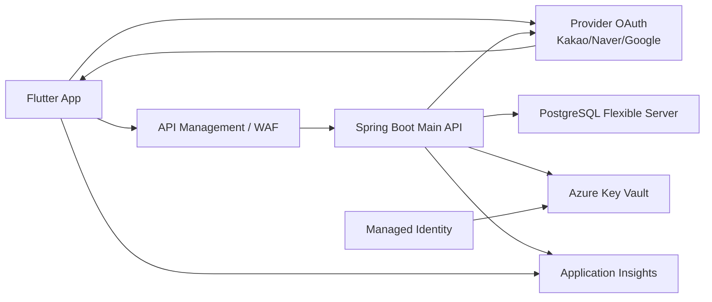

# ONMU Auth / User / Profile 아키텍처

## 목적

이 문서는 ONMU의 인증, 세션, 사용자, 프로필, 캐릭터, 취향, 친구 코드 영역을 Terraform/Azure migration에서 바로 참고할 수 있도록 정리한다.

핵심은 현재 구현과 목표 운영 구조를 섞지 않는 것이다.

- Current Implementation: 최신 `dev` 브랜치에 실제로 구현된 Spring/Flutter/DB 계약
- Target Architecture: 발표 이후 Azure/Terraform 운영 전환에서 지향할 구조
- Current-to-Target Delta: 지금 구현에서 목표 구조로 가기 위해 남은 리소스, PR, 운영 결정

이 문서는 Auth / Session / OAuth와 User / Profile / Character / Friends 사이의 경계를 함께 다룬다. 로그인 이후의 사용자 프로필 저장, 취향 온보딩, 캐릭터, 마이페이지 지역 설정, 친구 코드 기반 친구 추가가 모두 현재 사용자 identity에 묶이기 때문이다.

## 제품 원칙

| 원칙 | 설명 |
| --- | --- |
| OAuth provider token은 ONMU API token이 아니다 | Kakao/Naver/Google token 또는 authorization code는 Spring OAuth exchange endpoint로만 전달하고, 보호 API에는 Spring이 발급한 ONMU access JWT만 사용한다. |
| Flutter는 공개 값만 가진다 | Flutter dart-define, manifest, plist, bundle에는 공개 provider client id와 redirect URI만 들어간다. provider secret, JWT signing secret, DB password는 절대 넣지 않는다. |
| Spring Boot Main API가 인증 경계를 소유한다 | provider 검증, ONMU access JWT 발급, refresh token 저장/회전, logout 처리는 Spring이 담당한다. |
| 현재 사용자 API가 프로필 source of truth의 입구다 | Flutter는 `/api/v1/users/me` 조회/수정으로 취향, 캐릭터 요약, 온보딩 상태, 마이페이지 표시 데이터를 동기화한다. |
| 온보딩 완료와 지역 설정은 분리한다 | `onboardingStatus=COMPLETED`는 MVP 초기 온보딩 게이트를 다시 띄우지 않는 상태이며, 지역 설정 완료 여부는 별도 프로필 필드로 다룬다. |
| 친구/마이페이지 공개 범위는 viewer 기준이다 | 내 계정 전용 필드와 친구에게 보여줄 공개 프로필 필드를 분리한다. 거주지역은 기본 비공개이고 공개 설정이 있을 때만 제한적으로 노출한다. |
| DB schema는 Flyway가 소유한다 | Terraform은 PostgreSQL 서버와 네트워크, runtime, Key Vault reference를 만들 수 있지만 `users`, `auth_identities`, `refresh_tokens` 같은 core table DDL은 Spring Flyway가 소유한다. |

## Current Implementation

### Spring Auth Flow

현재 Spring Boot Main API는 `/api/v1/auth`와 `/api/v1/users/me` 계열을 제공한다.

```text
Flutter login action
  -> provider-specific browser or SDK flow
  -> POST /api/v1/auth/oauth/{provider}
  -> Spring provider verifier / authorization-code exchanger
  -> users + auth_identities 연결
  -> ONMU access JWT + refresh token 발급
  -> Flutter secure storage 저장
  -> GET /api/v1/auth/session
  -> GET /api/v1/users/me
  -> onboarding hub 또는 home 진입
```

주요 코드 기준:

| 역할 | 현재 구현 |
| --- | --- |
| Security boundary | `SecurityConfig`가 health/readiness, OAuth exchange/callback, refresh/logout public route를 열고 나머지 `/api/v1/**`는 인증을 요구한다. |
| Bearer token 검증 | `DevTokenAuthenticationFilter`, `AccessTokenIssuer`가 HS256 ONMU access JWT를 검증한다. |
| OAuth orchestration | `AuthService`가 provider identity 검증 결과를 사용자와 연결하고 token pair를 발급한다. |
| Provider verifier | Naver/Kakao는 provider access token 또는 authorization code exchange를 지원하고, Google은 idToken tokeninfo 검증을 수행한다. |
| Refresh/logout | `refresh_tokens` table 기반 저장, 회전, reuse 감지, family revoke를 수행한다. logout은 refresh token 기반 공개/idempotent route다. |

### Flutter Auth Flow

Flutter는 `features/auth` 아래에서 provider별 로딩과 Spring exchange를 분리한다.

| Flutter 구성 | 현재 역할 |
| --- | --- |
| `AuthActionController` | 로그인 버튼 액션, token 저장, 사용자 상태 갱신을 조율한다. |
| `AuthRepository` | `POST /api/v1/auth/oauth/{provider}`, `GET /api/v1/users/me`를 호출한다. |
| `AuthTokenStore` | ONMU access JWT와 refresh token을 secure storage에 저장한다. |
| `KakaoOAuthCredentialLoader` | Kakao 공개 client id/redirect URI를 읽고 browser authorization-code flow를 시작한다. |
| `NaverOAuthCredentialLoader` | Naver 공개 client id/redirect URI를 읽고 browser authorization-code flow를 시작한다. |
| `SocialAuthService` | Google client id/server client id를 읽고 idToken을 얻어 Spring으로 전달한다. |

실제 OAuth smoke에는 JWT 우회 define을 섞지 않는다. 보호 API 화면 개발용 JWT define과 provider 로그인 smoke용 OAuth define은 목적이 다르다.

### Current User and Profile

`GET /api/v1/users/me`는 현재 로그인 사용자의 private account/profile surface다.

현재 응답의 주요 필드:

```json
{
  "id": "usr_xxx",
  "databaseId": "uuid",
  "displayName": "사용자",
  "nickname": "nickname",
  "email": "user@example.com",
  "profileImageUrl": "https://...",
  "preferenceProfile": {},
  "pixelCharacter": {},
  "onboardingStatus": "COMPLETED",
  "authProvider": "NAVER",
  "authStatus": "authenticated",
  "tokenContract": {
    "accessToken": "issued-by-spring-main-api",
    "refreshToken": "issued-by-spring-main-api",
    "clientStorage": "flutter-secure-storage"
  }
}
```

`PATCH /api/v1/users/me`는 현재 사용자만 수정한다. 요청 body에서 다른 사용자 id를 받지 않고, authenticated principal의 `users.id`를 기준으로 저장한다.

현재 profile 저장 범위:

| 필드 | 저장 위치 | 현재 사용처 |
| --- | --- | --- |
| `displayName` | `users.display_name` | 마이페이지, 현재 사용자 표시 |
| `profileImageUrl` | `users.profile_image_url` | 프로필 표시 |
| `preferenceProfile` | `users.preference_profile` JSONB | 취향 선택, 지역 설정, 지역 공개 범위 |
| `pixelCharacter` | `users.pixel_character` JSONB | 캐릭터 표시 호환 |
| `onboardingStatus` | `users.onboarding_status` | Flutter onboarding gate |

### Preference / Onboarding

취향 선택 완료 화면은 현재 `preferenceProfile`을 `/api/v1/users/me` PATCH로 저장한 뒤 `onboardingStatus`를 derive해서 동기화한다.

현재 해석:

- `PENDING`: 초기 설정 필요
- `PREFERENCE_READY`: 취향 저장 완료
- `CHARACTER_READY`: 캐릭터 설정 완료
- `COMPLETED`: MVP 온보딩 게이트를 다시 띄우지 않아도 됨

지역 설정은 온보딩 필수 조건이 아니다. 마이페이지 프로필 편집에서 `preferenceProfile.region`, `preferenceProfile.regionVisibility`로 저장한다.

지역 payload 예시:

```json
{
  "preferenceProfile": {
    "region": {
      "country": "KR",
      "sido": "서울",
      "sigungu": "성동구",
      "displayName": "서울 성동구"
    },
    "regionVisibility": "PRIVATE"
  }
}
```

### Character

현재 캐릭터 API는 `/api/v1/users/me/character` 계열로 분리되어 있다.

| API | 역할 |
| --- | --- |
| `GET /api/v1/users/me/character` | 현재 사용자 캐릭터 조회 |
| `PUT /api/v1/users/me/character` | 캐릭터 설정 저장 |
| `POST /api/v1/users/me/character/generate` | 캐릭터 생성 보조 |
| `PATCH /api/v1/users/me/onboarding/character-skip` | 캐릭터 온보딩 skip 처리 |

DB에는 `character_profiles`가 도입되어 있고, `users.pixel_character`는 기존 API 호환용 read/write 필드로 남아 있다. 장기적으로는 `character_profiles`가 캐릭터 source of truth가 되어야 한다.

### Friends and User Codes

현재 `user_codes` table과 친구 API는 이미 존재한다.

| API | 역할 |
| --- | --- |
| `GET /api/v1/users/me/friends` | 내 친구 목록 |
| `GET /api/v1/users/me/friends/{friendUserId}/profile` | active friendship 기준 친구 상세 프로필 |
| `GET /api/v1/users/search?query={query}` | 친구 코드 또는 이름 검색 |
| `POST /api/v1/users/me/friends` | 친구 추가 |
| `PATCH /api/v1/users/me/friends/{friendUserId}` | 친구 메모/즐겨찾기 수정 |
| `DELETE /api/v1/users/me/friends/{friendUserId}` | 친구 삭제 |

최신 `dev` 기준으로 `user_codes`는 seed와 lookup 계약에 존재하지만, 신규 OAuth 사용자 생성 시 숫자 10자리 친구 코드를 자동 보장하는 로직은 아직 `dev`에 머지되지 않았다. 해당 보강은 PR #154에서 진행 중이며, 이 문서에서는 Target/Delta 항목으로 분리한다.

## Target Architecture



목표 구조:

- Flutter는 Spring Boot Main API만 직접 호출한다.
- Spring은 provider token/code/idToken을 검증하고 ONMU access JWT와 refresh token을 발급한다.
- Access JWT signing secret, OAuth provider secret, DB password는 Key Vault + Managed Identity reference로만 runtime에 주입한다.
- Refresh token은 DB에 hash로 저장하고 rotation/reuse detection을 유지한다.
- 사용자, auth identity, refresh token, profile, friend code schema는 Spring Flyway가 계속 소유한다.
- Terraform은 Key Vault, secret reference, Container Apps/AKS runtime, PostgreSQL server, network, App Insights를 만든다.
- 운영 smoke는 Android/iOS 실제 provider login, Spring exchange, secure storage 저장, session 유지까지 확인한다.

## Current-to-Target Delta

| 구분 | 현재 | 목표 | 담당/소유 |
| --- | --- | --- | --- |
| OAuth provider | Kakao/Naver authorization-code, Google idToken slice 구현 | Android/iOS provider console과 Key Vault 값 정합성 검증 완료 | Flutter/Spring/Ops |
| Runtime secret | dev Key Vault와 로컬 env/script 혼합 | Managed Identity 기반 Key Vault reference | Terraform/Ops |
| Access JWT | HS256 short-lived JWT | 환경별 signing secret, TTL, rotation policy 명문화 | Spring/Ops |
| Refresh token | DB 저장/회전 구현 | device/session 관리, revoke visibility, audit 보강 | Spring |
| User code | table/lookup 존재, 자동 생성은 PR #154 진행 중 | 신규 사용자마다 active 숫자 10자리 코드 1개 보장 | Spring/Flyway |
| Character | `character_profiles`와 `users.pixel_character` 병존 | `character_profiles` source of truth 확정 | Spring/Flutter |
| Region visibility | profile JSONB에 저장 | 약속 구성원 기준 제한 공유 read model 설계 | Profile/Meetup |
| Observability | access log, tests 중심 | auth failure reason, token refresh, OAuth provider latency metric | Spring/Ops |
| API gateway | dev endpoint 직접 호출 | WAF/APIM 앞단에서 rate limit, route policy, CORS 관리 | Terraform/Ops |

## API Contract

### `POST /api/v1/auth/oauth/{provider}`

Provider별 request 입력은 다르지만 응답은 ONMU token pair를 반환한다.

Request 예시:

```json
{
  "authorizationCode": "provider-code",
  "state": "opaque-state",
  "redirectUri": "https://dev-api.onmu.cloud/api/v1/auth/oauth/naver/callback",
  "providerIdToken": "google-id-token"
}
```

Response 예시:

```json
{
  "accessToken": "onmu-access-jwt",
  "refreshToken": "onmu-refresh-token",
  "refreshTokenExpiresAt": "2026-07-15T00:00:00Z",
  "user": {
    "id": "usr_xxx",
    "displayName": "사용자",
    "provider": "GOOGLE",
    "onboardingStatus": "PENDING"
  }
}
```

Provider token/code/idToken 원문은 로그, PR, 문서에 남기지 않는다.

### `GET /api/v1/auth/session`

Bearer access JWT 기준으로 현재 세션을 확인한다. token이 없거나 유효하지 않으면 보호 API는 `401`을 반환해야 한다.

### `POST /api/v1/auth/refresh`

Request:

```json
{
  "refreshToken": "onmu-refresh-token"
}
```

Refresh token이 유효하면 새 access/refresh token pair를 반환하고, reuse가 감지되면 token family를 폐기한다.

### `DELETE /api/v1/auth/session`

Public/idempotent logout route다. body에 refresh token이 있으면 해당 token을 revoke하고, 없어도 unauthenticated session 상태로 끝낸다.

### `GET /api/v1/users/me`

현재 사용자 private profile surface다. 계정 전용 필드와 친구 공개 필드를 혼동하지 않는다.

### `PATCH /api/v1/users/me`

현재 사용자 프로필만 부분 수정한다.

```json
{
  "displayName": "강신석",
  "preferenceProfile": {
    "preferredDays": ["FRIDAY", "SATURDAY"],
    "region": {
      "country": "KR",
      "sido": "서울",
      "sigungu": "성동구",
      "displayName": "서울 성동구"
    },
    "regionVisibility": "PRIVATE"
  },
  "onboardingStatus": "COMPLETED"
}
```

### Friend APIs

친구 조회/추가 API는 `users.public_id`와 `user_codes.code`를 모두 다룬다. 목표 구조에서는 친구 코드 검색에 rate limit과 abuse 방지 관측성을 추가한다.

## Event / Outbox / Side Effect Model

현재 Auth/User/Profile 영역은 대부분 동기 Spring transaction이다.

| Side effect | Current | Target |
| --- | --- | --- |
| OAuth login | `users`, `auth_identities`, `refresh_tokens` write | login audit metric, provider latency/error metric |
| Refresh | `refresh_tokens` rotate/revoke | token family reuse alert |
| Logout | refresh token revoke | session/device audit visibility |
| Profile PATCH | `users` profile fields update | profile change event 후보. 현재 outbox 필수 아님 |
| Character save | character/profile update | 캐릭터 source of truth 확정 후 event 필요 여부 결정 |
| Friend add | friendships/settings write | notification/activity side effect는 별도 domain decision |
| User code allocation | 현재 dev에는 자동 생성 없음, PR #154 진행 중 | signup transaction에서 active code 보장 |

Outbox를 무리하게 추가하지 않는다. 인증과 프로필 변경은 개인정보와 보안 이벤트이므로, event를 추가할 때는 payload 최소화와 PII 제거가 먼저 확정되어야 한다.

## Data Model and Source of Truth

| Table / Field | Current source of truth | Target note |
| --- | --- | --- |
| `users` | 사용자 기본 표시, public id, status, locale/timezone, profile JSON | 탈퇴/삭제 시 PII 제거 정책 보강 |
| `users.preference_profile` | 취향, 지역, 지역 공개 범위 JSONB | region schema를 앱/API 계약으로 고정 |
| `users.pixel_character` | 기존 캐릭터 JSON 호환 필드 | `character_profiles` 전환 후 read-through/제거 결정 |
| `character_profiles` | 캐릭터 원장 후보 | 최종 source of truth로 승격 |
| `auth_identities` | provider identity 연결 | provider별 subject unique, deleted identity 처리 유지 |
| `refresh_tokens` | refresh token hash/rotation/family | device/session 관리 UI 후보 |
| `user_codes` | 친구 검색용 코드 | PR #154 이후 `NUMERIC_10` active code 자동 보장 목표 |
| `friendships` | canonical pair 친구 관계 | active/hidden/deleted 정책 유지 |
| `friend_settings` | 사용자별 친구 메모/즐겨찾기/표시 설정 | 친구 공개 프로필과 개인 메모를 혼동하지 않음 |
| `friend_requests` | 요청 방향 보존 후보 | MVP 즉시 친구 추가 이후 요청 승인형으로 확장 가능 |

Terraform은 위 table을 만들지 않는다. DB server, network, backup, monitoring만 Terraform이 소유하고 schema는 Flyway가 소유한다.

## Flutter Boundary

Flutter가 해야 하는 일:

- provider login UI와 browser/SDK 시작
- provider callback/deep link 수신
- provider token/code/idToken을 Spring OAuth endpoint로 전달
- Spring이 발급한 ONMU access/refresh token을 secure storage에 저장
- `/api/v1/users/me`를 조회해 onboarding/profile 상태 복원
- profile edit, preference summary, character setup의 사용자 입력을 ViewModel/Repository를 통해 API로 전달

Flutter가 하지 말아야 하는 일:

- provider client secret 저장
- JWT signing secret 저장
- DB/Key Vault/Service Bus/Redis 직접 접근
- provider access token을 ONMU API bearer token으로 사용
- 다른 사용자의 계정 전용 필드 조회
- region visibility가 private인 친구의 거주지역 표시

## Spring / Worker Boundary

Spring Boot Main API가 소유하는 일:

- OAuth provider 검증과 identity linking
- access JWT 발급/검증, refresh token 저장/회전/logout
- current user profile read/write
- character/profile/onboarding 상태 저장
- friend lookup/add/delete/settings
- API authorization과 viewer 기준 read model

Worker가 현재 소유하지 않는 일:

- OAuth 검증
- token 발급/refresh/logout
- current user profile mutation
- friend code 생성
- Key Vault secret 값 처리

향후 worker/queue를 붙이더라도 Auth/User/Profile의 transaction source of truth는 Spring에 남긴다.

## Terraform Resource Implications

| 필요 기능 | Azure 리소스 후보 | Terraform 소유 여부 | 비고 |
| --- | --- | --- | --- |
| Public API runtime | Container Apps staging, AKS production, ACR | 예 | Spring Boot Main API 배포 단위 |
| DB | PostgreSQL Flexible Server | 예, server/network만 | schema는 Flyway |
| Secret reference | Azure Key Vault, Managed Identity | 예 | secret value는 문서/PR에 쓰지 않음 |
| API edge | API Management, WAF, Front Door/Application Gateway | 예 | OAuth callback, CORS, rate limit 경계 |
| Observability | Application Insights, Log Analytics | 예 | auth/session/profile smoke metric |
| Redis/rate limit | Azure Cache for Redis 후보 | 예 | 친구 코드 검색 abuse 방지에 사용 가능 |
| Queue/outbox | Service Bus 후보 | 제한적 | Auth/Profile에는 아직 필수 아님 |

Terraform이 하면 안 되는 일:

- `users`, `auth_identities`, `refresh_tokens`, `user_codes` DDL 생성
- OAuth secret 값 입력을 PR에 노출
- Flutter dart-define 파일 생성
- provider console 설정을 임의 변경
- production OAuth redirect URI를 검증 없이 교체

## Secret / Key Vault / Managed Identity Boundary

| 목적 | Spring env | Key Vault secret name 예시 | Flutter 전달 |
| --- | --- | --- | --- |
| Access JWT signing | `ONMU_ACCESS_TOKEN_SECRET` | `dev-access-token-secret`, `int-access-token-secret` | 금지 |
| Kakao REST API key | `KAKAO_REST_API_KEY` | `dev-kakao-rest-api-key`, `int-kakao-rest-api-key` | 공개 client id로만 가능 |
| Kakao client secret | `KAKAO_CLIENT_SECRET` | `dev-kakao-client-secret`, `int-kakao-client-secret` | 금지 |
| Kakao callback | `KAKAO_OAUTH_REDIRECT_URI`, `KAKAO_OAUTH_MOBILE_CALLBACK_URI` | config 또는 secret reference 후보 | redirect URI만 가능 |
| Naver OAuth client id | `NAVER_OAUTH_CLIENT_ID` | `dev-naver-oauth-client-id`, `int-naver-oauth-client-id` | 공개 client id로만 가능 |
| Naver OAuth secret | `NAVER_OAUTH_CLIENT_SECRET` | `dev-naver-oauth-client-secret`, `int-naver-oauth-client-secret` | 금지 |
| Google audience | `GOOGLE_OAUTH_CLIENT_ID`, `GOOGLE_SERVER_CLIENT_ID` | `dev-google-oauth-client-id`, `dev-google-server-client-id` | client id만 가능 |
| DB password | `SPRING_DATASOURCE_PASSWORD` | 환경별 DB password secret | 금지 |

Secret 값은 이 문서, PR 본문, log, screenshot에 남기지 않는다.

## Observability and Smoke Test

### 최소 metric 후보

| Metric | 의미 |
| --- | --- |
| `auth.oauth.exchange.count` | provider별 OAuth exchange 시도 |
| `auth.oauth.exchange.failure.count` | provider별 실패 수 |
| `auth.oauth.provider_latency_ms` | provider token/userinfo/tokeninfo latency |
| `auth.jwt.validation.failure.count` | access JWT 검증 실패 |
| `auth.refresh.success.count` | refresh 성공 |
| `auth.refresh.reuse_detected.count` | refresh token reuse 감지 |
| `profile.patch.count` | current user profile 저장 |
| `profile.patch.failure.count` | profile 저장 실패 |
| `friend.user_code.search.count` | 친구 코드 검색 시도 |
| `friend.user_code.search.rate_limited.count` | rate limit 후보 |

### Dev-safe smoke

1. `GET /healthz`, `GET /readyz`가 dev endpoint에서 200인지 확인한다.
2. token 없이 `GET /api/v1/users/me`가 401인지 확인한다.
3. Key Vault signing secret으로 짧은 수명 dev JWT를 로컬에서 발급한다.
4. `GET /api/v1/auth/session`이 authenticated session을 반환하는지 확인한다.
5. `GET /api/v1/users/me`가 profile/onboarding 필드를 반환하는지 확인한다.
6. `PATCH /api/v1/users/me`로 `preferenceProfile` 일부 저장 후 다시 조회한다.
7. region visibility가 `PRIVATE`일 때 친구 상세나 공개 프로필에 노출되지 않는지 확인한다.

### OAuth mobile smoke

1. JWT 우회 define 없이 OAuth 전용 define만 사용한다.
2. Android/iOS에서 provider login 화면 진입을 확인한다.
3. provider callback/deep link가 앱으로 돌아오는지 확인한다.
4. Spring `POST /api/v1/auth/oauth/{provider}` exchange가 성공하는지 확인한다.
5. Flutter secure storage에 ONMU access/refresh token이 저장되는지 확인한다.
6. 앱 재실행 후 session 유지 또는 refresh가 정상인지 확인한다.

## Migration Risks

- OAuth console redirect URI, Android package/SHA-1, iOS reversed client id가 Key Vault/runtime 값과 어긋나면 provider login은 열리지만 최종 ONMU token exchange가 실패한다.
- Google `GOOGLE_CLIENT_ID`, `GOOGLE_SERVER_CLIENT_ID`, Spring audience 검증 값이 서로 다르면 idToken은 받아도 backend에서 거절된다.
- Provider access token을 ONMU bearer token으로 착각하면 보호 API가 401 또는 잘못된 권한 상태가 된다.
- Refresh token reuse detection을 약화하면 탈취된 refresh token을 회수하기 어려워진다.
- `onboardingStatus=COMPLETED`에 지역 설정 완료 여부를 갑자기 포함하면 기존 사용자가 다시 온보딩 게이트에 걸릴 수 있다.
- 지역 공개 범위를 친구/약속 구성원 기준으로 제한하지 않으면 거주지역 개인정보가 과노출될 수 있다.
- Terraform이 DB table DDL을 직접 만들기 시작하면 Flyway migration history와 충돌한다.
- Secret 값을 `.dart_tool`, `.env`, PR 본문, console log에 출력하면 보안 사고로 본다.
- `user_codes` 숫자 자동 생성 PR이 머지된 뒤 기존 dev DB에 동일 사용자 다중 active code가 있으면 partial unique index 적용이 실패할 수 있다.

## Decision Log

| 결정 | 상태 | 근거 | 남은 질문 |
| --- | --- | --- | --- |
| Spring Boot Main API가 OAuth exchange와 ONMU token 발급을 소유한다 | 결정됨 | 현재 AuthService/SecurityConfig 구현 | 없음 |
| Flutter는 provider secret/JWT signing secret을 보관하지 않는다 | 결정됨 | 보안 규칙, README, smoke 문서 | 없음 |
| Access token은 HS256 JWT, `sub=<users.public_id>`를 유지한다 | 결정됨 | dev/integration smoke와 Spring filter 구현 | prod rotation 정책 |
| Refresh token은 DB 저장/회전/reuse detection을 사용한다 | 결정됨 | `refresh_tokens` 구현 | device/session UI |
| 지역 설정은 온보딩 필수가 아니라 마이페이지 프로필 필드다 | 결정됨 | #137 이후 팀 합의 | 약속 구성원 공유 read model |
| 캐릭터 source of truth는 `character_profiles`로 이동한다 | 후보 | 데이터 사전과 Character API 방향 | `users.pixel_character` 제거/호환 전략 |
| 친구 코드는 숫자 10자리 active code로 간다 | 진행 중 | PR #154 | dev DB 기존 코드 보정과 rate limit |
| Auth/Profile observability metric을 App Insights에 올린다 | 후보 | Terraform/Azure 전환 목표 | metric naming 확정 |

## Roadmap

| Phase | 목표 | 산출물 |
| --- | --- | --- |
| Phase 2 | Auth/User/Profile API 연결 완결 | OAuth exchange, `/users/me`, 취향 저장, 캐릭터, 지역 설정, 친구 기본 API |
| Phase 2.5 | 숫자 친구 코드 자동 생성 | PR #154 머지, 신규 사용자 `NUMERIC_10` active code 보장 |
| Phase 3 | 모바일 OAuth smoke | Android/iOS Kakao/Naver/Google 실제 login, secure storage, session 유지 검증 |
| Phase 3 | dev/runtime 안정화 | Key Vault env mapping, Windows Spring runtime, access log, smoke checklist |
| Phase 4 | 발표 freeze | demo 계정, seed profile, manual QA, OAuth fallback 운영 기준 |
| Azure staging | Terraform 전환 | Key Vault reference, Spring runtime, PostgreSQL, App Insights, API edge |
| Production 후보 | 보안/운영 강화 | token rotation, provider secret rotation, rate limit, audit, 개인정보 공개 범위 정책 |

## Non-goals

- Flutter가 DB, Key Vault, Redis, Service Bus, provider secret을 직접 다루지 않는다.
- Terraform이 core DB schema를 만들거나 Flyway migration을 대체하지 않는다.
- OAuth provider token/code/idToken 원문을 로그나 문서에 남기지 않는다.
- 지역 설정을 현재 sprint에서 온보딩 필수 단계로 올리지 않는다.
- 친구 코드 self-service 재발급, 외부 초대 링크, 그룹 초대 token은 현재 범위가 아니다.
- Google/Naver/Kakao provider console의 실제 secret 값은 문서화하지 않는다.
- dev-safe JWT smoke를 실제 OAuth login 완료로 간주하지 않는다.
