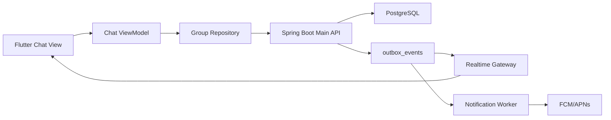

# ONMU 채팅 및 ChatActivity 아키텍처

## 목적

ONMU의 채팅은 단순한 부가 기능이 아니라 약속을 잡는 핵심 작업 공간이다. 사용자가 일정 조율을 위해 카카오톡으로 이동하면 대화, 투표, 장소 후보, 정산, 기록이 다시 흩어지고 ONMU를 불편한 앱으로 느끼게 된다. 따라서 ONMU 채팅의 목표는 카카오톡 수준의 기본 메시징 경험을 제공하면서, 약속을 만들고 결정하고 기록하는 ONMU 고유의 action card를 같은 흐름 안에 묶는 것이다.

현재 구현은 REST 기반 메시지 목록/작성 slice를 먼저 제공한다. Production 목표는 이 REST 계약 위에 실시간 수신, 낙관적 전송, 실패 재시도, 읽음/안읽음, push, 첨부, 대화 기반 action 전환을 단계적으로 얹는 구조다.

## 제품 원칙

| 원칙 | 의미 |
| --- | --- |
| 채팅은 약속 조율의 중심 화면이다 | 사용자는 대화 중에 장소, 시간, 투표, 정산, 기록으로 자연스럽게 이동해야 한다. |
| 기본 메시징 경험은 카카오톡 수준을 목표로 한다 | 전송 반응성, 새 메시지 도착, 안읽음, 알림, 재시도가 어색하면 사용자는 외부 메신저로 이동한다. |
| ONMU의 차별점은 action card다 | 일반 메시지 위에 약속 생성, 장소 후보, 투표, 정산, 기록 카드를 얹어 대화를 실행 가능한 상태로 바꾼다. |
| ChatActivity는 append-only event stream이다 | 메시지와 도메인 이벤트를 같은 시간축에 쌓되, 각 도메인의 source of truth는 해당 도메인 테이블에 둔다. |
| Flutter는 Spring Boot Main API만 직접 호출한다 | Realtime, worker, notification은 Spring Boot 뒤의 내부 계층으로 둔다. |

## 카카오톡과 ONMU 비교

| 항목 | 카카오톡 | ONMU 목표 |
| --- | --- | --- |
| 핵심 목적 | 범용 대화와 관계 유지 | 약속 조율, 결정, 실행, 기록 |
| 기본 단위 | 채팅방 메시지 | 모임별 ChatActivity stream |
| 사용자가 기대하는 기본 UX | 즉시 전송, 실시간 수신, 안읽음, push, 첨부 | 동일한 기본 UX를 제공하고 약속 action을 추가 |
| 실시간성 | 메시지 fan-out이 기본 | Realtime Gateway를 통해 group room 단위 fan-out |
| 읽음/안읽음 | 방/메시지 기준 읽음 상태 | 모임별 last read cursor와 unread count |
| 알림 | push 중심 | notification worker가 메시지/도메인 이벤트를 push로 변환 |
| 첨부 | 사진, 파일, 위치, 링크 | 사진, 장소 후보, 지도 링크, 약속/정산 공유 카드 |
| 대화에서 실행으로 전환 | 외부 앱 또는 수동 정리 | 대화를 약속, 투표, 장소 후보, 정산, 기록으로 즉시 전환 |
| Source of truth | 메시징 서버 | 메시지는 `chat_activity_events`, 약속/투표/정산은 각 도메인 테이블 |

## 현재 MVP Slice

현재 Flutter 채팅 화면이 기대하는 최소 계약은 다음과 같다.

| 기능 | API | 설명 |
| --- | --- | --- |
| 메시지 목록 | `GET /api/v1/groups/{groupId}/chat/messages` | 모임 채팅 화면의 초기 메시지 stream을 조회한다. |
| 메시지 작성 | `POST /api/v1/groups/{groupId}/chat/messages` | 텍스트 메시지를 append하고 작성된 메시지 객체를 반환한다. |

MVP slice는 다음 범위를 의도적으로 제외한다.

- WebSocket/SSE 기반 실시간 수신
- FCM/APNs push 전송
- 사진/파일/위치 첨부
- 메시지별 읽음 표시
- 대화 내용을 자동으로 약속/투표/정산으로 변환하는 AI/규칙 엔진

이 제외 항목은 제품 목표에서 빠진 것이 아니라, 현재 REST 계약의 범위 밖이라는 뜻이다.

## Target Architecture

Flutter는 View, ViewModel, Repository, API client 흐름을 유지한다. View는 입력과 렌더링만 담당하고, 메시지 조회/작성/재시도/구독 lifecycle은 ViewModel과 Repository가 관리한다.

Spring Boot Main API는 group membership 권한을 확인한 뒤 `chat_activity_events`에 append한다. 같은 transaction 안에서 필요한 domain table과 outbox event를 기록하고, Realtime Gateway와 Notification Worker는 outbox를 통해 후속 처리를 수행한다.

## Event Model

| Event type | 설명 | 표시 방식 |
| --- | --- | --- |
| `chat.message` | 사용자가 입력한 일반 텍스트 메시지 | 말풍선 |
| `system.message` | 시스템 안내, 권한/상태 변경 알림 | 중앙 안내 또는 낮은 강조 말풍선 |
| `plan.created` | 약속 생성 | 약속 카드 |
| `plan.updated` | 시간, 장소, 참여자 변경 | 약속 변경 카드 |
| `place_candidate.created` | 장소 후보 추가 | 장소 후보 카드 |
| `vote.created` | 투표 생성 | 투표 카드 |
| `settlement.created` | 정산 공유 | 정산 카드 |
| `record.created` | 약속 기록 생성 | 기록 카드 |

`chat_activity_events`는 시간축과 렌더링 payload를 제공한다. 약속, 투표, 정산, 장소 후보의 최종 source of truth는 각각의 domain table이며, ChatActivity payload는 화면 표시와 이동을 위한 snapshot이다.

## Production UX Requirements

| 요구사항 | 제품 의미 | 구현 방향 |
| --- | --- | --- |
| 낙관적 전송 | 사용자는 전송 버튼을 누른 즉시 말풍선을 봐야 한다. | `sending`, `sent`, `failed` 상태를 ViewModel state에 둔다. |
| 실패 재시도 | 네트워크 실패가 대화 유실로 느껴지면 안 된다. | 실패 메시지는 rollback보다 retry 가능한 failed bubble로 남긴다. |
| 실시간 수신 | 새 메시지를 보기 위해 화면을 새로고침하면 안 된다. | group room 구독과 outbox 기반 fan-out을 붙인다. |
| Cursor pagination | 오래된 대화를 안정적으로 불러와야 한다. | `beforeCursor`, `limit`, `nextCursor` 계약을 추가한다. |
| 읽음/안읽음 | 사용자는 어떤 대화를 놓쳤는지 알아야 한다. | group member별 last read cursor와 unread count를 관리한다. |
| Push 알림 | 앱 밖에서도 약속 조율을 놓치지 않아야 한다. | notification worker가 메시지/중요 action을 FCM/APNs로 변환한다. |
| 첨부와 공유 | 장소, 사진, 지도 링크가 대화 안에 있어야 한다. | message attachment table과 media storage를 분리한다. |
| 대화에서 action 생성 | "그럼 토요일 7시?"가 바로 약속/투표가 되어야 한다. | 수동 action button을 먼저 만들고, 이후 AI 보조를 붙인다. |

## Backend Production Requirements

- `chat_activity_events`는 append-only stream으로 유지한다.
- 메시지 정렬은 서버 sequence 또는 cursor를 기준으로 한다.
- 모든 읽기/쓰기는 group membership 권한을 확인한다.
- outbox event는 idempotency key와 retry 상태를 가진다.
- Realtime Gateway는 Redis pub/sub 또는 stream을 사용하되, Redis를 source of truth로 두지 않는다.
- notification worker는 push 실패와 재시도 상태를 기록한다.
- unread count, last message, last read cursor는 별도 projection으로 관리한다.
- message payload에는 렌더링에 필요한 snapshot만 두고, domain mutation은 domain service가 담당한다.
- 관측성은 `send latency`, `fan-out latency`, `push latency`, `failed send rate`, `unread count drift`를 최소 지표로 둔다.

## Flutter Production Requirements

- 채팅 메시지 목록은 화면의 critical path다. 투표/정산/기록 enrichment API가 실패해도 전체 채팅 로딩을 막지 않는다.
- ViewModel은 메시지 조회, 작성, 실패 상태, pagination, realtime subscription lifecycle을 관리한다.
- Repository는 REST와 realtime event를 같은 `GroupMessage` stream으로 합성하되, View가 API client를 직접 알지 않게 한다.
- 오프라인 또는 네트워크 불안정 상황에서는 pending outbox를 local storage에 보관하고 재전송한다.
- system/card message payload가 일부 누락되어도 화면이 깨지지 않는 fallback을 둔다.
- action card tap은 각 domain route로 이동하되, route contract는 `docs/architecture/api-contract-map.md`와 맞춘다.

## Roadmap

| 단계 | 목표 | 산출물 |
| --- | --- | --- |
| Phase 1 | REST 메시지 조회/작성 | `GET/POST /chat/messages`, Flutter Repository/ViewModel 연결 |
| Phase 2 | 채팅 UX 기초 품질 | 낙관적 전송, failed bubble, retry, cursor pagination, unread count |
| Phase 3 | 실시간 fan-out | Realtime Gateway, group room 구독, outbox 기반 WebSocket/SSE 전달 |
| Phase 4 | 알림과 첨부 | FCM/APNs, 사진/장소/지도 링크 첨부, media storage |
| Phase 5 | ONMU action 전환 | 대화에서 약속/투표/정산/기록 생성, AI 보조 추천 |

## Non-goals

- Flutter 앱이 FastAPI Worker를 직접 호출하지 않는다.
- Realtime Gateway가 Spring Boot Main API의 domain transaction을 대신하지 않는다.
- Redis를 메시지 source of truth로 사용하지 않는다.
- secret, API key, token, DB password 값을 문서나 로그에 남기지 않는다.
- 카카오톡을 그대로 복제하지 않는다. 기본 메시징 기대치를 충족하되, ONMU의 목적은 약속 조율과 기록의 실행성을 높이는 것이다.
