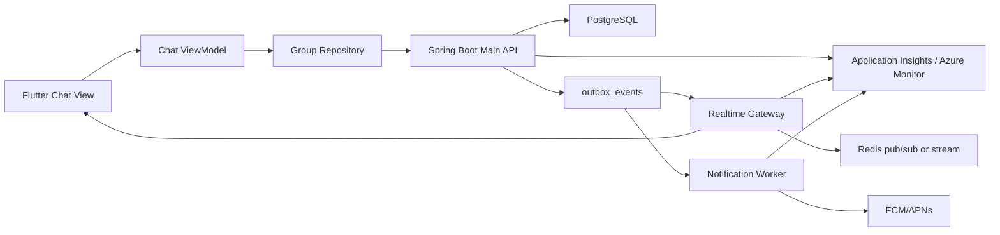

# ONMU 채팅 및 ChatActivity 아키텍처

## 목적

ONMU의 채팅은 단순한 부가 기능이 아니라 약속을 잡는 핵심 작업 공간이다. 사용자가 일정 조율을 위해 카카오톡으로 이동하면 대화, 투표, 장소 후보, 정산, 기록이 다시 흩어지고 ONMU를 불편한 앱으로 느끼게 된다.

이 문서는 Realtime / ChatActivity 영역을 Current Implementation, Target Architecture, Current-to-Target Delta로 나누어 정리한다. 목표는 Terraform/Azure migration 때 어떤 리소스를 만들고 어떤 경계를 Spring/Flutter/Flyway가 계속 소유해야 하는지 판단할 수 있게 하는 것이다.

현재 구현은 Spring Boot Main API 안에서 REST 메시지 목록/작성, cursor pagination, 읽음 상태, 이미지 첨부 metadata, in-process SSE fan-out을 제공한다. Flutter는 이 계약을 ViewModel/Repository 경계로 소비하며 낙관적 전송, 실패 재시도, SSE 재연결을 화면 상태로 관리한다.

SCRUM-50의 SSE 구현은 단일 dev/runtime에서 새 메시지를 자동 수신하기 위한 production-directed 중간 단계다. Redis나 별도 Realtime Gateway는 아직 구현되지 않았고, 메시지 source of truth는 계속 `chat_activity_events`다.

## 제품 원칙

| 원칙 | 의미 |
| --- | --- |
| 채팅은 약속 조율의 중심 화면이다 | 사용자는 대화 중에 장소, 시간, 투표, 정산, 기록으로 자연스럽게 이동해야 한다. |
| 기본 메시징 경험은 카카오톡 수준을 목표로 한다 | 전송 반응성, 새 메시지 도착, 안읽음, 알림, 재시도가 어색하면 사용자는 외부 메신저로 이동한다. |
| ONMU의 차별점은 action card다 | 일반 메시지 위에 약속 생성, 장소 후보, 투표, 정산, 기록 카드를 얹어 대화를 실행 가능한 상태로 바꾼다. |
| ChatActivity는 append-only event stream이다 | 메시지와 도메인 이벤트를 같은 시간축에 쌓되, 각 도메인의 source of truth는 해당 도메인 테이블에 둔다. |
| Realtime은 delivery layer다 | SSE, WebSocket, Redis, Realtime Gateway는 fan-out 수단이며 메시지 원장이 아니다. |
| Viewer-relative 필드는 구독자별로 계산한다 | `isMine`, 읽음 상태, unread count처럼 보는 사람에 따라 달라지는 값은 shared payload로 고정하지 않는다. |
| Flutter는 Spring Boot Main API만 직접 호출한다 | Flutter 앱은 Redis, worker, queue, Key Vault, FCM/APNs provider API를 직접 호출하지 않는다. |

## Current Implementation

### Spring API

현재 public API는 `ChatController`가 제공하고, 실제 도메인 처리는 `ChatActivityService`가 담당한다.

| 기능 | API | 현재 구현 |
| --- | --- | --- |
| 메시지 목록 | `GET /api/v1/groups/{groupId}/chat/messages` | `beforeCursor`, `limit` 기반 cursor pagination, unread count 포함 |
| 메시지 작성 | `POST /api/v1/groups/{groupId}/chat/messages` | 텍스트 메시지 또는 image attachment metadata를 `chat_activity_events`에 append |
| 읽음 상태 갱신 | `PUT /api/v1/groups/{groupId}/chat/read-state` | `chat_read_states`에 group/user별 last read event와 timestamp 저장 |
| 실시간 수신 | `GET /api/v1/groups/{groupId}/chat/events` | Spring in-process `SseEmitter` room에 구독하고 `afterCursor` replay 지원 |

모든 endpoint는 group membership을 확인한다. 멤버가 아니면 메시지 목록, 작성, 읽음 갱신, SSE 구독 모두 `403 group_member_required`로 거부한다.

### Spring Domain Flow

`POST /chat/messages`의 현재 흐름:

1. `groups.public_id`로 group을 찾고 현재 사용자의 membership을 확인한다.
2. message text와 attachments를 normalize한다.
3. text가 비어 있고 attachment도 없으면 `400 blank_chat_message`로 거부한다.
4. image attachment는 최대 4개까지 허용한다.
5. attachment type은 현재 `image`만 허용한다.
6. attachment `storageKey`는 public media key 정책을 통과해야 한다.
7. `chat_activity_events`에 `event_type=chat.message`와 payload를 저장한다.
8. active/joined member와 owner 중 작성자를 제외한 수신자에게 `chat_message` in-app notification row를 만들 수 있다.
9. notification별 `notification.requested` outbox event를 기록할 수 있다.
10. `chat.message` outbox event를 기록한다.
11. transaction commit 이후 in-process SSE publisher가 room subscriber에게 메시지를 fan-out한다.

현재 `notification.requested` payload는 실제 `notificationId`를 포함한다. 이는 provider delivery와 연결 가능한 형태지만, 실제 FCM/APNs push 발송은 별도 Notification / Push / Devices 영역에서 다룬다.

### In-process SSE

현재 `ChatRealtimePublisher` 구현은 `InProcessSseChatRealtimePublisher`다.

| 항목 | 현재 동작 |
| --- | --- |
| 구독 저장소 | Spring process memory의 `subscribersByGroupId` |
| 구독 timeout | 30분 |
| heartbeat | 15초마다 SSE comment heartbeat |
| replay | `afterCursor`가 있으면 `chat_activity_events.created_at > afterCursor`를 최대 100개 replay |
| event name | `chat.message` |
| event id | message `id` |
| payload | Flutter `GroupMessage`로 mapping 가능한 message object |
| viewer-relative 처리 | subscriber의 public user id 기준으로 `isMine`을 다시 계산 |

이 구현은 단일 Spring runtime에서만 fan-out된다. Spring instance가 여러 개로 늘면 현재 in-memory subscriber map은 instance 간 공유되지 않는다. 따라서 운영 목표에서는 Redis pub/sub/stream 또는 별도 Realtime Gateway가 필요하다.

### Flutter 흐름

Flutter는 `GroupChatPage` -> `GroupChatViewModel` -> `GroupRepository` -> `OnmuApiClient` 경계를 사용한다. View는 입력, 이미지 선택, snack bar, route 이동만 담당하고 API 호출과 상태 합성은 ViewModel/Repository에 있다.

| 기능 | Flutter 현재 구현 |
| --- | --- |
| 초기 로딩 | group detail과 message page를 가져오고 최신 메시지를 read-state로 mark |
| 메시지 작성 | local pending bubble을 먼저 추가하고 REST 성공 시 sent message로 교체 |
| 실패 재시도 | failed bubble을 유지하고 같은 text/attachments로 재전송 |
| 이미지 첨부 | `MediaRepository.uploadChatImage` 후 image attachment metadata로 메시지 전송 |
| 이전 메시지 | `nextCursor`로 older page를 prepend |
| SSE 구독 | `watchMessages(groupId, afterCursor)` line stream을 `GroupChatSseDecoder`로 decode |
| 재연결 | stream error/done 후 3초 뒤 latest cursor로 재구독 |
| 중복 제거 | id/cursor 기반으로 같은 메시지 중복 append 방지 |
| pending 교체 | 내 pending message와 incoming SSE message의 text/attachment signature가 같으면 교체 |

`GroupChatSseDecoder`는 SSE comment line을 무시하고 `data:` line을 모아 JSON으로 decode한다. 잘못된 JSON은 stream 전체를 깨지 않고 무시한다.

### 현재 제외 범위

- Redis/Realtime Gateway/WebSocket 운영 fan-out
- FCM/APNs push delivery
- 파일/위치/지도 링크 첨부
- 메시지별 상세 읽음 표시
- local durable outbox
- 대화 내용을 자동으로 약속/투표/정산으로 변환하는 AI/규칙 엔진

## Target Architecture



목표 구조에서도 Spring Boot Main API는 group membership, domain transaction, `chat_activity_events` append, read-state 저장을 소유한다. Realtime Gateway는 fan-out과 connection lifecycle을 맡고, Notification Worker는 push provider delivery를 맡는다.

Redis는 여러 runtime instance 사이의 event distribution을 돕는 fan-out infrastructure다. Redis에 메시지 원장을 두지 않고, replay와 pagination은 계속 PostgreSQL `chat_activity_events` 기준으로 수행한다.

### 확정

- 메시지 source of truth는 `chat_activity_events`.
- 읽음 상태 source of truth는 `chat_read_states`.
- Flutter는 Spring public API만 호출한다.
- SSE는 현재 구현된 첫 realtime delivery slice다.
- in-process SSE는 multi-instance production fan-out이 아니다.
- `isMine`은 subscriber별 viewer 기준으로 계산한다.
- DB schema는 Spring Flyway가 소유한다.

### 후보

- Realtime Gateway transport는 WebSocket 우선, SSE fallback 가능.
- Redis는 pub/sub 또는 stream 중 운영 요구에 맞춰 선택한다.
- Event Hubs는 outbox 기반 worker/notification fan-out에 우선 사용하고, realtime low-latency fan-out은 Redis와 분리할 수 있다.
- attachment table은 메시지 payload JSON 유지와 별도 `chat_message_attachments` 분리 중 선택한다.

### 미결정

- Realtime Gateway를 Spring module로 둘지 별도 service로 둘지.
- Redis pub/sub과 Redis Streams 중 어떤 모델을 사용할지.
- Realtime reconnect/backoff, token refresh, heartbeat timeout 기준.
- unread count projection을 DB query로 유지할지 별도 projection table/cache로 분리할지.
- message attachment를 payload JSON으로 계속 유지할지 물리 table로 분리할지.

## Current-to-Target Delta

| 구분 | 내용 | 소유 |
| --- | --- | --- |
| 유지 | `GET/POST /chat/messages`, `PUT /chat/read-state`, `GET /chat/events` public API | Spring/Flutter |
| 유지 | `chat_activity_events` append-only source of truth | Spring Flyway/Spring |
| 유지 | `chat_read_states` group/user별 read cursor | Spring Flyway/Spring |
| 유지 | Flutter ViewModel/Repository boundary, optimistic send, retry, SSE reconnect | Flutter |
| 대체 | Spring in-process SSE room broadcaster를 운영 Realtime Gateway로 확장 | Realtime/Spring |
| 추가 | Redis pub/sub or stream 기반 multi-instance fan-out | Terraform/Runtime |
| 추가 | fan-out latency, reconnect rate, subscriber count, unread drift metric | Observability |
| 추가 | attachment lifecycle, file/location/map link support | Flutter/Spring/Storage |
| 추가 | durable local outbox 또는 retry queue | Flutter |
| 보강 | outbox idempotency key, delivery retry/dead-letter | Spring/Worker |
| 보류 | AI 대화 분석으로 약속/투표/정산 자동 생성 | Later AI/Worker |

## API Contract

### `GET /api/v1/groups/{groupId}/chat/messages`

Query:

| 이름 | 의미 |
| --- | --- |
| `beforeCursor` | 이 cursor보다 오래된 메시지를 조회한다. ISO instant 문자열이다. |
| `limit` | 1~100으로 bounded 된다. 기본값은 50이다. |

Response:

```json
{
  "messages": [],
  "nextCursor": "2026-06-09T05:00:00Z",
  "hasMore": true,
  "limit": 50,
  "unreadCount": 0
}
```

### `POST /api/v1/groups/{groupId}/chat/messages`

Request:

```json
{
  "message": "사진 올렸어",
  "attachments": [
    {
      "type": "image",
      "storageKey": "records/media/example.jpg",
      "contentType": "image/jpeg",
      "fileName": "example.jpg",
      "width": 1200,
      "height": 900
    }
  ]
}
```

규칙:

- text와 attachment가 모두 비어 있으면 `400 blank_chat_message`.
- attachment가 있으면 text는 빈 문자열일 수 있다.
- 현재 attachment type은 `image`만 허용한다.
- 최대 attachment 수는 4개다.
- `storageKey`는 `MediaService.isAllowedPublicMediaKey`를 통과해야 한다.
- image content type이 있으면 `image/`로 시작해야 한다.

### `PUT /api/v1/groups/{groupId}/chat/read-state`

Request:

```json
{
  "lastReadMessageId": "<chat_activity_events.id UUID>"
}
```

`lastReadMessageId`를 생략하면 현재 group의 최신 메시지를 기준으로 읽음 처리한다. 잘못된 UUID는 `400 invalid_chat_message_id`, group에 없는 message id는 `404 chat_message_not_found`다.

### `GET /api/v1/groups/{groupId}/chat/events`

Query:

| 이름 | 의미 |
| --- | --- |
| `afterCursor` | 누락 메시지 replay 기준 cursor. ISO instant 문자열이다. |

Response stream:

```text
:connected

event:chat.message
id:<message-id>
data:{...message...}

:heartbeat
```

현재 SSE payload는 REST message object와 같은 형태다. `isMine`은 subscriber별로 다시 계산된다.

### Message Object

| 필드 | 의미 |
| --- | --- |
| `id` | `chat_activity_events.id` |
| `cursor` | `created_at` ISO instant |
| `senderUserId` | actor user public id |
| `senderName` | 표시 이름 snapshot |
| `message` | 말풍선 text |
| `attachments` | image attachment metadata |
| `messageType` | `message`, `system`, `plan_card`, `vote_card`, `settlement_card` 등 |
| `cardType` | 카드 표시 보조 type |
| `createdAt` | 생성 시각 |
| `timeLabel` | Asia/Seoul HH:mm 표시용 label |
| `isMine` | 현재 viewer 기준 여부 |
| `sendStatus` | API 응답 기준 기본 `sent`; Flutter local state에서는 `sending`, `failed` 가능 |

## Event / Outbox / Side Effect Model

| Event | Current | Target |
| --- | --- | --- |
| `chat.message` | 메시지 작성 시 `outbox_events`에 기록 | Realtime Gateway fan-out, analytics, notification worker trigger |
| `notification.requested` | 채팅 수신자별 in-app notification 생성 후 기록 | Notification Worker가 FCM/APNs delivery로 확장 |
| `vote.created` | ChatActivity 카드 event 후보 | Vote domain transaction 후 ChatActivity snapshot 기록 |
| `settlement.created` | ChatActivity 카드 event 후보 | Settlement domain transaction 후 ChatActivity snapshot 기록 |
| `record.created` | ChatActivity 카드 event 후보 | Record domain transaction 후 ChatActivity snapshot 기록 |

현재 `createMessage`는 `chat_activity_events` 저장, notification row 저장, outbox 기록을 같은 Spring transaction 안에서 수행한다. SSE fan-out은 transaction commit 이후 실행한다. 이는 commit되지 않은 메시지를 구독자에게 보내지 않기 위한 경계다.

Target에서는 Realtime Gateway와 Notification Worker가 outbox를 소비한다. 이때도 worker가 domain mutation을 대신하지 않고, domain mutation과 source of truth append는 Spring Boot Main API가 소유한다.

## Data Model and Source of Truth

| Table | Current | Target |
| --- | --- | --- |
| `chat_activity_events` | 구현됨. group timeline, event type, actor, JSONB payload, created_at 저장 | append-only source of truth 유지. sequence/idempotency/partition 후보 |
| `chat_read_states` | 구현됨. `(group_id, user_id)` unique, last_read_event_id, last_read_at 저장 | unread projection drift 감시, 멤버별 상세 read model 확장 후보 |
| `notifications` | 채팅 메시지 수신자별 in-app notification row 저장 가능 | push delivery와 분리된 inbox 원장 |
| `notification_deliveries` | dev-safe/provider delivery projection | 실제 provider push 결과 추적 |
| `outbox_events` | `chat.message`, `notification.requested` 기록 | queue publish, retry, dead-letter correlation 강화 |
| `chat_message_attachments` | 없음. 현재 payload JSON에 image metadata 저장 | 파일/위치/지도 링크 확장 시 별도 table 후보 |

Source of truth:

- 채팅 timeline은 `chat_activity_events`.
- 읽음 기준은 `chat_read_states`.
- 약속/투표/정산/기록의 최종 상태는 각 도메인 table.
- ChatActivity card payload는 화면 표시와 route 이동을 위한 snapshot.
- Redis/Realtime Gateway/SSE subscriber map은 delivery state일 뿐 원장이 아니다.

## Flutter Boundary

Flutter 책임:

- 채팅 화면 렌더링과 사용자 입력 전달.
- `GroupChatViewModel`에서 메시지 조회, 낙관적 전송, 실패 재시도, 이전 메시지 loading, SSE subscription lifecycle 관리.
- `GroupRepository`에서 REST message page와 SSE stream을 `GroupMessage`로 mapping.
- 이미지 선택 후 media upload를 먼저 수행하고, chat message에는 attachment metadata만 전달.
- unread/read-state 동기화 실패가 메시지 화면을 막지 않도록 처리.

Flutter 금지:

- Redis, Realtime Gateway internal endpoint, Event Hubs 직접 호출.
- FCM/APNs provider API 직접 호출.
- JWT signing secret, provider secret, OAuth secret 저장.
- DB password, Key Vault secret value, raw bearer token을 log/crash report에 남기기.
- `isMine` 값을 전역 payload로 신뢰해 다른 viewer에게 재사용하기.

## Spring / Worker Boundary

Spring Boot Main API 책임:

- 인증 사용자와 group membership 확인.
- `chat_activity_events` append.
- `chat_read_states` 갱신.
- image attachment metadata 검증.
- chat message 관련 notification row와 outbox event 기록.
- Flutter public API response shape 유지.

Realtime Gateway 책임 후보:

- multi-instance connection lifecycle.
- group room fan-out.
- Redis pub/sub or stream bridging.
- heartbeat, reconnect/backpressure 정책.
- fan-out latency와 subscriber metric 기록.

Notification Worker 책임 후보:

- `notification.requested` 소비.
- preference/device readiness 확인.
- FCM/APNs provider delivery.
- `notification_deliveries` result 저장.

AI/Data Worker 책임 아님:

- 채팅 메시지 source of truth 변경.
- Realtime connection fan-out.
- provider push secret 관리.
- Flutter-facing chat API 제공.

## Terraform Resource Implications

| 필요 기능 | 현재 구현 | 목표 구조 | Azure 리소스 후보 | Terraform 소유 여부 | 미결정 |
| --- | --- | --- | --- | --- | --- |
| Public chat API | Spring dev/runtime | ACA staging 또는 AKS production | Container Apps, AKS, ACR | 예 | 첫 staging runtime |
| Chat source DB | PostgreSQL + Flyway table | PostgreSQL Flexible Server | PostgreSQL Flexible Server | 서버/네트워크만 | schema는 Flyway |
| In-process SSE | Spring memory | Realtime Gateway fan-out | Container Apps/AKS service | 예 | Spring module vs separate service |
| Multi-instance fan-out | 없음 | Redis pub/sub or stream | Azure Cache for Redis | 예 | pub/sub vs stream |
| Async side effect | Spring outbox scheduled publisher | Event stream/worker fan-out | Azure Event Hubs | 예 | realtime과 event fan-out 역할 분리 |
| Push delivery | notification outbox only | Notification Worker + FCM/APNs | Key Vault, Managed Identity | 예 | push slice 결정 |
| Observability | app log/test 중심 | trace/metric/log | Application Insights, Monitor, Log Analytics | 예 | metric naming |
| Media attachment | media upload + payload metadata | Blob/Storage lifecycle | Azure Blob Storage | 예 | attachment table 여부 |

Terraform이 소유하지 않는 것:

- `chat_activity_events`, `chat_read_states`, `notifications`, `outbox_events` table DDL.
- Flyway migration history.
- Chat message JSON payload contract.
- Flutter ViewModel/Repository state machine.
- `isMine` 같은 viewer-relative calculation.

## Secret / Key Vault / Managed Identity Boundary

Realtime / ChatActivity 자체에는 domain-specific secret이 없다. 현재 필요한 값은 Spring runtime 공통 secret/config다.

| 목적 | Env var 후보 | Key Vault secret name 후보 | Flutter 전달 여부 |
| --- | --- | --- | --- |
| DB connection | `DATABASE_URL` 또는 `SPRING_DATASOURCE_URL` | 환경별 DB connection secret 후보 | 금지 |
| DB password | `POSTGRES_PASSWORD` 또는 `SPRING_DATASOURCE_PASSWORD` | 환경별 DB password secret 후보 | 금지 |
| JWT signing | `ONMU_ACCESS_TOKEN_SECRET` | `dev-access-token-secret`, `int-access-token-secret`, `prod-access-token-secret` | 금지 |
| CORS origin | `ONMU_CORS_ORIGINS`, `ONMU_DEV_CORS_ORIGINS` | secret보다 config/env 후보 | 공개 origin만 |
| Redis connection | `REDIS_URL` 또는 runtime-specific config 후보 | 환경별 Redis connection secret 후보 | 금지 |

문서와 PR 본문에는 실제 secret 값, API key, token, DB password, OAuth code/state를 남기지 않는다. Realtime Gateway가 별도 service가 되더라도 Managed Identity와 Key Vault reference를 사용하고, Flutter에는 public API base URL만 전달한다.

## Observability and Smoke Test

### 최소 지표

| 지표 | 의미 |
| --- | --- |
| `chat.message.created.count` | 메시지 append 수 |
| `chat.message.send_latency_ms` | POST 요청부터 persisted response까지 |
| `chat.sse.subscriber.count` | 현재 SSE subscriber 수 |
| `chat.sse.replay.count` | afterCursor replay 수 |
| `chat.sse.fanout_latency_ms` | commit 이후 subscriber delivery까지 |
| `chat.sse.reconnect.count` | Flutter 재연결 빈도 |
| `chat.read_state.updated.count` | read-state 갱신 수 |
| `chat.unread_count.drift` | unread projection 이상 후보 |
| `chat.attachment.image.count` | image attachment 메시지 수 |
| `chat.notification.requested.count` | notification side effect 수 |

### Dev-safe smoke

1. 짧은 수명 ONMU access JWT를 발급한다.
2. `GET /chat/messages`가 group member에게만 메시지 page를 반환하는지 확인한다.
3. `POST /chat/messages`로 text message를 생성하고 response `id`, `cursor`, `isMine`, `sendStatus=sent`를 확인한다.
4. 다른 member viewer 기준으로 `GET /chat/messages`의 `isMine=false`를 확인한다.
5. `PUT /chat/read-state`로 unread count가 감소하는지 확인한다.
6. `GET /chat/events?afterCursor=...` 구독 후 새 메시지를 만들고 SSE `chat.message` event를 확인한다.
7. 같은 message가 REST initial load와 SSE incoming에서 중복 append되지 않는지 Flutter ViewModel 단위로 확인한다.
8. image message는 `POST /api/v1/media/upload` 후 `POST /chat/messages` attachment metadata로 확인한다.

### Production smoke 후보

사람 승인과 인프라 준비 후에만 진행한다.

1. Realtime Gateway instance를 2개 이상 띄운다.
2. 서로 다른 instance에 연결된 두 client가 같은 group room event를 받는지 확인한다.
3. Redis 장애/재시작 시 reconnect와 replay가 source DB 기준으로 복구되는지 확인한다.
4. `isMine`이 subscriber별로 다르게 계산되는지 확인한다.
5. Notification Worker와 FCM/APNs smoke는 Notification / Push / Devices 문서 기준으로 별도 수행한다.

## Migration Risks

- Spring in-process SSE를 production-ready multi-instance fan-out으로 오해할 수 있다.
- Redis나 Realtime Gateway를 message source of truth로 만들면 replay/pagination/read-state가 DB 원장과 갈라진다.
- `isMine`을 발신자 응답 그대로 모든 subscriber에게 공유하면 다른 사용자의 말풍선 방향이 틀어진다.
- `afterCursor` replay 없이 reconnect하면 stream gap이 생긴다.
- read-state update 실패를 메시지 표시 실패로 취급하면 채팅 critical path가 불안정해진다.
- image attachment `storageKey` 검증을 우회하면 records/media public key 정책을 깨뜨릴 수 있다.
- Notification Worker/push delivery와 realtime delivery를 같은 성공 기준으로 섞으면 QA 결과가 오염된다.
- Terraform이 DB table을 만들기 시작하면 Spring Flyway ownership과 충돌한다.
- Flutter bundle에 JWT signing secret, provider secret, DB password가 들어가면 보안 사고로 본다.

## Decision Log

| 결정 | 상태 | 근거 | 남은 질문 |
| --- | --- | --- | --- |
| `chat_activity_events`를 message source of truth로 둔다 | 결정됨 | Flyway/JPA/API 구현 | 없음 |
| SSE는 delivery layer로만 둔다 | 결정됨 | `InProcessSseChatRealtimePublisher` 구현 | 운영 gateway 선택 |
| `isMine`은 viewer별 계산 | 결정됨 | SSE publisher test와 current implementation | 없음 |
| `chat_read_states`는 group/user별 read cursor | 구현됨 | V14 migration, service 구현 | 메시지별 상세 읽음 표시 |
| image attachment는 media upload 후 metadata 연결 | 구현됨 | Flutter media repository, Spring validation | 파일/위치 확장 방식 |
| Realtime Gateway 분리 | 후보 | current architecture target | Spring module vs 별도 service |
| Redis 도입 | 후보 | multi-instance fan-out 필요 | pub/sub vs stream |
| Notification Worker push 연결 | 후보 | notification architecture target | push provider slice와 조율 |

## Roadmap

| Phase | 목표 | 산출물 |
| --- | --- | --- |
| Phase 1 | REST 메시지 조회/작성 | `GET/POST /chat/messages`, Flutter Repository/ViewModel 연결 |
| Phase 2 | 채팅 UX 기초 품질 | 낙관적 전송, failed bubble, retry, cursor pagination, unread count, read-state 저장 |
| Phase 3 | Spring SSE vertical slice | `GET /chat/events`, in-process room broadcaster, subscriber별 `isMine` 재계산 |
| Phase 4 | 이미지 첨부와 notification side effect | media upload 기반 image attachment, `chat_message` notification, `notification.requested` |
| Phase 5 | 운영 Realtime Gateway | Redis fan-out, multi-instance smoke, reconnect/replay metric |
| Phase 6 | Push delivery 연결 | Notification Worker, FCM/APNs, delivery result 추적 |
| Phase 7 | ONMU action 전환 | 대화에서 약속/투표/정산/기록 생성, AI 보조 추천 |
| Phase 8 | Durable/offline messaging | local durable outbox, conflict/retry policy, background sync |

## Non-goals

- Flutter 앱이 FastAPI Worker, Realtime Gateway internal endpoint, Redis, Event Hubs를 직접 호출하지 않는다.
- Realtime Gateway가 Spring Boot Main API의 domain transaction을 대신하지 않는다.
- Redis를 메시지 source of truth로 사용하지 않는다.
- secret, API key, token, DB password 값을 문서나 로그에 남기지 않는다.
- dev-safe SSE smoke를 FCM/APNs push 성공으로 간주하지 않는다.
- 카카오톡을 그대로 복제하지 않는다. 기본 메시징 기대치를 충족하되, ONMU의 목적은 약속 조율과 기록의 실행성을 높이는 것이다.
