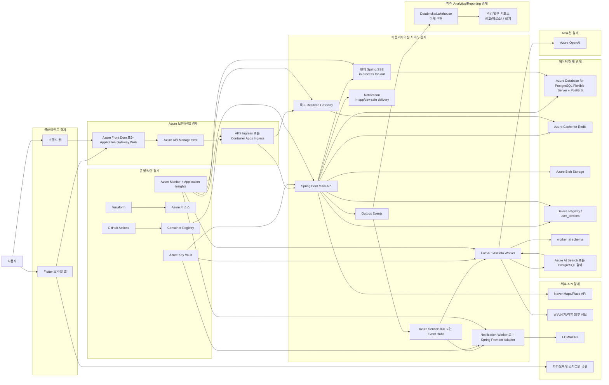
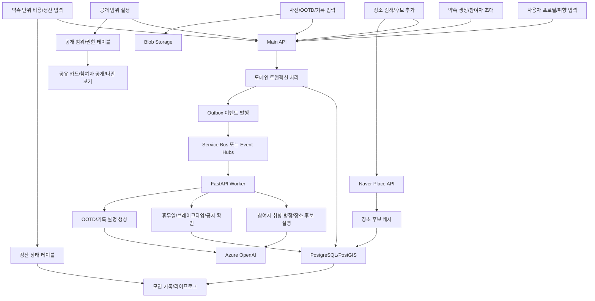
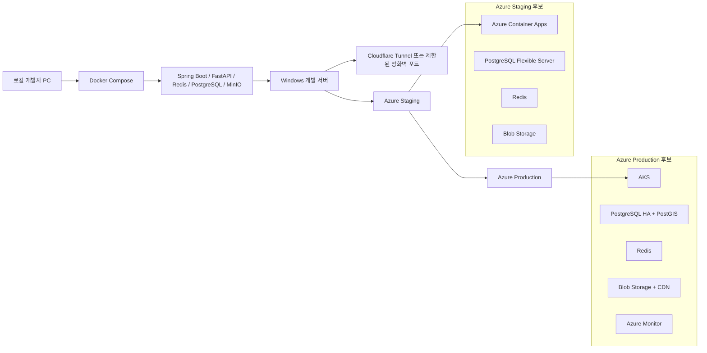

# ONMU 현재 아키텍처 다이어그램과 기술 스택 결정안

## 1. 문서 목적

이 문서는 현재 ONMU의 제품 방향과 대표 피드백을 기준으로, 발표와 개발 계획에 바로 사용할 수 있는 아키텍처 그림과 기술 스택 선택 기준을 정리한다.

핵심 포지션은 다음과 같이 잡는다.

> ONMU는 카카오톡, 지도 앱, 캘린더, 사진첩, 정산 앱에 흩어진 약속 경험을 하나의 흐름으로 묶는 약속 큐레이션 및 라이프로그 플랫폼이다.

초기 구현은 Flutter 모바일 앱을 중심으로 진행하고, 백엔드는 로컬 Docker 환경에서 시작하되 Azure 운영 환경으로 옮길 수 있는 구조를 전제로 둔다.

2026년 6월 현재 Flutter 프론트가 먼저 구체화되면서, 아키텍처는 아래 세 계층을 구분해서 설명한다.

| 계층 | 설명 | 현재 상태 |
| --- | --- | --- |
| Frontend-first Prototype | Flutter route, mock data, 화면 흐름, 디자인 시스템 | 구현 중 |
| Integration Architecture | API contract, repository, full social OAuth, Spring SSE realtime vertical slice, notification, file upload | 구현 중 |
| Target Operation Architecture | Azure edge, API Management, Spring Boot Main API, FastAPI Worker, DB, Redis, Blob, Event/Queue, Monitor | 목표 운영 구조 |

Flutter는 확정 스택이다. 백엔드는 `Spring Boot Main API + FastAPI Worker` 구조로 결정한다. Spring Boot는 모바일 앱이 직접 호출하는 공식 API, 인증/인가, 권한, 트랜잭션을 맡고, FastAPI Worker는 AI/추천/분석성 비동기 작업을 맡는다.

현재 `dev`와 `integration-staging` Windows backend-host는 `services/api-spring` Spring Boot Main API를 기준으로 실행한다. `dev-api.onmu.cloud`와 `int-api.onmu.cloud`는 같은 Spring health/readiness/API 계약을 검증하는 공개 개발 엔드포인트다.

## 2. 다이어그램 관리 방식

현재 저장소에서는 이 문서의 Mermaid 블록을 다이어그램 원본으로 관리한다. 발표 자료나 Notion에 이미지가 필요할 때만 Mermaid를 PNG/SVG로 렌더링해서 별도 산출물로 만든다.

이미지 파일은 저장소의 필수 소스가 아니다. 다이어그램을 수정할 때는 아래 Mermaid 블록을 먼저 고치고, 필요한 경우에만 렌더링 산출물을 생성한다.

## 3. 현재 기준 전체 아키텍처



이 그림에서 발표자가 반드시 설명해야 하는 경계는 네 가지다.

| 경계 | 설명 |
| --- | --- |
| 클라이언트 경계 | 사용자가 직접 만나는 영역이다. 핵심 제품은 Flutter 앱이고, 웹은 브랜드/프로젝트 소개만 담당한다. |
| Azure 보안/진입 경계 | 외부 요청이 처음 들어오는 곳이다. WAF, API 정책, 인증 검증, rate limit을 이 계층에서 설명한다. |
| 애플리케이션 서비스 경계 | Spring Boot Main API는 트랜잭션과 도메인 계약을 맡고, 현재 채팅 실시간 slice는 Spring SSE in-process fan-out으로 검증한다. FastAPI Worker는 추천/분석/AI 작업, Realtime Gateway는 운영 목표의 실시간 fan-out 경계를 맡는다. |
| 외부 API 경계 | 네이버 지도/장소, 공유 채널, 외부 공지 정보는 내부 데이터가 아니므로 호출, 캐시, 장애 대응 정책을 따로 둔다. |

현재 채팅의 source of truth는 `chat_activity_events`이며, SSE는 단일 Spring runtime 안의 delivery layer다. 운영 단계에서 Realtime Gateway를 분리하더라도 Redis나 Gateway가 메시지 원장을 대신하지 않는다. 채팅 메시지 작성은 `notification.requested` outbox와 in-app notification row를 만들 수 있지만, 실제 FCM/APNs provider push는 별도 보안/인프라 검증 뒤 연결한다.

## 4. 제품 데이터 흐름



제품 흐름에서 중요한 점은 감성 기능과 실용 기능을 같은 기록 흐름에 묶는 것이다.

| 데이터 | 저장/처리 위치 | 제품 의미 |
| --- | --- | --- |
| 프로필/취향 | PostgreSQL, 추천 워커 | 개인화 장소 추천의 근거 |
| 약속/참여자 | PostgreSQL, Redis, Realtime Gateway | 실시간 협업과 상태 공유 |
| 장소/외부 API | Naver API, PostGIS, 캐시 | 장소 후보, 거리, 영업 정보, 선택 보조 정보 |
| 사진/OOTD | Blob Storage, FastAPI Worker | 기록, 공유, 재방문 유도 |
| 정산/비용 | PostgreSQL 트랜잭션 | 약속 완료 후 공유/알림까지 이어지는 실용 흐름 |
| 공개 범위 | 권한 테이블, API 정책 | 개인정보 보호와 공유 정책 |

## 5. 로컬 개발에서 Azure 운영까지



현재 팀 상황에서는 `로컬 Docker Compose -> Windows 개발 서버 -> Azure Staging -> Azure Production` 순서가 현실적이다.

단, 운영 플랫폼은 두 가지 선택지가 있다.

| 선택지 | 장점 | 단점 | 추천 상황 |
| --- | --- | --- | --- |
| Azure Container Apps | Kubernetes 운영 부담이 적고, 컨테이너 배포와 스케일링이 빠르다. | Kubernetes 자체 역량을 보여주기는 약하다. | 빠른 staging, 팀 속도 우선, 운영 복잡도 절감 |
| AKS | 실제 Kubernetes 운영 역량, 네트워크/보안/관측성 설계를 보여주기 좋다. | 클러스터 운영, Ingress, Secret, 노드 비용 관리가 어렵다. | 최종 발표에서 인프라 역량을 강하게 보여주고 싶을 때 |

ONMU는 포트폴리오 관점에서 AKS를 목표 아키텍처에 남겨두되, 첫 배포 검증은 Azure Container Apps로 낮게 시작하는 전략이 좋다.

## 6. 대표 피드백 반영용 기술 스택 결정안

| 영역 | 1차 권장 스택 | 이유 | 도입 시점 |
| --- | --- | --- | --- |
| 모바일 앱 | Flutter, go_router, Riverpod, Dio, freezed/json_serializable | iOS/Android를 한 코드베이스로 만들고, 화면/상태/API 모델을 분리하기 좋다. | 즉시 |
| 프로토타입 | FlutterFlow | 스토리보드와 화면 이동 검증에 빠르다. 단, 최종 앱은 Flutter 코드 품질 기준으로 관리한다. | 즉시 |
| 브랜드 웹 | 정적 웹, Azure Static Web Apps 또는 Vercel | 제품 소개/팀 소개만 담당하므로 복잡한 웹앱이 필요 없다. | 발표 전 |
| 메인 API | Spring Boot 3, Java 21, Spring Security, JPA/Querydsl, Flyway | 약속, 참여자, 장소 후보, 정산, 공개 범위, full social OAuth를 처리한다. | Sprint 0-1 |
| AI/Data Worker | `services/workers/ai-data-worker`, FastAPI, Pydantic, Alembic | 장소 추천 설명, OOTD 분석, 기록 설명 생성처럼 비동기/AI 작업을 분리할 때 사용한다. | Sprint 1-2 |
| 실시간 상태 | Spring WebSocket 또는 별도 Realtime Gateway, Redis pub/sub | 출발/도착/지각/미확인 상태를 빠르게 fan-out한다. | Sprint 2 |
| API 경계 | Azure API Management | 모바일 앱과 백엔드 사이에서 인증, rate limit, API 정책을 설명하기 좋다. | Staging |
| WAF/Edge | Azure Front Door WAF 또는 Application Gateway WAF | 외부 요청의 첫 보안 경계를 명확히 보여준다. | Staging |
| 컨테이너 운영 | 로컬 Docker Compose, Staging은 Container Apps, Production 목표는 AKS | 개발 속도와 포트폴리오 아키텍처를 둘 다 챙긴다. | Sprint 0부터 |
| 관계형 DB | Azure Database for PostgreSQL Flexible Server, PostGIS | 약속, 장소, 위치 거리 계산, 정산, 권한 데이터를 한 모델로 관리하기 좋다. | Sprint 0부터 |
| 캐시 | Redis | 장소 API 캐시, 실시간 presence, 짧은 TTL 상태에 적합하다. | Sprint 1 |
| 파일 저장 | Azure Blob Storage, 로컬 MinIO | 사진/OOTD/공유 카드 같은 비정형 미디어를 DB에서 분리한다. | Sprint 1 |
| 검색/RAG | 초기에는 PostgreSQL 검색, 확장 시 Azure AI Search | 처음부터 검색 엔진을 크게 가져가지 않고, 발표용 AI/RAG 확장성을 보여줄 수 있다. | Sprint 2 이후 |
| 이벤트/큐 | Spring Boot Outbox, Azure Service Bus, 필요 시 Event Hubs Kafka endpoint | Spring Boot와 FastAPI Worker, Notification Worker 사이의 작업 요청을 queue/outbox로 관리한다. | Sprint 0부터 |
| AI | Azure OpenAI | 추천 설명, 기록 문장 생성, OOTD 분석 결과 요약에 사용한다. 앱에서 직접 호출하지 않고 worker 뒤에 둔다. | Sprint 2 이후 |
| 인증 | Naver OAuth 우선 + access/refresh token | Flutter에서 Naver 소셜 로그인을 시작하고 Spring Boot가 provider token 검증, access/refresh token 발급, refresh/로그아웃을 관리한다. | Sprint 0 |
| DB Migration | Spring Boot Flyway + FastAPI Alembic | core domain은 Flyway, `worker_ai` schema는 Alembic이 관리한다. | Sprint 0부터 |
| 비밀값 | Azure Key Vault, Managed Identity | 외부 API 키, DB 비밀번호, push provider credential을 코드/GitHub/Jira에 남기지 않는다. | Staging |
| 관측성 | Azure Monitor, Application Insights, OpenTelemetry | Spring/FastAPI/Realtime의 요청 흐름을 trace로 묶어 보여준다. | Sprint 1부터 |
| IaC/CI | Terraform, GitHub Actions, Dependabot | 로컬에서 Azure로 옮기는 과정을 반복 가능하게 만들고, 공개 저장소 운영 기준을 세운다. | Sprint 0부터 |

## 7. 기술 스택별 사용 방식

이 섹션은 발표 중 "그 기술을 어디에 쓰나요?"라는 질문에 답하기 위한 기준이다. 기술 이름을 나열하지 말고, ONMU의 어떤 문제를 해결하는지와 어느 데이터가 지나가는지를 함께 설명한다.

### 7.1 클라이언트와 화면

| 기술 | ONMU에서 쓰는 위치 | 처리하는 것 | 선택 이유 |
| --- | --- | --- | --- |
| Flutter | iOS/Android 모바일 앱 | 약속 생성, 장소 선택, 실시간 상태, OOTD, 기록, 마이 페이지 | 핵심 서비스가 모바일 네이티브 중심이고 한 코드베이스로 양쪽 앱을 만들 수 있다. |
| go_router | Flutter 라우팅 | 온보딩, 캐릭터 생성, 약속 생성, 기록 상세, 마이 페이지 이동 | URL/route 기반으로 화면 흐름을 명확히 관리한다. |
| Riverpod | Flutter 상태 관리 | 로그인 상태, 캐릭터 draft, 약속 draft, 장소 후보, 정산 상태 | 화면 상태와 API 상태를 분리해 테스트하기 쉽다. |
| Dio | Flutter API client | REST API 요청, 인증 토큰 첨부, 에러 처리 | interceptor로 인증/재시도/로그 마스킹을 관리하기 좋다. |
| FlutterFlow | 초기 프로토타입 | 스토리보드 화면 연결, 사용자 흐름 검증 | 실제 개발 전 화면 흐름을 빠르게 검증한다. 최종 앱은 Flutter 코드 기준으로 정리한다. |

### 7.2 백엔드 API와 도메인

| 기술 | ONMU에서 쓰는 위치 | 처리하는 것 | 선택 이유 |
| --- | --- | --- | --- |
| Spring Boot | Main API | 사용자, 약속, 참여자, 장소 후보, 정산, 공개 범위, 기록 저장 | 트랜잭션이 중요한 도메인 로직을 안정적으로 처리한다. |
| Spring Security | Main API 인증/인가 | 로그인 사용자 식별, role/permission, API 보호 | 공개/비공개 기록, 참여자 전용 데이터 같은 권한 판단이 필요하다. |
| JPA/Querydsl | Main API 데이터 접근 | 약속 목록, 장소 후보, 기록 조회, 정산 상태 조회 | 일반 CRUD와 조건 검색을 타입 안정성 있게 관리한다. |
| Flyway | DB migration | 테이블 생성/변경 이력 | 팀원이 같은 DB 스키마로 개발하고, staging/prod 배포 때 변경을 추적한다. |
| FastAPI | AI/Data Worker | 장소 후보 설명, OOTD 분석, 추천 설명, 비동기 데이터 처리 | Python AI/데이터 라이브러리와 붙이기 쉽고, Main API와 역할을 분리할 수 있다. |

Spring Boot와 FastAPI를 나누는 기준은 단순하다. 사용자 요청에 즉시 일관성 있게 처리되어야 하는 것은 Main API가 맡고, 시간이 걸리거나 AI/분석 성격이 강한 작업은 FastAPI Worker로 넘긴다.

### 7.2.1 확정된 백엔드 구조

| 영역 | 확정 기술 | 책임 |
| --- | --- | --- |
| Main API | `services/api-spring`, Spring Boot 3 | Naver OAuth 우선, access/refresh token, 사용자/session, groups/plans/place-candidates/votes/settlements/records API, 권한, 트랜잭션, Flyway core migration |
| AI/Data Worker | `services/workers/ai-data-worker`, FastAPI | 장소 후보 설명, 취향/추천 계산, OOTD/기록 설명 생성, AI 호출, 비동기 분석, Alembic worker schema migration |
| Public API | Spring Boot `/api/v1` | Flutter 앱이 직접 호출하는 단일 API 계약 |
| Worker API/Event | queue/outbox | 모바일 앱에서 직접 호출하지 않고 Spring Boot가 작업 요청과 결과 반영을 관리 |

기존 Spring Boot 단독, FastAPI 단독, Node/TypeScript API는 검토안으로 남긴다. 구현 기준은 `Spring Boot Main API + FastAPI Worker`이며, Sprint 0에서는 선택지 비교가 아니라 이 구조의 세로 흐름을 작게 검증한다.

### 7.3 데이터 저장소

| 기술 | ONMU에서 쓰는 위치 | 처리하는 것 | 선택 이유 |
| --- | --- | --- | --- |
| PostgreSQL | 메인 관계형 DB | 사용자, 약속, 참여자, 장소 후보, 기록, 정산, 공개 범위 | 서비스의 핵심 정합성을 지키는 중심 저장소다. |
| PostGIS | PostgreSQL 확장 | 장소 좌표, 거리 계산, 반경 검색, 근처 후보 조회 | 장소 추천과 지도 기반 필터링에 필요하다. |
| Redis | 캐시/짧은 상태 저장 | 장소 API 응답 캐시, 참여자 presence, 실시간 방 상태, rate limit 보조 | 빠르게 변하거나 짧게 보관할 상태를 DB에 계속 쓰지 않게 한다. |
| Azure Blob Storage | 운영 파일 저장소 | OOTD 사진, 기록 이미지, 공유 카드 이미지, 캐릭터 결과 이미지 | 큰 바이너리 파일을 DB와 분리하고 CDN 연동이 쉽다. |
| MinIO | 로컬 개발용 오브젝트 스토리지 | Blob Storage와 같은 방식의 사진/이미지 저장 mock | 로컬 Docker에서 Azure Blob과 유사한 개발 경험을 제공한다. |

Redis는 영구 데이터의 원본이 아니다. ONMU에서 원본은 PostgreSQL과 Blob Storage이고, Redis는 빠른 조회와 실시간 상태 보조에만 사용한다.

### 7.4 이벤트와 비동기 처리

| 기술 | ONMU에서 쓰는 위치 | 처리하는 것 | 선택 이유 |
| --- | --- | --- | --- |
| Outbox Pattern | Spring Boot 내부 | 약속 생성, 장소 후보 추가, 기록 생성, 정산 생성, AI 작업 요청 후 이벤트 발행 예약 | DB 저장과 이벤트 발행 사이의 유실을 줄인다. |
| Azure Service Bus | 기본 비동기 큐 | 추천 작업 요청, 알림 요청, 이미지 분석 요청, 정산 완료 후 기록 갱신 | Spring Boot와 FastAPI Worker/Notification Worker를 느슨하게 연결하고 재시도/장애 격리를 쉽게 한다. |
| Kafka/Event Hubs | 확장 이벤트 스트림 | 실시간 행동 로그, 추천 학습용 이벤트, 대량 상태 이벤트 | Kafka 역량을 보여주거나 스트리밍 분석이 필요할 때 확장한다. |
| GitHub Actions scheduled job | 가벼운 배치 | 문서 링크 점검, 의존성 점검, 간단한 health check | 별도 배치 플랫폼 없이 반복 검증을 자동화한다. |

초기에는 Kafka를 바로 운영하지 않는다. 발표에서는 `Service Bus로 업무 이벤트를 안정적으로 처리하고, 대량 이벤트/스트리밍 분석이 필요해지면 Event Hubs의 Kafka 호환 endpoint로 확장한다`고 설명한다.

### 7.5 실시간 협업

| 기술 | ONMU에서 쓰는 위치 | 처리하는 것 | 선택 이유 |
| --- | --- | --- | --- |
| WebSocket | Realtime Gateway | 출발, 도착, 지각, 미확인, 투표 상태 fan-out | 약속 방 참여자에게 상태 변화를 즉시 보여준다. |
| Redis pub/sub | Realtime Gateway 내부 | 여러 서버 인스턴스 간 방 이벤트 전달 | 서버가 여러 개로 늘어도 같은 방 참여자에게 이벤트를 보낼 수 있다. |
| Redis TTL key | Presence 상태 | 접속 중, 마지막 확인 시간, 임시 typing/active 상태 | 자동 만료가 필요한 짧은 상태에 적합하다. |

실시간 상태는 DB에 전부 저장하지 않는다. 최종 기록에 필요한 이벤트만 PostgreSQL에 남기고, 화면 표시용 임시 상태는 Redis에 둔다.

### 7.6 검색, 추천, AI

| 기술 | ONMU에서 쓰는 위치 | 처리하는 것 | 선택 이유 |
| --- | --- | --- | --- |
| PostgreSQL Full Text/Search | 초기 검색 | 장소명, 태그, 기록 제목, 메모 검색 | 초기에는 별도 검색 엔진 없이 단순하게 시작한다. |
| Azure AI Search | 확장 검색/RAG | 기록 검색, 취향 기반 후보 검색, AI 답변 근거 검색 | 발표용 AI/RAG 확장성과 운영형 검색 구조를 보여줄 수 있다. |
| Azure OpenAI | AI 기능 | 추천 설명 생성, OOTD/기록 문장 생성, 장소 선택 이유 요약 | 사용자가 납득할 수 있는 보조 설명을 만든다. |
| FastAPI Worker | AI 호출 중간 계층 | prompt 구성, 결과 검증, fallback, 비용 제어 | 모바일 앱이나 Spring API가 AI 모델을 직접 호출하지 않게 한다. |

Azure OpenAI는 의사결정을 대신하는 도구가 아니라 설명과 보조 판단을 만드는 계층으로 둔다. 장소 후보 설명은 취향, 거리, 시간, 휴무, 정산/모임 유형 같은 구조화 데이터를 근거로 만든다.

### 7.6.1 미래 Analytics/Reporting Layer

Databricks 기반 주간/월간 리포트, 기업용 집계 데이터, 광고 세그먼트, OOTD/persona feature는 미래 레이어로 둔다. 지금 구현 범위에는 Databricks 연결, Bronze/Silver/Gold table, 광고 API 연동, persona segmentation을 포함하지 않는다.

다만 core 설계에는 analytics가 불가능해지지 않도록 `outbox_events`, consent/privacy, 익명화 가능한 subject 식별자, 장소/기록/OOTD taxonomy 여지를 남긴다.

### 7.7 외부 API

| 기술 | ONMU에서 쓰는 위치 | 처리하는 것 | 선택 이유 |
| --- | --- | --- | --- |
| Naver Maps/Place API | 장소 도메인 | 장소 검색, 좌표, 카테고리, 주소, 지도 표시용 데이터 | 국내 장소 데이터와 사용자 친숙도가 높다. |
| 외부 공지/휴무 정보 | 장소 선택 보조 | 휴무일, 브레이크타임, 공지성 정보 | 장소 선택 실패를 줄이기 위한 보조 데이터다. |
| Kakao/Instagram 공유 | Share 도메인 | 공유 카드, 이미지 저장, 외부 공유 | 기록/라이프로그의 확산과 재방문을 유도한다. |

외부 API 응답은 그대로 믿지 않고, 캐시 시간과 출처를 함께 저장한다. 장애가 나면 최근 캐시 또는 수동 입력으로 fallback한다.

### 7.8 보안과 운영

| 기술 | ONMU에서 쓰는 위치 | 처리하는 것 | 선택 이유 |
| --- | --- | --- | --- |
| Azure Front Door WAF 또는 Application Gateway WAF | 외부 진입 경계 | 웹 공격 차단, TLS, routing | 인터넷에서 들어오는 요청의 첫 방어선이다. |
| Azure API Management | API 정책 계층 | rate limit, 인증 검증, API versioning, 외부 노출 제어 | 모바일 앱과 백엔드 사이의 정책을 한 곳에서 관리한다. |
| Azure Key Vault | 비밀값 저장 | DB 비밀번호, Naver API key, Azure OpenAI key, JWT secret | 비밀값을 코드, GitHub, Jira, Notion에 남기지 않는다. |
| Managed Identity | Azure 리소스 간 인증 | 앱이 Key Vault, Storage 등에 접근 | 비밀번호 없는 리소스 접근을 목표로 한다. |
| Azure Monitor/Application Insights | 관측성 | API latency, error rate, trace, dependency call, worker 실패 | 발표에서 운영 가능한 서비스라는 근거가 된다. |
| OpenTelemetry | 서비스 간 trace | Flutter 요청에서 API, worker, DB까지 흐름 추적 | 장애 원인을 서비스 경계별로 찾기 쉽다. |

보안 설명의 핵심은 `민감 데이터는 DB/Storage에 분리 저장하고, 접근은 인증/인가/API 정책/Key Vault로 통제한다`는 것이다.

Notification / Push / Devices 영역에서는 `notifications`를 사용자별 inbox source of truth로 두고, 실제 provider 발송 시도와 결과는 `notification_deliveries` projection으로 분리한다. 현재 dev-safe provider는 실제 FCM/APNs 발송 없이 `provider=dev`, `status=skipped_dev`를 남긴다. Terraform은 Key Vault, Managed Identity, Service Bus, Application Insights 같은 리소스 경계를 만들 수 있지만 `notifications`, `notification_deliveries`, `notification_preferences`, `user_devices` table은 Spring Flyway가 소유한다. 세부 기준은 [Notification / Push / Devices 아키텍처](./notification-push-devices-architecture.md)를 따른다.

### 7.9 배포와 인프라

| 기술 | ONMU에서 쓰는 위치 | 처리하는 것 | 선택 이유 |
| --- | --- | --- | --- |
| Docker Compose | 로컬 개발 | Spring Boot, FastAPI, PostgreSQL, Redis, MinIO 실행 | 팀원 개발 환경을 맞추고 Windows 개발 서버로 옮기기 쉽다. |
| Azure Container Apps | Staging 후보 | 컨테이너 API/Worker 배포 | AKS보다 운영 부담이 낮아 빠른 검증에 좋다. |
| AKS | Production 목표 아키텍처 | 서비스, Ingress, Secret, autoscale, observability | 최종 발표에서 Kubernetes 운영 설계를 보여줄 수 있다. |
| Terraform | IaC | Azure 리소스 생성, 네트워크, DB, Storage, monitoring | 로컬에서 클라우드로 옮길 때 환경을 반복 가능하게 만든다. |
| GitHub Actions | CI/CD | lint, test, build, Docker image, deploy, PR check | Jira/GitHub workflow와 연결해 협업 기준을 만든다. |
| Dependabot | 의존성 관리 | GitHub Actions, npm, Flutter pub, Gradle/Maven 업데이트 | public 저장소에서 보안 업데이트를 놓치지 않는다. |

개발 순서는 `Docker Compose로 로컬 통합 -> Windows 개발 서버로 팀 테스트 -> Container Apps staging -> AKS 목표 구조`가 가장 현실적이다.

### 7.9.1 Terraform 전환 Agent Notes

이 섹션은 나중에 AI Agent가 Windows dev backend와 Docker Compose 기준을 Azure/Terraform staging으로 옮길 때 먼저 읽는 작업 기준이다. 실제 Azure 리소스 생성, 비용 발생, DNS 변경, secret 쓰기, `terraform apply`는 사람 승인 후에만 실행한다.

Terraform 전환의 목표는 "현재 dev에서 검증된 Spring Main API 계약을 Azure staging에 반복 가능하게 배치"하는 것이다. 앱 기능이나 DB schema를 Terraform 전환 중에 선제 변경하지 않는다.

| 구분 | 현재 기준 | Terraform 전환 기준 |
| --- | --- | --- |
| Main API | `services/api-spring` Spring Boot, Windows dev backend-host | Azure Container Apps staging 또는 AKS service로 배포 |
| Worker | `services/workers/ai-data-worker`, queue/outbox 소비 목표 | Container Apps job/service 또는 AKS deployment로 분리 |
| DB | Docker PostgreSQL/Flyway, dev PostgreSQL | Azure Database for PostgreSQL Flexible Server + Flyway migration |
| Object storage | MinIO, `/api/v1/media/upload` contract | Azure Blob Storage. Flutter는 API 응답 URL contract만 본다 |
| Cache/realtime 보조 | Redis dev dependency, 현재 채팅은 Spring SSE in-process | Azure Cache for Redis. 운영 Realtime Gateway를 붙일 때만 fan-out 계층에 연결 |
| Event/queue | `outbox_events`, 외부 broker 없음 또는 dev-safe 처리 | Azure Service Bus를 1차 선택. Kafka 호환성이 필요하면 Event Hubs 검토 |
| Notification/push | `notifications` inbox, `user_devices` push token readiness, `provider=dev` skipped delivery | Key Vault provider secret reference, Managed Identity, Service Bus 기반 delivery fan-out, Application Insights push metric |
| Secrets | 로컬 env, GitHub Secrets, Key Vault secret name 문서화 | Azure Key Vault + Managed Identity. Terraform에는 secret 값이 아니라 secret name/reference만 둔다 |
| Observability | access log, GitHub Actions, Windows logs | Azure Monitor/Application Insights/OpenTelemetry |
| Edge | Cloudflare Tunnel 기반 dev endpoint | Azure Front Door 또는 Application Gateway WAF + API Management + Container ingress |

Terraform 작업 단위는 아래 순서로 쪼갠다.

1. `infra/terraform` skeleton만 만든다: provider, backend, environment folder, naming locals, common tags.
2. 네트워크/리소스 그룹/Log Analytics/Key Vault를 먼저 만든다. secret 값은 넣지 않고 secret 이름과 access policy/RBAC만 정의한다.
3. PostgreSQL Flexible Server, Redis, Storage, Container Registry를 만든다. DB schema 변경은 Flyway가 맡고 Terraform은 schema DDL을 만들지 않는다.
4. Spring Main API container 배포를 만든다. `/healthz`, `/readyz`, `/api/v1/**` 인증/CORS env를 먼저 검증한다.
5. FastAPI Worker와 Service Bus 연결을 붙인다. Flutter 앱은 Worker를 직접 호출하지 않는다.
6. Notification provider delivery는 dev-safe `provider=dev` 결과와 실제 FCM/APNs 발송을 분리해 붙인다. Provider secret 값은 Key Vault에만 두고, Terraform은 secret name/reference와 Managed Identity 권한만 관리한다.
7. Realtime Gateway는 현재 Spring SSE slice가 안정된 뒤 별도 module로 추가한다. Redis나 Gateway를 `chat_activity_events`의 source of truth로 만들지 않는다.
8. API Management/WAF/DNS를 붙인다. `dev-api.onmu.cloud`, `int-api.onmu.cloud`, future `api.onmu.cloud`의 역할을 문서에 함께 갱신한다.
9. GitHub Actions는 `terraform fmt`, `terraform validate`, `terraform plan`을 PR check로 먼저 붙이고, `apply`는 protected environment approval 뒤에만 허용한다.

Agent가 Terraform 코드를 작성하기 전에 확인할 입력은 다음이다.

| 입력 | 확인 위치 | 주의 |
| --- | --- | --- |
| API runtime env | `services/api-spring/README.md`, `docs/operations/spring-runtime-transition-workflow.md` | secret 값 출력 금지. env var 이름과 Key Vault secret name만 사용 |
| API contract | `docs/architecture/api-contract-map.md` | Flutter가 직접 호출하는 표면은 Spring `/api/v1`만 |
| Chat/realtime boundary | `docs/architecture/chat-activity-architecture.md` | 현재 Spring SSE와 목표 Realtime Gateway를 분리 |
| Notification/push boundary | `docs/architecture/api-contract-map.md`, `docs/data_dict/ONMU 데이터 사전.md` | in-app inbox, dev-safe delivery, 실제 FCM/APNs provider delivery를 분리 |
| Data ownership | `docs/data_dict/ONMU 데이터 사전.md` | Spring Flyway는 core schema, FastAPI Alembic은 `worker_ai` schema |
| Windows dev baseline | `docs/operations/windows-backend-server.md`, `docs/operations/spring-runtime-transition-workflow.md` | Azure 전환 전 dev endpoint와 runtime이 Spring인지 확인 |
| AI 도구 권한 | `docs/development/team-ai-tooling.md` | Terraform `apply`, 리소스 삭제, DNS 변경은 사람 승인 후 실행 |

Terraform 전환 중 금지한다.

- Terraform state, `.tfvars`, plan output에 secret 값을 남기지 않는다.
- Flutter bundle, dart-define, 문서, PR 본문에 JWT signing secret, OAuth client secret, DB password를 넣지 않는다.
- Terraform으로 core DB table을 직접 만들거나 수정하지 않는다. schema는 Spring Flyway와 Worker Alembic이 소유한다.
- dev/main에 직접 push하지 않는다.
- 비용 발생 리소스, public endpoint, DNS, WAF/APIM 정책을 승인 없이 apply하지 않는다.
- 현재 Spring SSE slice를 Realtime Gateway 구현으로 착각해 Redis/Gateway에 메시지 원장을 만들지 않는다.
- dev-safe `skipped_dev` notification delivery를 실제 FCM/APNs 발송 성공으로 해석하지 않는다.

## 8. Frontend-first Prototype 반영

현재 Flutter route는 운영 API보다 먼저 구체화됐다. 그래서 화면 용어와 서버 리소스명을 아래처럼 구분한다.

| 사용자-facing 용어 | Flutter route 기준 | 운영 API/DB 권장명 | 이유 |
| --- | --- | --- | --- |
| 온모임 | `/groups`, 기존 legacy `/onmoim` redirect | `Group` | UI 이름이 바뀌어도 모임 리소스는 안정적으로 유지된다. |
| 약속 | `/groups/{groupId}/plans` | `Plan` | 장소, 투표, 정산의 기준 단위다. |
| 장소 후보 | `/place-candidates` | `PlaceCandidate` | 후보 리스트와 실제 일정 등록 장소를 분리한다. |
| 기록 | `/records` | `Record`, `Memory` | 전역 기록과 모임 기록을 같은 기록 계층에서 연결한다. |
| 정산 | `/groups/{groupId}/plans/{planId}/settlements` | `Settlement` | 모임 단위가 아니라 약속 단위로만 생성한다. |

하단 탭은 `홈 / 온모임 / 기록 / 마이`로 유지한다. route contract는 `RoutePaths`를 기준으로 관리하고, 기존 prototype URL 호환이 꼭 필요할 때만 `app_router.dart`에 명시적인 redirect route를 추가한다.

## 9. 기능 피드백을 아키텍처에 반영하는 방법

| 피드백 | 아키텍처 반영 |
| --- | --- |
| 약속 단위 N분의 1 정산 | `Settlement`를 `Plan` 하위 도메인으로 두고 비용 항목, 대상자, 미리보기, 최종 결과를 PostgreSQL 트랜잭션으로 관리 |
| 공개/비공개/공유 범위 | `Privacy` 또는 `VisibilityPolicy` 테이블 추가, API 응답마다 권한 필터 적용 |
| 기존 앱과의 차별점 | 카카오톡/지도/캘린더/사진첩/정산 앱에 흩어진 흐름을 하나의 이벤트 흐름으로 설명 |
| Azure 중심 아키텍처 | API Management, Key Vault, Azure Monitor, Azure OpenAI, Azure Database for PostgreSQL을 중심에 배치 |
| 장소 흐름 | 장소 검색은 지도 화면 안에서 이어가고, 후보 추가와 일정 바로 등록을 모두 지원한다. 점수, 운영 리스크, 후보 비교 화면은 현재 합의에서 제외한다. |
| 외부 API 경계 | Naver API와 공유 채널은 외부 영역으로 분리하고, 캐시/장애/fallback 정책을 명시 |
| 보안 경계 | WAF, 인증, API 정책, 비밀값 관리, private network, 로그 마스킹을 별도 계층으로 표시 |

## 10. 지금 바로 추가하면 좋은 도메인

현재 도메인 경계에 아래 세 가지를 추가하면 피드백 반영력이 좋아진다.

| 도메인 | 책임 |
| --- | --- |
| ChatActivity | 채팅 메시지, 투표 카드, 정산 카드, 약속 변경 알림 |
| Settlement | 약속 단위 결제 항목, 대상자, 미리보기, 최종 송금 요약, 정산 완료 여부 |
| Privacy | 기록 공개 범위, 항목별 공개 여부, 외부 공유 정책 |
| Share | 카카오톡 공유 카드, 인스타그램 저장 이미지, 공유 링크 |
| Notification | 약속, 투표, 정산, 기록 이벤트의 사용자별 알림 |
| Devices / Push | 로그인 사용자 기기 token readiness, provider 발송 시도/결과, 앱 밖 알림 |
| AnalyticsEvent | 미래 리포팅을 위한 비식별 이벤트와 taxonomy 연결 |

초기 구현 범위는 작게 잡는다.

1. 약속별 결제 항목 입력
2. 결제 항목별 정산 대상자 선택
3. 최종 정산 미리보기와 결과 저장
4. 채팅과 알림에 정산 결과 카드 공유
5. 기록 공개 범위 `나만 보기`, `참여자만 보기`, `외부 공유용 이미지`부터 지원

Settlement의 current-to-target 경계는 [Settlement 아키텍처](./settlement-architecture.md)를 기준으로 관리한다. 현재 Spring 구현은 `settlement_items`, `settlement_item_targets`, `settlement_transfers` structured table을 우선 읽고 JSON `payload`는 compact fallback으로 유지한다. Terraform은 PostgreSQL 서버, 네트워크, queue, runtime, Key Vault, observability 리소스 경계를 만들 수 있지만, 정산 core table schema와 migration은 Spring Flyway가 계속 소유한다.

## 11. 발표용 한 장 요약 문구

발표에서는 기술을 나열하기보다 아래 흐름으로 설명한다.

```text
Flutter 앱에서 약속과 취향, 장소 후보, 사진, 정산 정보를 입력한다.
Main API가 도메인 트랜잭션과 권한을 처리하고,
PostgreSQL/PostGIS가 약속/장소/정산/공개 범위를 저장한다.
FastAPI Worker는 Azure OpenAI와 장소 데이터를 활용해 추천과 기록 설명을 생성한다.
Azure API Management, WAF, Key Vault, Monitor가 보안과 운영 경계를 담당한다.
Naver Place API와 공유 채널은 외부 API 경계로 분리한다.
```

## 12. 확정된 세부 구현 기준

아래 표는 빠르게 볼 수 있는 확정 기준이다. 각 항목의 다른 선택지, 장단점, 결정 이유는 [백엔드 기술스택 결정안](./backend-stack-options.md)의 `세부 결정과 선택지 비교` 섹션에서 자세히 비교한다.

| 결정 항목 | 확정값 | 나중에 바꿀 수 있는 대안 |
| --- | --- | --- |
| Spring Boot 폴더 위치 | `services/api-spring` | 별도 monorepo로 분리할 정도의 경계가 생기면 새 repo |
| FastAPI Worker 폴더 위치 | `services/workers/ai-data-worker` | notification/media worker는 Sprint 2 이후 팀 논의 |
| 운영 컴퓨트 | Staging은 Container Apps, Production 목표는 AKS | 비용/운영 부담이 크면 Production도 Container Apps |
| 첫 인증 제공자 | Naver 우선 | Provider 추가/제거는 auth identity 테이블로 흡수 |
| session 방식 | access token + refresh token, Flutter secure storage | 웹 surface가 커지면 cookie session 별도 검토 |
| Worker 연결 | queue/outbox | 내부 HTTP는 smoke/mock 보조로만 사용 |
| 투표 리소스 | `POST /api/v1/groups/{groupId}/votes` 자체 생성 리소스 | plan 하위 vote route는 alias/compat로만 검토 |
| 장소 검색 | `POST /api/v1/place-search` | GET은 단순 dev 호환용으로만 검토 |
| DB Migration | Spring Boot Flyway + FastAPI Alembic | worker schema가 커지면 별도 worker DB 검토 |
| 검색 엔진 | PostgreSQL 검색으로 시작 | Azure AI Search, OpenSearch |
| 이벤트 브로커 | Service Bus로 시작 | Kafka 호환성이 필요하면 Event Hubs |
| 정산 범위 | 약속 단위 정산 상태 관리 | 실제 결제/송금 연동은 Toss Payments/PortOne 등 별도 검토 |

## 13. 함께 관리하는 세부 문서

| 문서 | 역할 |
| --- | --- |
| [Flutter 프론트 아키텍처](./frontend-architecture.md) | Flutter route, feature 구조, ViewModel/repository 기준 |
| [API Contract Map](./api-contract-map.md) | 화면별 API와 read model |
| [Notification / Push / Devices 아키텍처](./notification-push-devices-architecture.md) | 알림 inbox, push delivery, device registry의 Current-to-Target 경계 |
| [백엔드 결정 원본과 기술스택](./backend-stack-options.md) | Spring Boot Main API + FastAPI Worker 확정안, 선택지 비교, 세부 결정 |
| [Settlement 아키텍처](./settlement-architecture.md) | 정산 draft/item/target/preview/create/result와 Terraform migration 경계 |
| [데이터/리포팅 로드맵](./data-analytics-reporting-roadmap.md) | Databricks, 기업용 리포트, 광고 세그먼트, OOTD/persona feature의 미래 확장 |
| [온모임 제품 플로우](../product/onmoim-flow.md) | 온모임, 채팅, 투표, 기록, 약속 관계 |
| [장소 플로우](../product/place-flow.md) | 후보 리스트, 지도 검색, 일정 등록, 투표 생성 |
| [정산 플로우](../product/settlement-flow.md) | 약속 단위 정산 생성, 미리보기, 결과, 공유 |
| [Flutter Routing 운영 규칙](../development/flutter-routing.md) | `RoutePaths`, 운영 route, demo seed 금지 규칙 |
| [Flutter UI QA 체크리스트](../development/flutter-ui-qa.md) | iPhone 17 viewport와 화면 깨짐 점검 |
| [Mock to API Migration](../development/mock-to-api-migration.md) | mock repository에서 실제 API로 전환하는 단계 |

## 14. 공식 참고 문서

- [Azure Container Apps documentation](https://learn.microsoft.com/azure/container-apps/services)
- [What is Azure Kubernetes Service](https://learn.microsoft.com/en-us/azure/aks/what-is-aks)
- [Azure API Management authentication and authorization](https://learn.microsoft.com/en-us/azure/api-management/authentication-authorization-overview)
- [Azure Database for PostgreSQL Flexible Server](https://learn.microsoft.com/en-us/azure/postgresql/flexible-server/how-to-deploy-on-azure-free-account)
- [Azure Event Hubs](https://learn.microsoft.com/en-ca/azure/event-hubs/event-hubs-about)
- [Azure Service Bus](https://learn.microsoft.com/en-us/azure/service-bus-messaging/service-bus-messaging-overview)
- [Azure Key Vault](https://learn.microsoft.com/en-us/azure/key-vault/)
- [Azure Monitor Application Insights with OpenTelemetry](https://learn.microsoft.com/en-us/azure/azure-monitor/app/opentelemetry)
- [Azure AI Search vector search](https://learn.microsoft.com/en-us/azure/search/vector-search-overview)
- [Azure OpenAI in Azure AI Foundry Models](https://learn.microsoft.com/en-us/azure/ai-services/openai/)
- [Azure Blob Storage](https://learn.microsoft.com/en-us/azure/storage/blobs/storage-blobs-overview)
- [Microsoft Entra External ID](https://learn.microsoft.com/en-us/entra/external-id/external-identities-overview)
