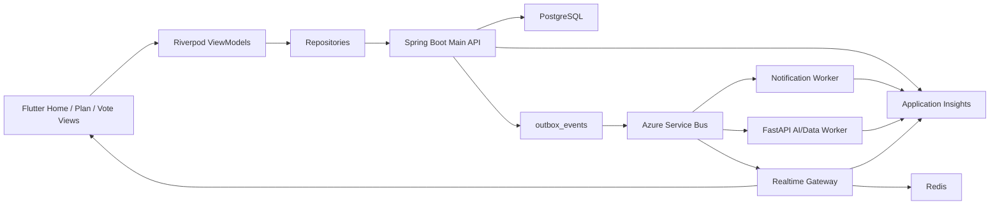

# ONMU 홈 / 약속 / 투표 아키텍처

## 목적

이 문서는 ONMU의 홈 화면, 약속, 약속 참여자, 투표/결정 흐름을 Current Implementation, Target Architecture, Current-to-Target Delta로 나누어 정리한다. 목표는 Terraform/Azure migration 때 어떤 리소스를 만들고, 어떤 계약과 데이터 모델을 Spring/Flutter/Flyway가 계속 소유해야 하는지 판단할 수 있게 하는 것이다.

홈 화면은 별도 원장 도메인이 아니라 사용자가 지금 행동해야 할 약속, 투표, 알림, 기록을 모아 보여 주는 read model이다. 약속은 장소 후보, 투표, 정산, 기록, ChatActivity 카드의 기준 단위이며, 투표는 모임 안에서 장소 후보와 일정 결정을 실행 가능한 action card로 바꾸는 Decision 경계다.

## 제품 원칙

| 원칙 | 의미 |
| --- | --- |
| 홈은 다음 행동을 보여 준다 | 사용자가 앱을 열었을 때 오늘 약속, 다가오는 약속, 진행 중 투표, 알림을 바로 이어갈 수 있어야 한다. |
| 약속은 ONMU의 작업 단위다 | 장소 후보, 일정 장소, 투표, 정산, 기록은 약속을 기준으로 연결된다. |
| 참여자는 모임 멤버와 분리한다 | 모임에 속한 모든 사람이 항상 모든 약속의 참여자는 아니다. |
| 투표는 Decision 원장이다 | 장소, 시간, 일반 선택을 같은 `Vote` 계약으로 다루고, 실제 선택지와 응답은 정규화된 테이블로 관리한다. |
| 화면 read model과 원장을 구분한다 | Flutter 카드 표시용 필드와 DB source of truth를 혼동하지 않는다. |
| Flutter는 Spring Boot Main API만 직접 호출한다 | Flutter 앱은 PostgreSQL, Redis, Service Bus, Worker, Key Vault를 직접 호출하지 않는다. |

## Current Implementation

### Spring API

현재 Spring Boot Main API는 홈 요약, 모임, 약속, 약속 참여자, 투표 계약을 `/api/v1` 아래에 제공한다.

| 기능 | API | 현재 구현 |
| --- | --- | --- |
| 홈 요약 | `GET /api/v1/home/summary` | 첫 모임 기준 viewer, groups, upcomingPlans, activeVotes, nextPlan read model 반환 |
| 모임 홈 | `GET /api/v1/groups/{groupId}/summary` | group, plans, votes를 한 번에 반환 |
| 약속 목록 | `GET /api/v1/groups/{groupId}/plans` | viewer가 active participant인 약속 목록 반환 경로가 있음 |
| 약속 생성 | `POST /api/v1/groups/{groupId}/plans` | `plans` row 생성, 생성자를 `plan_participants`에 joined/accepted로 upsert, 초기 `participantUserIds` 추가 |
| 약속 수정 | `PATCH /api/v1/groups/{groupId}/plans/{planId}` | title, startsAt, endsAt, status, memo, placeName 부분 갱신 |
| 약속 상세 | `GET /api/v1/groups/{groupId}/plans/{planId}` | plan card에 active participants, members, memberCount 포함 |
| 참여자 목록 | `GET /api/v1/groups/{groupId}/plans/{planId}/participants` | active participant만 반환 |
| 내 참여 응답 | `PUT/PATCH /api/v1/groups/{groupId}/plans/{planId}/participants/me` | 현재 사용자 참여 row upsert, status/response 갱신 |
| 참여자 추가 | `POST /api/v1/groups/{groupId}/plans/{planId}/participants` | 요청 userId가 같은 group member인지 확인한 뒤 joined/accepted로 upsert |
| 투표 목록 | `GET /api/v1/groups/{groupId}/votes` | 선택 query `targetType`, `targetId`로 필터 가능 |
| 투표 생성 | `POST /api/v1/groups/{groupId}/votes` | `votes`, `vote_options` 저장, 장소 후보 기반 투표 지원 |
| 투표 상세 | `GET /api/v1/groups/{groupId}/votes/{voteId}` | options를 정규화 row 우선으로 반환하고 없으면 payload fallback |

현재 약속과 투표 write 경로는 `outbox_events`를 같은 DB transaction 안에 기록한다. 약속 생성/수정/참여자 변경은 `plan.created`, `plan.updated`, `plan.participant_updated`, `plan.participant_added` 이벤트를 남기고, 투표 생성은 `vote.created` 이벤트를 남긴다.

### Flutter 흐름

Flutter는 Riverpod ViewModel과 Repository 경계를 사용한다.

| 화면/흐름 | 현재 구현 |
| --- | --- |
| 홈 | `HomeViewModel`이 `GroupRepository.fetchGroups`, `fetchPlans`를 조합해 오늘/다가오는/캘린더 약속을 계산 |
| 약속 상세 | `PlanDetailViewModel`이 `PlanRepository.fetchPlan`, `fetchPlanParticipants`를 읽고 `PlanDetailState`로 합성 |
| 약속 생성/수정 | `PlanRepository.createPlan/updatePlan`이 `participantUserIds`, startsAt/endsAt, placeName, memo를 Spring API로 전달 |
| 내 도착/참여 상태 | `updateMyArrivalStatus`, `leaveAsCurrentUser`, `joinAsCurrentUser`가 participants/me API를 호출 |
| 참여자 추가 | `PlanDetailViewModel.addParticipant`가 `POST /participants`를 호출하고 자기 상태를 invalidate |
| 투표 목록 | `VoteListViewModel`이 group, pinnedPlan, plans, votes를 합성 |
| 투표 상세 | `VoteDetailViewModel`이 vote card, place candidates, votersByCandidateId를 합성하려고 하지만 voters map은 아직 빈 map |
| 투표 생성 | `GroupRepository.createVote`가 `voteType=PLACE`, `targetType=PLAN`, `targetId`, `placeCandidateIds`를 전달 |

현재 홈 ViewModel은 아직 `GET /api/v1/home/summary`를 직접 사용하지 않고, group/plans API를 조합해 홈 상태를 만든다. 이 방식은 화면 smoke에는 충분하지만, 홈 전용 read model과 서버 권한/정렬 정책을 검증하려면 `HomeRepository` 또는 기존 repository의 home summary 경계를 추가해야 한다.

### 최신 dev 기능 갭

2026-06-15 현재 `origin/dev` 기준으로 확인한 홈/약속/투표 갭은 다음과 같다. PR #157 같은 Azure/Terraform 문서 PR이 직접 만든 회귀는 아니지만, Azure staging smoke와 릴리스 gate에 포함하지 않으면 전환 후 기능 미완성을 놓칠 수 있다.

| 항목 | 현재 확인 | 영향 | 보강 방향 |
| --- | --- | --- | --- |
| 생성 화면 추가 멤버 선호도 | 약속 참여자 API와 `PlanMember`는 `preferenceProfile`을 다루지만, 생성 화면 후보 멤버는 `GET /groups/{groupId}/members`와 `GroupMemberProfile`에서 오며 `preferenceProfile`을 포함하지 않는다. | 추가 멤버의 `preferredTimes`, `unavailableDates`가 생성 화면 추천/경고에 반영되지 않을 수 있다. | group member candidate 응답 또는 별도 plan participant candidate API에 `preferenceProfile` presence를 추가하고 Flutter mapper까지 연결한다. |
| 투표 상세 후보별 결과 | `GroupRepository.fetchVoteVoters()`가 빈 map을 반환한다. | 투표 생성/목록은 동작해도 상세의 후보별 투표자/표 수 표시가 0표 또는 empty state로 보일 수 있다. | vote detail 응답에 option별 `responseCount`, `progress`, voter preview 또는 별도 voters API를 정한다. |
| 약속 수정 status | Flutter `updatePlan()`이 항상 `status=draft`를 보낸다. Spring은 `status`가 오면 기존 상태 대신 반영한다. | 예정/진행 중 약속이 수정 후 draft로 회귀할 수 있다. | 일반 수정 body에서 `status`를 제거하고, 상태 변경은 별도 action 또는 명시 UX로 분리한다. |
| 생성 화면 MVVM 경계 | 생성 모드는 View에서 repository를 직접 호출하고, 비선호 시간 판단과 저장 경고도 View 내부에 있다. 수정 모드는 ViewModel을 사용한다. | 생성/수정 흐름 불일치, 테스트 어려움, 참여자 선호도 보강 시 회귀 위험이 커진다. | `PlanCreateViewModel` 또는 기존 ViewModel 확장으로 생성/수정 저장, optimistic state, rollback, provider invalidation을 모은다. |
| 홈 read model | Flutter 홈은 `GET /home/summary` 대신 groups/plans 조합을 사용하고 `activePlan`, `settlementId`는 null이다. | Azure staging에서 서버 home summary, 권한, 정렬, activeVotes/nextPlan 정책이 앱에서 충분히 검증되지 않는다. | Flutter가 `HomeSummary`를 우선 소비하고, 임시 fallback만 group/plans 조합으로 둔다. |
| 도메인 side effect smoke | Spring write path는 `plan.created`, `plan.updated`, `plan.participant_added`, `vote.created` outbox를 기록하지만 Azure smoke가 이를 충분히 요구하지 않았다. | 도메인 transaction은 성공했지만 ChatActivity/notification/worker 후속 이벤트가 누락되는 문제를 놓칠 수 있다. | Azure smoke와 release checklist에 event count/status/field presence 검증을 추가한다. |

### Data Model

현재 Flyway migration에는 `groups`, `group_members`, `plans`, `plan_participants`, `votes`, `vote_options`, `vote_responses`가 존재한다. 데이터 사전의 일부 상태 표기는 "다음 구현"으로 남아 있었지만, 실제 schema와 현재 브랜치 구현은 참여자와 투표 option/response 집계를 이미 사용하기 시작했다.

| 테이블 | 역할 | 현재 상태 |
| --- | --- | --- |
| `groups` | 온모임 상위 공간 | 구현됨, 권한/초대 확장 필요 |
| `group_members` | 모임 멤버와 role/status | 구현됨, 초대/권한 세분화 확장 필요 |
| `plans` | 약속 원장 | 구현됨, 상태 이력/공개 범위 확장 필요 |
| `plan_participants` | 약속 참여자와 응답 상태 | 구현됨, arrival/availability 모델 정리 필요 |
| `votes` | 투표 원장 | 구현됨, 닫기/결정 로그 확장 필요 |
| `vote_options` | 투표 선택지 | 구현됨, 장소/시간/일반 option 타입 확장 필요 |
| `vote_responses` | 사용자별 투표 응답 | 구현됨, 응답 API와 단일/복수 선택 제약 확장 필요 |
| `outbox_events` | domain side effect | 구현됨, 외부 queue publisher 확장 필요 |

### 현재 제외 범위

- 홈 전용 server-side read model을 Flutter가 직접 소비하는 구조
- 투표 응답 생성/수정 API
- 투표 종료, 최종 결정, 선택된 장소/시간을 약속에 반영하는 decision log
- 약속 시간 후보와 가능 시간 응답
- 참석자별 실시간 presence, 출발/도착 위치 공유
- Notification Worker, Realtime Gateway, Service Bus consumer
- 운영 Redis cache/projection

## Target Architecture



목표 구조에서도 Spring Boot Main API는 group membership, plan participation, vote decision transaction을 소유한다. PostgreSQL은 원장과 read model의 source of truth이고, Redis나 Realtime Gateway는 fan-out/cache layer일 뿐 원장을 대체하지 않는다.

### 확정

- Flutter 앱이 직접 호출하는 공개 API는 Spring Boot Main API다.
- core domain schema는 Spring Flyway가 소유한다.
- 약속 source of truth는 `plans`와 `plan_participants`다.
- 투표 source of truth는 `votes`, `vote_options`, `vote_responses`다.
- 장소 후보 기반 투표는 `targetType=PLAN`, `targetId=<planId>`, `voteType=PLACE`, `placeCandidateIds`를 기준으로 연결한다.
- 약속/투표 side effect는 `outbox_events`를 통해 ChatActivity, notification, worker로 확장한다.

### 후보

- 홈 summary는 Spring에서 viewer별 projection을 만들어 `GET /home/summary`로 canonical화한다.
- 투표 응답 API는 `PUT /api/v1/groups/{groupId}/votes/{voteId}/responses/me`를 우선 후보로 둔다.
- 투표 종료/결정은 `POST /api/v1/groups/{groupId}/votes/{voteId}/close` 또는 `POST /decision` 계열 action endpoint로 분리한다.
- 약속 참여자 응답의 `response`는 도착 상태와 참석 가능 여부를 분리할 수 있다.
- 홈/약속 카드는 Redis cache보다 PostgreSQL query/projection으로 먼저 운영하고, 성능 병목이 확인되면 cache를 붙인다.

### 미결정

- `plan_participants.response`가 도착 상태, 참석 응답, 시간 후보 가능 여부를 모두 담을지 별도 컬럼/테이블로 나눌지.
- vote 단일 선택/복수 선택 설정을 `votes.payload`에 둘지 명시 컬럼으로 올릴지.
- vote close가 선택된 `place_candidates`를 `schedule_places` 또는 `plans.location_note`에 자동 반영할지.
- 홈 summary를 DB view/materialized projection으로 둘지 application query로 유지할지.
- 참여자 추가 권한을 모임 owner/admin으로 제한할지 active member 전체에 열지.

## Current-to-Target Delta

| 구분 | 내용 | 소유 |
| --- | --- | --- |
| 유지 | `/groups`, `/plans`, `/participants`, `/votes` public API | Spring/Flutter |
| 유지 | `plans`, `plan_participants`, `votes`, `vote_options`, `vote_responses` schema | Spring Flyway |
| 유지 | ViewModel/Repository 경계와 API DTO mapping | Flutter |
| 보강 | Flutter 홈이 서버 `HomeSummary`를 직접 소비하도록 repository 경계 추가 | Flutter/Spring |
| 보강 | 생성 화면 후보 멤버의 `preferenceProfile` 전달 경로 추가 | Spring/Flutter |
| 보강 | 약속 수정 body에서 의도하지 않은 `status=draft` 회귀 제거 | Flutter/Spring |
| 보강 | 약속 생성/수정 저장 흐름을 ViewModel 경계로 일원화 | Flutter |
| 보강 | 투표 응답 create/update API와 Flutter voting action 연결 | Spring/Flutter |
| 보강 | 투표 상세의 option별 count/progress/voter preview 연결 | Spring/Flutter |
| 보강 | 투표 종료와 최종 결정 로그 추가 | Spring/Flyway |
| 보강 | `plan.participant_added`, `vote.created`, `vote.closed`를 ChatActivity 카드와 notification row로 연결 | Spring/Notification |
| 추가 | Service Bus publisher/consumer로 outbox 외부 전달 | Terraform/Spring |
| 추가 | 홈/약속/투표 지표와 smoke test | Observability |
| 보류 | Redis projection cache, Realtime Gateway fan-out | Runtime/Terraform |

## API Contract

### `GET /api/v1/home/summary`

현재 응답은 viewer, groups, upcomingPlans, activeVotes, nextPlan을 포함한다. 목표 응답은 홈 화면이 별도 group/plans 조합 없이 바로 렌더링할 수 있게 다음 필드를 안정화한다.

```json
{
  "viewer": {},
  "todayPlans": [],
  "upcomingPlans": [],
  "activeVotes": [],
  "notifications": [],
  "nextPlan": null
}
```

### `POST /api/v1/groups/{groupId}/plans`

요청:

```json
{
  "title": "토요일 브런치",
  "startsAt": "2026-06-20T02:00:00Z",
  "endsAt": "2026-06-20T04:00:00Z",
  "placeName": "장소 미정",
  "memo": "예약 필요",
  "participantUserIds": ["user-1", "user-2"]
}
```

현재 생성자는 자동으로 joined/accepted 참여자가 되고, `participantUserIds`에 포함된 같은 모임 멤버도 joined/accepted로 upsert된다. 같은 모임 멤버가 아니면 `403 not_group_member`다.

### `GET /api/v1/groups/{groupId}/plans/{planId}/participants`

응답 항목:

```json
{
  "id": "<plan_participants uuid>",
  "userId": "<users.public_id>",
  "displayName": "참여자",
  "status": "joined",
  "response": "accepted",
  "joinedAt": "2026-06-15T00:00:00Z",
  "profileImageUrl": "",
  "preferenceProfile": {}
}
```

현재 active participant만 반환한다. `left`, `declined`, `removed` 상태는 상세 화면 참여자 목록에서 제외된다.

### `PUT/PATCH /api/v1/groups/{groupId}/plans/{planId}/participants/me`

요청:

```json
{
  "status": "joined",
  "response": "arrived"
}
```

현재 Flutter는 `response`를 도착 상태 공유에도 사용한다. 목표 구조에서는 참석 응답과 도착 상태를 분리할지 결정해야 한다.

### `POST /api/v1/groups/{groupId}/plans/{planId}/participants`

요청:

```json
{
  "userId": "<users.public_id>"
}
```

현재 actor와 target user 모두 같은 group member여야 한다. 성공하면 target participant를 joined/accepted로 upsert한다.

### `GET /api/v1/groups/{groupId}/votes?targetType=PLAN&targetId=101`

모임 투표 목록을 반환하고, 선택 query로 대상 plan의 투표만 필터할 수 있다.

### `POST /api/v1/groups/{groupId}/votes`

장소 후보 기반 요청:

```json
{
  "voteType": "PLACE",
  "targetType": "PLAN",
  "targetId": "101",
  "title": "장소 투표",
  "placeCandidateIds": ["201", "202"]
}
```

현재 `placeCandidateIds`가 있으면 각 후보를 `vote_options`의 `targetType=PLACE_CANDIDATE`, `targetId=<candidateId>`로 저장한다. 문자열 `options` fallback도 유지한다.

### 후속 후보: `PUT /api/v1/groups/{groupId}/votes/{voteId}/responses/me`

아직 구현되지 않은 투표 응답 후보 계약이다.

```json
{
  "optionIds": ["vopt-501-1"],
  "comment": "역에서 가까워요"
}
```

단일 선택 투표면 사용자당 하나의 active response만 허용한다. 복수 선택 투표면 같은 사용자와 option 조합의 중복을 금지한다.

## Event / Outbox / Side Effect Model

| 이벤트 | 현재 발생 | 목표 side effect |
| --- | --- | --- |
| `plan.created` | 약속 생성 transaction | ChatActivity 약속 카드, 참여자 알림, 홈 summary refresh |
| `plan.updated` | 약속 수정 transaction | ChatActivity 변경 카드, 참여자 알림 |
| `plan.participant_added` | 참여자 추가 transaction | 추가된 사용자 알림, 약속 상세 refresh |
| `plan.participant_updated` | 내 참여 상태 변경 transaction | 필요 시 ChatActivity 상태 카드 또는 presence update |
| `vote.created` | 투표 생성 transaction | ChatActivity 투표 카드, 참여자 알림 |
| `vote.closed` | 현재 미구현 | 결정 카드, 선택 결과 반영, 알림 |
| `decision.recorded` | 현재 미구현 | 장소/시간 확정 이력과 감사 로그 |

Outbox table은 Spring transaction 안에서만 기록한다. Terraform은 outbox table DDL을 만들지 않고, Azure Service Bus, Managed Identity, runtime env, monitor를 준비한다.

## Data Model and Source of Truth

| 데이터 | Source of truth | Projection/read model |
| --- | --- | --- |
| 홈 카드 | `plans`, `plan_participants`, `votes`, `notifications`, `records` | `HomeSummary` |
| 약속 | `plans` | `PlanCard`, `GroupPlanSummary`, `UpcomingPlanCard` |
| 약속 참여자 | `plan_participants` | `PlanParticipantArrival`, `PlanMember` |
| 투표 | `votes` | `VoteSummary`, `VoteCard` |
| 투표 선택지 | `vote_options` | `VoteOptionSummary` |
| 투표 응답 | `vote_responses` | responseCount, progress, participantCount |
| side effect | `outbox_events` | ChatActivity card, notification inbox |

## Flutter Boundary

Flutter는 View와 ViewModel을 분리한다. View는 route, snackbar, dialog, 사용자 입력 전달을 맡고, API 호출과 상태 합성은 ViewModel/Repository에 둔다.

목표 Flutter 경계:

- `HomeViewModel`은 서버 `HomeSummary`를 우선 소비하고, 임시 fallback만 group/plans 조합으로 둔다.
- `PlanDetailViewModel`은 참여자 추가, 내 상태 변경, 약속 수정 후 관련 provider를 invalidate한다.
- `VoteDetailViewModel`은 투표 응답 API가 생기면 vote option 선택, 응답 저장, 응답 결과 refresh를 담당한다.
- Flutter에서 Service Bus, Worker, Redis, Key Vault를 직접 호출하지 않는다.

## Spring / Worker Boundary

Spring Boot Main API는 다음을 소유한다.

- group membership 검증
- plan create/update/participant transaction
- vote create/response/close transaction
- source of truth DB write
- outbox event 기록
- Flutter 공개 API 계약

FastAPI Worker는 다음으로 제한한다.

- 약속/장소 후보 설명 생성
- 참여자 취향 병합 기반 후보 추천 설명
- 투표 결과 요약 문구 생성 후보
- core table 직접 DDL/DML 금지

## Terraform Resource Implications

| 리소스 후보 | 필요한 이유 | 소유 경계 |
| --- | --- | --- |
| Azure Database for PostgreSQL Flexible Server + PostGIS | groups/plans/votes 원장 저장 | Terraform은 서버/네트워크, Flyway는 schema |
| Azure Service Bus | `outbox_events`를 notification/worker/realtime로 전달 | Terraform |
| Azure Cache for Redis | 홈/약속 projection cache, realtime fan-out 후보 | Terraform, 애플리케이션 cache 정책은 Spring |
| Azure Blob Storage | 약속/모임 커버 이미지, 기록 미디어 | Terraform, object key 정책은 Spring |
| Azure Key Vault | DB/JWT/OAuth/provider secret reference | Terraform/Managed Identity |
| Application Insights / Azure Monitor | API latency, outbox, vote/plan smoke 관측 | Terraform/runtime |
| API Management 또는 Ingress | 모바일 공개 API 진입, rate limit | Terraform |

DB table, index, enum-like constraint, seed data는 Spring Flyway가 소유한다. Terraform으로 `plans`, `plan_participants`, `votes`, `vote_options`, `vote_responses`를 만들지 않는다.

## Secret / Key Vault / Managed Identity Boundary

이 영역 자체에는 별도 provider secret이 없다. Spring 공통 DB 연결, JWT signing secret, OAuth provider secret, 장소 provider credential은 기존 runtime 문서의 env/Key Vault 경계를 따른다.

| 목적 | Env var | Key Vault secret name 후보 |
| --- | --- | --- |
| dev access JWT signing | `ONMU_ACCESS_TOKEN_SECRET` | `dev-access-token-secret` |
| integration access JWT signing | `ONMU_ACCESS_TOKEN_SECRET` | `int-access-token-secret` |
| Naver place/search | `NAVER_SEARCH_CLIENT_ID`, `NAVER_SEARCH_CLIENT_SECRET` | dev/int/prod search secret 후보 |
| Kakao local/search | `KAKAO_REST_API_KEY` | `dev-kakao-rest-api-key`, `int-kakao-rest-api-key` |

secret 값은 Flutter bundle, PR 본문, 문서, 로그에 쓰지 않는다. Flutter에는 공개 OAuth client id와 API base URL만 전달한다.

## Observability and Smoke Test

| 관측 대상 | 기준 |
| --- | --- |
| 홈 summary | `GET /home/summary` latency, 401/403/5xx 비율, empty state 비율 |
| 약속 생성 | `plan.created` outbox 생성 여부, participant count, `plans` write latency |
| 참여자 추가 | `plan.participant_added` outbox, `not_group_member` 비율 |
| 투표 생성 | `vote.created` outbox, option count, candidate validation error |
| 투표 응답 | option response count/progress drift, 중복 응답 차단 |
| 홈 stale data | plan/vote write 후 home summary 반영 지연 |

Smoke 후보:

1. 보호 token으로 `GET /api/v1/home/summary`가 200을 반환한다.
2. Flutter 홈이 서버 home summary를 소비하는지, 또는 fallback을 쓰는지 smoke 결과에 표시한다.
3. `POST /groups/{groupId}/plans`가 `participantUserIds` 포함 요청을 받고, 생성자와 대상 참여자를 반환한다.
4. 생성 직후 `GET /plans/{planId}/participants`가 active participant만 반환하고 각 participant의 `preferenceProfile` presence를 확인한다.
5. 일반 약속 수정은 명시 상태 변경이 없으면 기존 status를 유지한다.
6. 장소 후보를 만든 뒤 `POST /groups/{groupId}/votes`에 `placeCandidateIds`를 넣으면 option object가 후보 정보와 함께 반환된다.
7. `GET /votes/{voteId}`에서 option count, `responseCount`, `progress` 또는 voters projection presence를 확인한다.
8. `plan.created`, `plan.updated`, `plan.participant_added`, `vote.created` outbox count/status를 확인한다.
9. `git diff --check`와 문서 링크 확인을 통과한다.

## Migration Risks

| 리스크 | 영향 | 대응 |
| --- | --- | --- |
| 홈이 클라이언트 조합 read model에 머무름 | 권한/정렬/성능 정책이 화면마다 달라질 수 있음 | `HomeSummary` canonical 계약으로 이동 |
| 생성 화면 후보 멤버에 선호도 없음 | 추가 참여자 기반 시간 추천/경고가 현재 사용자 중심으로 축소될 수 있음 | group member 또는 plan candidate API에 `preferenceProfile` 전달 |
| 약속 수정 body가 status를 강제 | 약속 상태가 의도치 않게 draft로 회귀할 수 있음 | 상태 변경 action과 일반 수정 action 분리 |
| 생성 화면 View가 API 호출을 직접 수행 | 생성/수정 흐름과 테스트 경계가 달라짐 | 저장/검증/rollback을 ViewModel로 이동 |
| `plan_participants.response` 의미 혼합 | 참석 응답과 도착 상태가 충돌할 수 있음 | 컬럼/테이블 분리 decision 필요 |
| 투표 응답 API 부재 | 투표 생성 후 실제 참여 UX가 완성되지 않음 | `responses/me` 계약 우선 구현 |
| 투표 상세 voter projection 부재 | 후보별 결과가 빈 상태로 보일 수 있음 | option별 count/voter preview 계약 추가 |
| vote option payload fallback 장기화 | 집계와 후보 연결이 불안정해짐 | `vote_options` row 우선, payload는 legacy fallback |
| outbox external publisher 부재 | ChatActivity/notification side effect가 runtime 밖으로 나가지 않음 | Service Bus publisher slice 추가 |
| 권한 모델 단순화 | active member 누구나 참여자 추가 가능 | owner/admin/member 권한 정책 결정 |

## Decision Log

| 날짜 | 결정 | 근거 |
| --- | --- | --- |
| 2026-06-15 | 홈/약속/투표 문서는 `home-plans-vote-architecture.md`로 묶는다 | 홈은 원장이 아니라 약속/투표 read model 소비 화면이므로 같은 경계에서 다룬다. |
| 2026-06-15 | Terraform은 DB schema를 소유하지 않는다 | core domain table은 Spring Flyway가 관리한다. |
| 2026-06-15 | 장소 후보 기반 투표는 `targetType=PLAN`, `placeCandidateIds`를 기준으로 문서화한다 | 현재 Spring/Flutter 구현과 API Contract Map이 같은 방향이다. |

## Roadmap

| 단계 | 내용 |
| --- | --- |
| 1 | 데이터 사전 상태와 실제 Flyway 구현 상태 정합화 |
| 2 | 생성 화면 후보 멤버 `preferenceProfile` 연결과 약속 수정 status 회귀 제거 |
| 3 | PlanCreatePage 생성 저장 흐름을 ViewModel으로 이동 |
| 4 | Flutter 홈을 `GET /home/summary` 소비 구조로 전환 |
| 5 | 투표 상세 count/voter projection과 응답 저장 UX 구현 |
| 6 | 투표 종료와 decision/action card 구현 |
| 7 | outbox -> Service Bus -> Notification/Realtime/Worker 연결 |
| 8 | 홈/약속/투표 Application Insights metric과 smoke 대시보드 구성 |

## Non-goals

- Terraform으로 core domain table을 생성하지 않는다.
- Flutter 앱이 Worker, Redis, Queue, Key Vault를 직접 호출하지 않는다.
- OAuth/session, 장소 검색 provider, 정산, 기록/미디어의 세부 아키텍처를 이 문서에서 중복 설명하지 않는다.
- 실제 FCM/APNs push provider delivery는 Notification / Push / Devices 문서 범위다.
- Databricks/Lakehouse reporting은 core production 이후 단계다.
