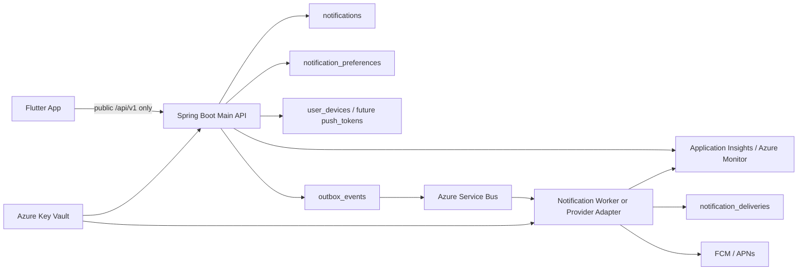

# ONMU Notification / Push / Devices 아키텍처

## 목적

이 문서는 ONMU의 사용자별 알림 inbox, push 발송, 기기 token registry를 현재 구현과 목표 아키텍처로 나누어 정리한다. 목표는 Terraform/Azure migration 때 어떤 리소스를 만들고 어떤 경계를 애플리케이션이 계속 소유해야 하는지 판단할 수 있게 하는 것이다.

Notification / Push / Devices는 한 기능처럼 보이지만 운영 책임은 세 가지로 나뉜다.

| 영역 | 사용자 경험 | Source of truth | 현재 상태 |
| --- | --- | --- | --- |
| Notification inbox | 앱 안의 알림 목록, unread count, 읽음 처리 | PostgreSQL `notifications` | Spring API와 Flutter 화면 구현됨 |
| Push delivery | 앱 밖에서 OS notification 수신 | `notification_deliveries` + provider 응답 | dev-safe provider만 구현됨 |
| Device registry | 로그인 사용자의 현재 기기 token 등록/비활성화 | PostgreSQL `user_devices` | push token readiness 구현됨 |

이 문서는 실제 FCM/APNs 발송을 이미 구현한 것으로 해석하지 않는다. 현재 구현은 provider secret 없이 동작하는 dev-safe 경로이며, production push delivery는 별도 보안/인프라 결정이 필요하다.

## 제품 원칙

| 원칙 | 의미 |
| --- | --- |
| Inbox와 push는 분리한다 | 사용자가 앱 안에서 보는 알림 원장은 `notifications`이고, push는 그 알림을 앱 밖으로 전달하는 후속 side effect다. |
| 앱은 public API만 호출한다 | Flutter는 `/api/v1/notifications`, `/api/v1/notification-preferences`, `/api/v1/devices/push-token`만 호출하고 queue, worker, provider API를 직접 호출하지 않는다. |
| Push 실패가 inbox를 지우면 안 된다 | provider 발송 실패나 dev skip은 `notification_deliveries`와 outbox 상태에 남기고, inbox row는 사용자의 알림 원장으로 유지한다. |
| Device token은 credential에 준해 다룬다 | 응답, 로그, 문서, PR 본문에는 token 원문을 남기지 않는다. 현재 저장 방식은 readiness 단계이며 production 전 암호화/분리 결정을 해야 한다. |
| Provider secret은 서버/Key Vault 경계에만 둔다 | FCM/APNs credential, JWT signing secret, OAuth secret은 Flutter bundle, dart-define, manifest, plist에 넣지 않는다. |
| DB schema는 Flyway가 소유한다 | Terraform은 PostgreSQL 서버와 네트워크를 만들 수 있지만 `notifications`, `notification_preferences`, `notification_deliveries`, `user_devices` table을 만들지 않는다. |
| Dev-safe와 실제 delivery를 구분한다 | `DevNotificationPushProvider`의 `skipped_dev`는 smoke 안전장치이지 FCM/APNs 성공이 아니다. |

## Current Implementation

### Flutter 흐름

현재 Flutter 알림 화면은 `HomeNotificationsPage`가 `HomeNotificationsViewModel`을 구독하고, ViewModel이 `NotificationRepository`를 통해 Spring API를 호출한다. View는 렌더링과 route 이동만 담당하고 API 호출은 repository에 있다.

| 기능 | Flutter 파일 | 현재 동작 |
| --- | --- | --- |
| 알림 목록 | `apps/mobile-flutter/lib/features/home/presentation/pages/home_notifications_page.dart` | loading/error/empty/list 상태를 렌더링하고 item tap 시 route를 계산한다. |
| 알림 상태 | `apps/mobile-flutter/lib/features/home/view_model/home_notifications_view_model.dart` | 목록 fetch, optimistic read/read-all, unread count invalidation을 처리한다. |
| 알림 API | `apps/mobile-flutter/lib/features/home/repository/notification_repository.dart` | `/api/v1/notifications`, unread count, read/read-all, preferences API를 호출한다. |
| 알림 모델 | `apps/mobile-flutter/lib/shared/models/notification_models.dart` | `NotificationItem`, `NotificationPreferences`를 API JSON에서 파싱한다. |
| Push token API | `apps/mobile-flutter/lib/features/notifications/repository/device_push_token_repository.dart` | `/api/v1/devices/push-token` register/deactivate repository와 coordinator가 있다. |
| Push token source | 같은 파일 | 기본 provider가 `NoopDevicePushTokenSource`라 현재 실제 OS token은 얻지 않는다. |
| Token storage | `apps/mobile-flutter/lib/features/auth/data/auth_token_store.dart` | ONMU access/refresh token은 `flutter_secure_storage`에 저장한다. |

로그인 bootstrap, OAuth login 완료, sign-out 경로는 `PushTokenRegistrationCoordinator`를 호출하지만 현재 token source가 null을 반환하므로 실제 등록은 `push_token_source_unavailable`로 skip된다.

### Spring/API 흐름

Spring Boot Main API는 다음 public API를 제공한다.

| API | Controller | Service | 역할 |
| --- | --- | --- | --- |
| `GET /api/v1/notifications` | `NotificationController` | `NotificationService.inbox` | 현재 인증 사용자 inbox를 최신순으로 조회한다. |
| `GET /api/v1/notifications/unread-count` | `NotificationController` | `NotificationService.unreadCount` | `read_at is null` count를 반환한다. |
| `PUT /api/v1/notifications/{notificationId}/read` | `NotificationController` | `NotificationService.markRead` | 현재 사용자 소유 알림만 읽음 처리한다. |
| `PUT /api/v1/notifications/read-all` | `NotificationController` | `NotificationService.markAllRead` | 현재 사용자의 unread row만 읽음 처리한다. |
| `GET /api/v1/notification-preferences` | `NotificationPreferenceController` | `NotificationPreferenceService.preferences` | 기본 type/channel 조합과 저장된 설정을 합쳐 반환한다. |
| `PUT /api/v1/notification-preferences` | `NotificationPreferenceController` | `NotificationPreferenceService.update` | allowlist type/channel만 저장한다. |
| `POST /api/v1/devices/push-token` | `DeviceController` | `PushTokenService.register` | 현재 사용자의 push token readiness를 등록한다. |
| `DELETE /api/v1/devices/push-token` | `DeviceController` | `PushTokenService.deactivate` | 현재 사용자의 active token을 비활성화한다. |

`NotificationRepository.findInboxByUserId`와 `findInboxItemByIdAndUserId`는 `notification.user.id = currentUserId`를 조건으로 사용한다. 다른 사용자의 알림 id는 읽음 처리되지 않고 `notification_not_found`가 된다.

`PushTokenService`는 `provider`를 `fcm`, `apns`, `dev`로 제한하고, token hash와 last4를 만든다. 같은 provider/token hash가 다른 사용자에게 active 상태로 있으면 이전 사용자 row를 inactive로 바꾼 뒤 현재 사용자 row를 저장한다. 응답은 `deviceId`, `provider`, `platform`, `status`, `registered`, `tokenLast4`, `updatedAt`만 반환한다.

### DB/Flyway 상태

Spring Flyway가 core schema를 소유한다.

| Table | Migration | Current ownership | 현재 의미 |
| --- | --- | --- | --- |
| `notifications` | `V4__core_schema_data_dictionary.sql` | Spring Flyway + Spring JPA | 사용자별 inbox source of truth |
| `notification_preferences` | `V4__core_schema_data_dictionary.sql` | Spring Flyway + Spring JPA | `(user, notification_type, channel)` 수신 설정 |
| `notification_deliveries` | `V4__core_schema_data_dictionary.sql` | Spring Flyway + Spring JPA | push 등 provider 발송 시도/결과 projection |
| `user_devices` | `V4__core_schema_data_dictionary.sql`, `V18__push_token_readiness.sql` | Spring Flyway + Spring JPA | device registry와 push token readiness |
| `outbox_events` | `V1__core_schema_scaffold.sql` 이후 | Spring Flyway + Spring runtime | domain transaction side effect 원장 |

현재 `user_devices.push_token`은 text 컬럼이다. hash/last4도 저장하지만 token 원문도 저장한다. production 전에는 암호문 저장 또는 별도 `push_tokens` table 분리 여부를 결정해야 한다.

## Event / Outbox / Side Effect Model

`OutboxService.publishPendingEvents`는 5초마다 pending outbox를 조회한다. `notification.requested`는 외부 queue가 아니라 Spring runtime 안의 `NotificationDeliveryService`가 직접 처리한다.

현재 delivery 처리 순서:

1. outbox payload의 `notificationId`를 읽는다.
2. 없으면 aggregate type이 `notification`일 때 aggregate id를 notification id로 사용한다.
3. `notifications` row를 찾는다.
4. push preference가 enabled인지 확인한다.
5. `NotificationPushProvider.deliver`를 호출한다.
6. `notification_deliveries` row를 저장한다.
7. outbox status를 delivery result에 맞춰 갱신한다.

현재 provider bean은 `DevNotificationPushProvider`뿐이다. 이 provider는 항상 `provider=dev`, `status=skipped_dev`, `errorMessage=dev_push_delivery_disabled` 성격의 결과를 반환한다.

채팅 메시지 경로는 실제 `NotificationEntity`를 저장한 뒤 `notification.requested` outbox payload에 `notificationId`를 넣는다. 반면 일부 정산 경로는 `aggregateType=settlement`와 `settlementId` 중심 payload를 남긴다. 현재 delivery consumer 기준으로 이 이벤트는 push delivery로 이어지지 않고 dev skip 또는 missing notification id 상태가 될 수 있다. Target에서는 provider delivery 대상 이벤트에 `notificationId`를 포함하도록 통일해야 한다.

### Local / Dev Runtime 의존성

- Windows dev/integration runtime은 `services/api-spring` Spring Boot Main API다.
- `dev-api.onmu.cloud`와 `int-api.onmu.cloud`는 Spring health/readiness/API contract smoke용 공개 개발 endpoint다.
- 보호 API smoke는 `ONMU_ACCESS_TOKEN_SECRET`으로 발급한 짧은 수명 JWT를 사용한다. `dev-access-token-secret`, `int-access-token-secret`은 Key Vault secret name이며 값을 문서에 남기지 않는다.
- 현재 push delivery smoke는 provider secret 없는 dev-safe row/status 확인만 의미한다.

## Target Architecture



### 확정

- Flutter는 Spring Boot Main API의 `/api/v1`만 직접 호출한다.
- `notifications`는 사용자별 inbox 원장이다.
- `notification_deliveries`는 provider 발송 시도/결과 projection이다.
- `user_devices`는 현재 device registry와 push token readiness를 담당한다.
- DB schema는 Spring Flyway가 소유한다.
- Provider secret과 JWT signing secret은 Flutter bundle에 넣지 않는다.

### 후보

- 실제 provider 연결 위치는 두 가지다.
  - Spring 내부 `NotificationPushProvider` adapter로 시작한다.
  - 별도 `notification-worker`가 Service Bus message를 소비해 FCM/APNs를 호출한다.
- Azure queue는 Service Bus를 1차 후보로 두고, 대량 stream/analytics 요구가 생기면 Event Hubs를 검토한다.
- Staging runtime은 Azure Container Apps, production 목표는 AKS다.
- token 저장은 `user_devices` 암호문 컬럼 보강 또는 별도 `push_tokens` table 분리 중 선택한다.

### 미결정

- MVP push provider 범위가 FCM만인지, FCM/APNs 동시인지.
- FCM service account와 APNs credential의 Key Vault secret name.
- push delivery feature flag 이름과 환경별 기본값.
- provider invalid token callback을 어떻게 반영할지.
- 별도 Notification Worker를 `services/workers/notification-worker`로 만들지, Spring adapter로 충분히 시작할지.

## Current-to-Target Delta

| 구분 | 내용 | 소유 |
| --- | --- | --- |
| 유지 | Flutter inbox/preferences repository, Spring notification API, Flyway tables | Flutter/Spring |
| 유지 | `DevNotificationPushProvider`의 local/dev 안전장치 | Spring |
| 대체 | dev provider를 실제 FCM/APNs provider adapter 또는 worker consumer로 대체 | Spring/Worker |
| 추가 | OS push token source, permission prompt, foreground/background notification 정책 | Flutter |
| 추가 | Service Bus publisher/consumer, idempotency key, retry/dead-letter 기준 | Spring/Worker/Terraform |
| 추가 | provider credential Key Vault reference, Managed Identity | Terraform/Runtime |
| 추가 | push latency, provider error, invalid token, skipped_dev 지표 | Observability |
| 보강 | `notification.requested` payload에 `notificationId`를 포함하는 규칙 | Spring/API contract |
| 보강 | `user_devices.push_token` 암호화 또는 별도 token table | Flyway/Spring |
| 보류 | email/kakao/sms channel, marketing notification, campaign tooling | Later |

## API Contract

### Public Flutter API

| API | Caller | Response 원칙 |
| --- | --- | --- |
| `GET /api/v1/notifications?limit=50` | Flutter inbox page | 현재 사용자 알림만 반환한다. |
| `GET /api/v1/notifications/unread-count` | Flutter home/my badge | 현재 사용자 unread count만 반환한다. |
| `PUT /api/v1/notifications/{notificationId}/read` | Flutter inbox item tap | 소유자 불일치는 `404 notification_not_found`로 취급한다. |
| `PUT /api/v1/notifications/read-all` | Flutter inbox action | 현재 사용자 unread row만 갱신한다. |
| `GET /api/v1/notification-preferences` | Flutter settings | 기본 type/channel 조합을 포함한다. |
| `PUT /api/v1/notification-preferences` | Flutter settings | allowlist type/channel만 허용한다. |
| `POST /api/v1/devices/push-token` | Flutter auth/session lifecycle | token은 JSON body로만 보낸다. URL query 금지. |
| `DELETE /api/v1/devices/push-token` | Flutter sign-out/session cleanup | token은 JSON body로만 보낸다. URL query 금지. |

### Internal-only 경계

Flutter가 직접 호출하면 안 되는 대상:

- Azure Service Bus / Event Hubs
- FCM HTTP v1 API
- APNs provider API
- Notification Worker internal endpoint
- FastAPI Worker internal endpoint
- PostgreSQL / Redis / MinIO / Blob Storage private endpoint
- Key Vault secret endpoint

### `notification.requested` payload 규칙

Provider delivery 대상 event는 다음 최소 payload를 가져야 한다.

```json
{
  "notificationId": "<notifications.id UUID>",
  "notificationType": "chat_message",
  "channels": ["push"],
  "groupId": "1",
  "planId": "101"
}
```

규칙:

- `notificationId`는 실제 `notifications.id` UUID여야 한다.
- 화면 이동용 public id는 `groupId`, `planId`, `voteId`, `settlementId`, `recordId`처럼 별도 payload로 둔다.
- `channel=activity`처럼 inbox 생성 또는 ChatActivity 공유만 의미하는 이벤트는 push delivery 대상과 분리한다.
- `notification_deliveries.notification_id`에 연결할 수 없는 이벤트는 실제 provider delivery를 시도하지 않는다.

## Data Model and Source of Truth

| Table | Current | Target |
| --- | --- | --- |
| `notifications` | 구현됨. 사용자별 inbox, status/read_at/payload 저장 | 계속 source of truth. archive/partition, richer target metadata를 나중에 검토 |
| `notification_preferences` | 구현됨. 기본 type/channel은 service allowlist로 제한 | quiet hours semantics, marketing consent, channel 확장 |
| `notification_deliveries` | 구현됨. dev-safe row와 provider result projection | provider message id, retry/dead-letter, latency/error taxonomy 강화 |
| `user_devices` | 구현됨. device metadata + push token readiness. token 원문 text 저장 | 암호문 저장 또는 `push_tokens` 분리. invalid/revoked lifecycle 강화 |
| `push_tokens` | 미래 후보 | provider별 token lifecycle, encryption, invalid callback 대응 |
| `outbox_events` | 구현됨. Spring scheduled publisher가 처리 | queue publish state, idempotency key, DLQ correlation 보강 |

Source of truth:

- 앱 안 알림 목록은 `notifications`.
- provider 발송 시도와 결과는 `notification_deliveries`.
- 기기별 push readiness는 현재 `user_devices`.
- 외부 provider의 message id는 운영 추적용 projection이지 ONMU inbox 원장이 아니다.

## Flutter Boundary

Flutter 책임:

- 사용자가 보는 inbox UI와 읽음 action.
- 알림 설정 toggle.
- 로그인/session lifecycle에서 현재 기기 push token 등록/비활성화 시도.
- ONMU access/refresh token을 secure storage에 저장.
- provider 공개 client id나 redirect URI 같은 공개 설정만 dart-define으로 받는다.

Flutter 금지:

- FCM/APNs provider secret 저장.
- JWT signing secret 저장.
- OAuth client secret 저장.
- provider API 직접 호출.
- queue/worker/internal API 직접 호출.
- token 원문을 로그, analytics event, crash report custom field에 남기기.

현재 gap:

- `NoopDevicePushTokenSource` 때문에 실제 FCM/APNs token 취득이 없다.
- OS notification permission request, foreground notification handling, background tap routing이 없다.
- provider SDK dependency가 현재 확인되지 않는다.

## Spring / Worker Boundary

Spring Boot Main API 책임:

- 인증 사용자 기준 inbox read/write.
- notification preference 검증과 저장.
- push token readiness 등록/비활성화.
- domain transaction과 함께 `notifications` 및 `outbox_events` 기록.
- Flutter에 public `/api/v1` read model 제공.
- provider/worker로 넘기는 payload에서 secret과 개인정보를 최소화.

Notification Worker 또는 provider adapter 책임:

- `notification.requested` message 소비.
- preference와 device readiness 확인.
- FCM/APNs provider 호출.
- `notification_deliveries`에 result 저장.
- provider invalid token을 device/token lifecycle에 반영.
- retry/backoff/dead-letter 처리.

AI/Data Worker 책임 아님:

- push provider secret 관리.
- provider API 호출.
- `notifications`/`user_devices` core table 직접 변경.
- Flutter-facing notification API 제공.

## Terraform Resource Implications

| 필요 기능 | 현재 구현 | 목표 구조 | Azure 리소스 후보 | Terraform 소유 여부 | 미결정 |
| --- | --- | --- | --- | --- | --- |
| Public API runtime | Windows Spring dev server | ACA staging 또는 AKS production | Container Apps, AKS, ACR | 예 | 첫 Azure staging 선택 |
| Inbox DB | Local/dev PostgreSQL | PostgreSQL Flexible Server | PostgreSQL Flexible Server | 서버/네트워크만 | schema는 Flyway |
| Async push request | Spring scheduled outbox | Queue 기반 fan-out | Azure Service Bus | 예 | Event Hubs 필요성 |
| Provider secret | 로컬 env/Key Vault 문서화 | Managed Identity + Key Vault reference | Azure Key Vault | 예 | secret name 확정 |
| Worker identity | 없음 | passwordless secret/resource access | Managed Identity | 예 | worker 분리 여부 |
| Observability | access log 중심 | trace/metric/log | Application Insights, Monitor, Log Analytics | 예 | metric naming |
| Device token storage | DB text column | encrypted storage or split table | PostgreSQL + Key Vault key 후보 | 리소스만 | app-level encryption 방식 |
| Realtime notification companion | Spring SSE 일부 | Realtime Gateway + Redis | Redis, ingress | 예 | push와 분리 수준 |

Terraform이 소유하지 않는 것:

- `notifications`, `notification_deliveries`, `notification_preferences`, `user_devices` DDL.
- seed data.
- Flyway/Alembic migration history.
- FCM/APNs token 원문.
- 애플리케이션 feature flag의 runtime 기본 동작.

## Secret / Key Vault / Managed Identity Boundary

문서에는 값이 아니라 이름 후보만 남긴다.

| 목적 | Env var 후보 | Key Vault secret name 후보 | Flutter 전달 여부 |
| --- | --- | --- | --- |
| ONMU access JWT signing | `ONMU_ACCESS_TOKEN_SECRET` | `dev-access-token-secret`, `int-access-token-secret`, `prod-access-token-secret` | 금지 |
| FCM service account | `ONMU_FCM_SERVICE_ACCOUNT_JSON` | `dev-fcm-service-account-json`, `int-fcm-service-account-json`, `prod-fcm-service-account-json` | 금지 |
| APNs private key | `ONMU_APNS_PRIVATE_KEY` | `dev-apns-private-key`, `int-apns-private-key`, `prod-apns-private-key` | 금지 |
| APNs key id | `ONMU_APNS_KEY_ID` | `dev-apns-key-id`, `int-apns-key-id`, `prod-apns-key-id` | 금지 |
| APNs team id | `ONMU_APNS_TEAM_ID` | `dev-apns-team-id`, `int-apns-team-id`, `prod-apns-team-id` | 금지 |
| APNs bundle id | `ONMU_APNS_BUNDLE_ID` | `dev-apns-bundle-id`, `int-apns-bundle-id`, `prod-apns-bundle-id` | 공개 식별자는 가능하나 secret과 함께 전달 금지 |
| Push delivery flag | `ONMU_PUSH_DELIVERY_ENABLED` | secret보다 config/env 후보 | 공개 앱 bundle에는 금지 |
| Push provider mode | `ONMU_PUSH_PROVIDER_MODE` | secret보다 config/env 후보 | 금지 |

Managed Identity 기준:

- Azure runtime이 Key Vault secret을 읽는다.
- 일반 팀원 smoke 권한은 read-only 또는 제한된 scope로 둔다.
- `Secrets Officer` 권한은 secret 관리 담당자에게만 둔다.
- AI agent가 secret 값을 쓰거나 조회해 출력하는 작업은 금지한다.

## Observability and Smoke Test

### 최소 지표

| 지표 | 의미 |
| --- | --- |
| `notification.inbox.created.count` | inbox row 생성량 |
| `notification.inbox.unread.count` | unread projection drift 확인 |
| `notification.outbox.requested.count` | push 요청 이벤트 수 |
| `notification.delivery.skipped_dev.count` | dev-safe skip 수 |
| `notification.delivery.sent.count` | provider 성공 수 |
| `notification.delivery.failed.count` | provider 실패 수 |
| `notification.delivery.latency_ms` | outbox 생성부터 provider 결과까지 |
| `device.push_token.registered.count` | token 등록 수 |
| `device.push_token.deactivated.count` | token 비활성 수 |
| `device.push_token.invalidated.count` | provider invalid token 반영 수 |

### Dev-safe smoke

목적은 API contract와 DB side effect가 안전하게 동작하는지 확인하는 것이다. 실제 FCM/APNs 발송 성공으로 판정하지 않는다.

1. 짧은 수명 ONMU access JWT를 로컬에서 발급한다.
2. `GET /api/v1/notifications`가 현재 사용자 inbox만 반환하는지 확인한다.
3. `PUT /api/v1/notifications/{id}/read`가 소유자 기준으로 동작하는지 확인한다.
4. `GET/PUT /api/v1/notification-preferences`가 allowlist type/channel만 받는지 확인한다.
5. `POST /api/v1/devices/push-token`에 `provider=dev` synthetic token을 JSON body로 보낸다.
6. `DELETE /api/v1/devices/push-token`으로 inactive 응답을 확인한다.
7. `notification.requested` pending event가 있으면 `notification_deliveries.provider=dev`, `status=skipped_dev`로 남는지 확인한다.

### Real provider smoke

사람 승인과 secret 준비 후에만 진행한다.

1. FCM/APNs credential이 Key Vault에 저장되어 있고 runtime이 Managed Identity로 읽는지 확인한다.
2. `ONMU_PUSH_DELIVERY_ENABLED=true` 같은 명시 flag를 켠 환경에서만 실행한다.
3. 실제 iOS/Android build에서 OS permission과 provider token source를 확인한다.
4. Flutter가 `/api/v1/devices/push-token`으로 token을 등록한다.
5. Spring/worker가 provider API를 호출한다.
6. `notification_deliveries.status=sent` 또는 `failed`와 provider message id/error taxonomy를 확인한다.
7. 앱에서 background/foreground/tap routing을 별도 smoke한다.

## Migration Risks

- `DevNotificationPushProvider`의 `skipped_dev`를 실제 발송 성공으로 오해할 수 있다.
- `notification.requested` payload에 `notificationId`가 없으면 현재 delivery service가 provider delivery 대상 알림을 찾지 못한다.
- `user_devices.push_token`은 현재 text 저장이다. production 전 암호화/분리 없이 실제 token을 오래 보관하면 보안 리스크가 커진다.
- Terraform이 DB table을 만들기 시작하면 Spring Flyway와 ownership 충돌이 난다.
- Flutter bundle에 provider secret, JWT signing secret, OAuth secret이 들어가면 즉시 보안 사고로 봐야 한다.
- Provider invalid token을 반영하지 않으면 실패 재시도와 비용이 누적된다.
- Service Bus, Worker, App Insights를 한 번에 도입하면 비용과 운영 복잡도가 급격히 올라간다.
- dev API smoke와 실제 모바일 provider smoke를 섞으면 OAuth/JWT 우회와 push 검증 결과가 오염된다.
- push notification만 성공하고 inbox row가 없으면 사용자는 앱 안에서 알림 이력을 확인할 수 없다.

## Decision Log

| 결정 | 상태 | 근거 | 남은 질문 |
| --- | --- | --- | --- |
| Inbox와 push delivery 분리 | 결정됨 | API contract와 현재 Spring 구현 | 없음 |
| Flutter는 Spring Main API만 직접 호출 | 결정됨 | frontend/API 문서 | 없음 |
| DB schema는 Flyway 소유 | 결정됨 | Spring README와 migration 구조 | 없음 |
| `user_devices`를 readiness 저장소로 사용 | 구현됨 | V18 migration + PushTokenService | production 암호화/분리 방식 |
| `notification_deliveries`에 delivery 결과 저장 | 구현됨 | JPA entity/service | provider taxonomy 확장 |
| dev provider는 실제 FCM/APNs가 아님 | 결정됨 | `DevNotificationPushProvider` | 없음 |
| 실제 provider 연결 위치 | 후보 | Spring adapter vs 별도 worker 모두 가능 | 팀 결정 필요 |
| Azure queue | 후보 | 현재 아키텍처 문서의 Service Bus 우선 방향 | 적용 시점 |

## Roadmap

| Phase | 목표 | 산출물 |
| --- | --- | --- |
| Phase 0 | Current 문서화와 payload 규칙 고정 | 이 문서, API/data/operations 문서 보강 |
| Phase 1 | Inbox contract hardening | notification contract tests, ownership/limit/read tests |
| Phase 2 | Device token source 연결 | Flutter FCM/APNs token source, permission UX, repository tests |
| Phase 3 | Dev-safe delivery observability | `skipped_dev` metric/log, outbox status dashboard |
| Phase 4 | Real provider adapter 또는 worker | FCM/APNs provider adapter, Key Vault reference, feature flag |
| Phase 5 | Queue 기반 production delivery | Service Bus, retry/dead-letter, idempotency |
| Phase 6 | Token lifecycle hardening | encrypted token storage or `push_tokens`, invalid callback, retention |
| Phase 7 | Full mobile smoke | iOS/Android background/foreground/tap routing, provider delivery validation |

## Non-goals

- 이 문서는 FCM/APNs credential 값을 정의하지 않는다.
- 이 문서는 Terraform apply, Azure 리소스 생성, DNS 변경, Key Vault secret 쓰기를 수행하지 않는다.
- Flutter 앱이 FCM/APNs provider API를 직접 호출하게 만들지 않는다.
- Terraform이 Spring core DB table을 만들게 하지 않는다.
- dev-safe `skipped_dev`를 production push 성공으로 간주하지 않는다.
- email, SMS, Kakao message, marketing campaign system은 현재 범위가 아니다.
- AI/Data Worker가 push provider 호출을 담당한다고 가정하지 않는다.
