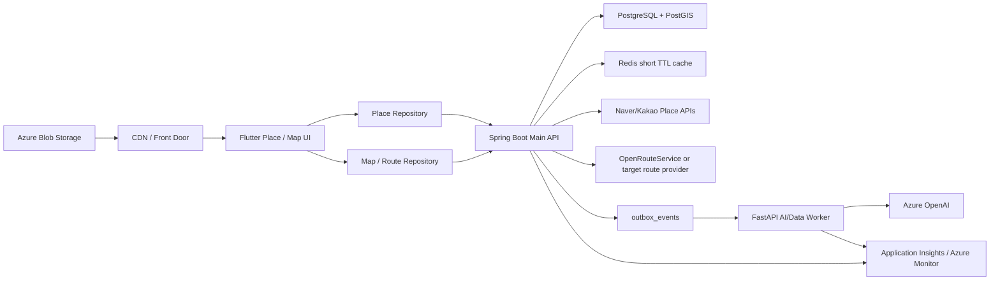

# ONMU Place / Search / Route / Map 아키텍처

## 목적

Place / Search / Route / Map 영역은 약속 장소를 찾고, 후보로 모으고, 일정에 등록하고, 지도와 동선으로 확인하는 ONMU의 핵심 결정 흐름이다. 이 문서는 현재 구현과 목표 아키텍처를 분리해 Terraform/Azure migration 때 어떤 리소스를 만들고 어떤 경계를 Spring, Flutter, Flyway, Worker가 계속 소유해야 하는지 판단할 수 있게 한다.

현재 구현은 Spring Boot Main API가 장소 검색, 장소 후보, 후보 하트, 일정 등록 장소, 동선 추천 API를 제공하고 Flutter가 Repository/ViewModel 경계로 이를 소비한다. 지도는 Flutter `OnmuMapView`가 tile manifest를 읽고 MapLibre를 사용할 수 있으면 MapLibre style을 렌더링하며, 그렇지 않으면 후보 위치와 동선을 nonblank fallback overlay로 표시한다.

목표 구조는 provider 검색과 route provider 호출을 Spring Boot 뒤에 두고, Redis는 짧은 TTL 캐시로만 사용하며, PostgreSQL/PostGIS는 사용자가 후보 또는 일정 장소로 선택한 최소 snapshot의 source of truth가 되는 구조다. 추천 설명이나 AI 보조가 필요할 때는 FastAPI Worker/Azure OpenAI로 분리하되, Spring이 인증/권한/트랜잭션/저장을 계속 소유한다.

## 제품 원칙

| 원칙 | 의미 |
| --- | --- |
| 장소 후보와 일정 등록 장소를 분리한다 | 후보는 약속 단위 공유 pool이고, 일정 등록 장소는 특정 일정에 들어간 장소다. 후보에 먼저 넣어야만 일정 등록할 수 있는 구조는 피한다. |
| 검색 결과에서 바로 행동할 수 있어야 한다 | 사용자는 검색 결과 또는 지도 상세에서 `후보에 추가`와 `일정에 추가`를 모두 선택할 수 있어야 한다. |
| 후보 리스트는 날짜 탭으로 쪼개지 않는다 | 후보 리스트는 약속 단위 공유 리스트이며, 날짜별 동선은 별도 itinerary/route 화면에서 다룬다. |
| provider 출처는 제품 UI에 직접 노출하지 않는다 | `Naver`, `Kakao`, `Provider` 같은 출처명은 내부 진단/저장 경계에서만 쓰고 사용자-facing chip/text로 드러내지 않는다. |
| 추천은 결정을 대신하지 않는다 | 현재 MVP는 점수 중심 비교, 후보 비교 전용 화면, 운영 리스크 문구를 만들지 않는다. 추천은 취향/거리/영업정보 기반 보조 설명으로 시작한다. |
| Flutter는 Spring Boot Main API만 직접 호출한다 | Flutter 앱은 Naver/Kakao/OpenRouteService, Redis, DB, Key Vault, Event Hubs, Worker를 직접 호출하지 않는다. |
| Redis는 source of truth가 아니다 | provider 검색 결과와 route 응답의 짧은 TTL cache에만 사용하고, 후보/일정 원장은 PostgreSQL에 둔다. |
| 지도 타일은 manifest pointer로 전환한다 | Flutter는 PMTiles object URL을 하드코딩하지 않고 `ONMU_TILE_MANIFEST_URL` 또는 기본 manifest URL을 읽는다. |

## Current Implementation

### Spring API Surface

현재 Spring public API는 `services/api-spring/src/main/java/com/onmu/api/web/ApiController.java` 아래 `/api/v1` 계약으로 제공된다.

| 기능 | API | 현재 구현 |
| --- | --- | --- |
| 장소 검색 | `POST /api/v1/place-search` | `PlaceSearchService`가 Naver, Kakao, `onmu_catalog` provider를 선택하고 Redis cache와 dev mock fallback을 적용한다. |
| 지도 catalog points/clusters | `POST /api/v1/map-points` | `external_places.provider='ONMU_CATALOG'` catalog를 PostGIS bbox와 zoom별 grid cluster/point로 반환한다. 하단 top20 검색 결과와 분리한다. |
| 동선 추천 | `POST /api/v1/routes/recommend` | `RouteRecommendationService`가 후보 좌표로 OpenRouteService를 호출하거나 deterministic `dev-mock` geometry를 반환한다. |
| 후보 리스트 | `GET /api/v1/groups/{groupId}/plans/{planId}/place-candidates` | plan별 후보를 조회하고 heart count, 내 heart 상태, external place snapshot 필드를 포함한다. |
| 후보 추가 | `POST /api/v1/groups/{groupId}/plans/{planId}/place-candidates` | 검색 결과 또는 수동 입력을 후보로 저장하고 external place snapshot을 연결할 수 있다. |
| 후보 상세 | `GET /api/v1/groups/{groupId}/plans/{planId}/place-candidates/{candidateId}` | 후보 단건 read model을 반환한다. |
| 후보 하트 | `PUT /api/v1/groups/{groupId}/plans/{planId}/place-candidates/{candidateId}/heart` | body의 `hearted=false`면 끄고, 생략 또는 true면 켠다. |
| 일정 장소 등록 | `POST /api/v1/groups/{groupId}/plans/{planId}/schedule-places` | `candidateId` 기반 등록과 직접 장소명 등록을 모두 허용한다. |
| 일정 장소 목록 | `GET /api/v1/groups/{groupId}/plans/{planId}/schedule-places` | plan의 일정 등록 장소를 sort order 기준으로 반환한다. |

`POST /api/v1/place-search` 응답은 `query`, `canonical`, `results`, `provider_counts`, `source_counts`, `coordinate_count` wrapper를 유지한다. `results[]`는 기존 `id`, `name`, `category`, `address`, `lat`, `lng`, `heartCount`, `myHearted`, `canAddCandidate`와 provider 연결용 `provider`, `providerPlaceId`, `roadAddress`, `sourceUrl`, `providerLink`, `fetchedAt`을 포함할 수 있다.

`POST /api/v1/routes/recommend` 응답은 `provider`, `stops`, `geometry`, `distanceMeters`, `durationSeconds`, `travelMode`, `fetchedAt`을 포함한다. `geometry`는 Flutter에서 `[lng, lat]` pair list로 decode된다.

### Place Search Provider Flow

`PlaceSearchService`의 현재 흐름:

1. `PlaceSearchQuery`가 query, groupId, planId, lat, lng, radius, category, providers, compare를 normalize한다.
2. 요청 provider가 없으면 category별 provider 순서를 사용한다. `가볼만한곳`/관광 계열은 `onmu_catalog`, `naver`, `kakao` 순서이고, 음식점/카페 계열은 `naver`, `kakao`, `onmu_catalog` 순서다.
3. provider별 `isAvailable()`로 credential 주입 여부를 확인한다.
4. Redis `place-search:v4:*` cache를 조회한다. cache key에는 query, 위치, category, Naver fan-out signature, 요청 provider, 실제 available provider, compare, dev mock fallback 여부와 추천 설명 rule version이 포함된다.
5. available provider가 있으면 provider를 호출하고 이름/주소 기반으로 중복 제거한다.
6. provider 결과가 비거나 실패하고 dev mock fallback이 켜져 있으면 `DevMockPlaceSearchProvider`를 사용한다.
7. available provider가 있었는데 결과 실패로 dev mock fallback을 사용한 경우에는 fallback 결과를 cache하지 않는다.

provider별 현재 경계:

| Provider | Spring class | Credential/env | 비고 |
| --- | --- | --- | --- |
| Naver Local Search | `NaverLocalSearchProvider` | `NAVER_SEARCH_CLIENT_ID`, `NAVER_SEARCH_CLIENT_SECRET` | OAuth용 `NAVER_OAUTH_*`와 분리한다. |
| Kakao Keyword Search | `KakaoKeywordSearchProvider` | `KAKAO_REST_API_KEY` | Kakao OAuth 공개 REST API key와 같은 env를 공유하지만 Flutter가 Local API를 직접 호출하지 않는다. |
| ONMU curated catalog | `CuratedPlaceSearchProvider` | 없음 | `external_places.provider='ONMU_CATALOG'` 정적/공공 catalog 행을 읽는다. 데이터 적재는 Flyway가 아니라 별도 운영 import가 담당하고, Flyway는 schema/index만 소유한다. |
| Dev mock | `DevMockPlaceSearchProvider` | 없음 | local/dev/test 또는 명시 fallback에서 deterministic 결과를 제공한다. |

현재 provider별 역할:

- 음식점: Naver query fan-out을 1차로 사용한다. `한식`, `양식`, `중식`, `일식`, `아시안식` 세부 query를 최대 5개 실행하고, 결과가 부족하면 `onmu_catalog`의 `식당` category를 supplement로 사용한다.
- 카페: Naver query fan-out을 1차로 사용한다. `카페`, `디저트`, `베이커리` query를 실행하고, 결과가 부족하면 `onmu_catalog`의 `식당` 행 중 cafe-like tag/summary가 있는 row만 supplement로 사용한다.
- 가볼만한곳: Kakao Local API 승인 전에도 안정적인 결과 수를 확보하기 위해 `onmu_catalog`를 1차 provider로 사용한다. catalog는 `관광명소`, `문화공간`, `행사` category와 `공원`, `해수욕장`, `박물관`, `미술관`, `전시`, `전망대`, `산책로` 같은 tag/summary를 사용해 필터링한다.
- Kakao provider는 승인/availability가 확인될 때만 보조 provider로 참여한다.

`CuratedPlaceSearchProvider`는 top20 장소 검색 supplement 목적을 유지한다. 지도 context용 catalog 노출은 `MapCatalogService`가 맡고, `external_places.place_point`/`place_geog` generated column과 GiST index를 사용한다. 낮은 zoom은 `ST_SnapToGrid` 기반 cluster count를 반환하고, 높은 zoom은 작은 catalog point를 반환한다.

`POST /api/v1/map-points` cache key는 bounds, zoom, category, filter, query, catalog provider availability signature, PostGIS schema version을 포함한다. Redis 장애나 JSON decode 실패는 API 실패로 전파하지 않고 DB query 결과를 반환한다.

Staging 배포 전에는 PostgreSQL Flexible Server에서 `postgis` extension이 allowlist에 있고 Flyway 앱 계정으로 `create extension if not exists postgis`를 실행할 수 있는지 preflight로 확인한다. 이 권한이 미확정이면 migration 적용을 운영 gate로 막고, DBA/운영 계정이 extension을 선생성한 뒤 Flyway schema/index migration을 재실행한다.

### Route Recommendation Flow

`RouteRecommendationService`의 현재 흐름:

1. `groupId`, `planId`, `travelMode`를 받아 group/plan을 조회한다.
2. plan의 `place_candidates`에서 좌표가 있는 후보만 route stop으로 변환한다.
3. 좌표는 우선 `external_places.latitude/longitude`, 없으면 candidate payload의 `lat/lng` 또는 `latitude/longitude`를 사용한다.
4. stop 목록과 travel mode로 Redis `route-recommendation:v1:*` cache key를 만든다.
5. `OPENROUTESERVICE_API_KEY`가 있고 stop이 2개 이상이면 OpenRouteService provider를 호출한다.
6. provider 실패, credential 없음, 좌표 부족이면 `DevMockRouteProvider`가 Flutter UI smoke가 가능한 deterministic geometry를 반환한다.

현재 route provider cache TTL은 `RedisRouteRecommendationCache` 기준 30분이다. 이 값은 provider 응답을 원장으로 보관한다는 뜻이 아니라, UI 재조회와 외부 API 비용/지연을 줄이기 위한 짧은 TTL cache다.

### Candidate / Schedule / Heart Flow

후보 추가는 `CreatePlaceCandidateRequest`로 name, category, address, summary, tags와 provider snapshot 필드를 받을 수 있다. provider와 providerPlaceId가 있으면 `ExternalPlaceEntity`를 찾아 재사용하거나 새로 저장한다. 후보에는 external place FK와 payload snapshot이 함께 저장된다.

후보 card 응답에는 다음 정보가 포함된다.

| 필드 | 의미 |
| --- | --- |
| `id`, `groupId`, `planId` | Flutter route/API contract용 public id |
| `name`, `category`, `address`, `summary` | 사용자 표시 최소 정보 |
| `heartCount`, `myHearted` | 후보 선호 표시 |
| `provider`, `providerPlaceId`, `roadAddress`, `sourceUrl`, `lat`, `lng`, `fetchedAt` | 내부 저장/지도/동선 연결용 provider snapshot |
| `sourceLabel` | 현재 API에는 남지만 제품 UI에서는 provider명을 직접 노출하지 않는 기준을 지킨다. |

`schedule_places`는 `candidateId`가 있으면 후보와 연결하고, 없으면 직접 장소명으로 등록한다. 이 구조는 "후보에 넣어야만 일정에 등록할 수 있다"는 제약을 피하기 위한 현재 구현이다.

방문 시각은 약속 기간 안에서만 저장할 수 있다. `startsAt`과 `endsAt`이 모두 비어 있으면 방문 시간 미정 상태로 허용하고, 둘 중 하나만 있거나 `endsAt <= startsAt`이면 `400 invalid_schedule_place_time_range`로 거절한다. 둘 다 있으면 `plans.starts_at <= schedule_places.starts_at`이고, `plans.ends_at`이 있는 경우 `schedule_places.ends_at <= plans.ends_at`이어야 한다. 이 범위를 벗어나면 `400 schedule_place_time_out_of_plan_range`로 거절한다. Flutter 방문 시간 피커도 같은 범위만 선택 가능하게 제한한다.

### Flutter Surface

Flutter route와 repository는 운영 API 이름을 따른다.

| Flutter surface | 파일 | 역할 |
| --- | --- | --- |
| route contract | `apps/mobile-flutter/lib/core/routing/route_paths.dart` | `/groups/:groupId/plans/:planId/place-candidates`, `/place-search`, `/itinerary` 등 경로 생성 |
| place repository | `apps/mobile-flutter/lib/features/place/repository/place_repository.dart` | 후보 조회/추가, 장소 검색 API 호출 |
| place candidates VM | `apps/mobile-flutter/lib/features/place/view_model/place_candidates_view_model.dart` | 후보 list state, dedupe, optimistic favorite, vote 생성 연결 |
| map page | `apps/mobile-flutter/lib/features/place/presentation/pages/place_map_page.dart` | 검색, 지도, 후보 bottom sheet, 후보/일정 action |
| map widget | `apps/mobile-flutter/lib/features/map/widgets/onmu_map_view.dart` | tile manifest + MapLibre + fallback overlay |
| route repository | `apps/mobile-flutter/lib/features/map/repository/route_repository.dart` | `POST /api/v1/routes/recommend` 호출 |
| itinerary page | `apps/mobile-flutter/lib/features/plan/presentation/pages/plan_itinerary_page.dart` | 날짜별 동선/route review 화면 |

`OnmuMapView`는 `TileManifestRepository`가 manifest를 읽고 style URL이 있으며 platform view와 PMTiles protocol bootstrap이 준비되면 `MapLibreMap`을 렌더링한다. 그렇지 않으면 `CustomPaint` fallback 배경 위에 projected pins와 route overlay를 표시한다. 이 fallback은 Android emulator나 test binding에서 blank 지도 대신 후보 위치와 동선을 계속 보여주기 위한 현재 안정화 장치다.

지도 camera fit은 초기 데이터/route 변경 seed에만 사용하고, runtime sync에서 강제 `fitBounds`를 다시 켜지 않는다. iOS MapLibre 안정성을 위해 pan/zoom 이후 center 또는 zoom만 바뀌는 경우에는 자동 refit하지 않는다. 현재 위치 버튼, catalog cluster tap처럼 사용자가 명시적으로 누른 액션만 `animateCamera`를 호출해 카메라를 이동한다.

### Tile Runtime

지도 타일 운영 기준은 `docs/operations/map-tiles-dev.md`와 `scripts/windows/seed-map-tiles-minio.ps1`, `scripts/map-tiles-gateway.js`에 나뉘어 있다.

| 항목 | 현재 dev 기준 |
| --- | --- |
| Public manifest | `https://tiles.onmu.cloud/manifest.json` |
| Public style | `https://tiles.onmu.cloud/styles/onmu-light.json` |
| PMTiles URL | manifest `current.tileset.url`의 `pmtiles://...` pointer |
| Local tile gateway | `127.0.0.1:19100` |
| Required smoke | manifest/style 200, PMTiles Range 206, CORS/Range headers |
| Local object storage | MinIO bucket/object |
| Target object storage | Azure Blob Storage + CDN/Front Door 후보 |

Flutter 앱은 `ONMU_TILE_MANIFEST_URL` dart-define 또는 default public manifest URL만 안다. PMTiles object URL이나 storage credential은 앱 bundle에 넣지 않는다.

## Target Architecture



목표 구조에서도 Spring Boot Main API는 인증/권한, provider 호출, 후보 저장, 일정 등록, route provider 호출, outbox 기록을 소유한다. Flutter는 Spring public API와 tile manifest URL만 사용한다. FastAPI Worker는 후보 추천 설명, AI 보조 문장 생성, 장기 분석성 작업을 맡되 core domain table을 직접 수정하지 않는다.

PostgreSQL은 `external_places`, `place_candidates`, `place_candidate_hearts`, `schedule_places`, vote tables의 source of truth다. PostGIS는 target에서 거리/반경/nearby query와 route stop 정렬을 고도화하는 확장이다. Redis는 `place-search:*`, `route-recommendation:*` 같은 짧은 TTL cache와 실시간/presence 보조에만 사용한다.

### 확정

- Flutter는 Naver/Kakao/OpenRouteService provider API를 직접 호출하지 않는다.
- `POST /api/v1/place-search`가 장소 검색 canonical API다.
- `POST /api/v1/routes/recommend`가 동선 추천 canonical API다.
- 후보와 일정 등록 장소는 분리한다.
- provider 검색 결과는 Redis 짧은 TTL cache와 선택된 최소 snapshot으로만 다룬다.
- DB schema는 Spring Flyway가 소유한다.
- AI 설명은 결정을 대신하지 않는 보조 설명이다.

### 후보

- 지도 타일 target edge는 Azure Blob Storage + CDN, Azure Front Door, 또는 Static Website + CDN 중 선택한다.
- route provider는 현재 OpenRouteService를 기준으로 하되 운영 비용/약관/국내 품질을 보고 Naver/Kakao/ORS 병행 여부를 결정한다.
- PostGIS generated geography column 또는 별도 spatial index를 `external_places`와 `place_candidates`에 추가할 수 있다.
- 장소 추천 설명은 Spring `PlaceRecommendationReasoner`의 rule-based explanation을 먼저 제공하고, 저장 후보에는 같은 이유를 payload로 보존한다. 이후 FastAPI Worker `/tasks/place-reason`과 Azure OpenAI가 자연어 설명을 보강한다.
- Azure AI Search는 장소 자체 검색보다 기록/취향/RAG 확장에 먼저 쓰는 후보로 둔다.

### 미결정

- Kakao Local API 심사/권한 완료 후 dev/prod provider availability 정책.
- provider별 약관상 보관 가능한 필드와 snapshot TTL/retention.
- route geometry를 PostgreSQL에 snapshot으로 남길지, Redis cache로만 둘지.
- 지도 manifest CDN invalidation과 rollback 자동화 기준.
- Android native에서 PMTiles protocol을 어떻게 안정적으로 지원할지, web bootstrap과 native plugin 경계를 어떻게 둘지.
- candidate ranking/reason field를 API read model로 둘지 Worker 결과 projection으로 둘지.

### Terraform 전 지도 리소스 결정 항목

현재 문서 세트는 Azure 전환을 위한 기준선과 checklist로 충분하지만, Terraform으로 리소스를 실제 생성하기 전에는 아래 결정을 별도로 닫아야 한다. 이 표의 항목이 비어 있으면 `infra/terraform` skeleton은 후보 리소스와 variable/output만 만들고, production cutover나 tile traffic 전환은 진행하지 않는다.

| 결정 항목 | 현재 기준 | Terraform 전 보완 | 소유 |
| --- | --- | --- | --- |
| Tile hosting 최종안 | Blob Storage + CDN/Front Door 후보, local/dev gateway fallback | Blob static hosting, Front Door, CDN/gateway 조합 중 하나를 선택하고 staging/prod별 endpoint, origin, cache TTL, purge 권한을 정한다. | Infra/Runtime |
| Tile rollback/cache invalidation | manifest pointer로 PMTiles를 참조 | manifest/style/PMTiles를 versioned object path로 배포하고, 이전 manifest/style/PMTiles pointer를 보존한다. stale cache가 있으면 CDN/Front Door purge 기준을 runbook에 둔다. | Runtime |
| Provider production readiness | Naver/Kakao/OpenRouteService는 Spring 뒤에서 호출 | Kakao Local 심사/권한, Naver/Kakao quota, route provider quota/약관, prod credential 준비 상태를 provider별로 분리 판정한다. | Backend/Ops |
| Provider response retention | 선택된 최소 snapshot만 PostgreSQL에 보관 | raw provider body를 장기 저장하지 않는 원칙을 유지하고, 저장 가능 필드, TTL, 삭제 기준, 운영 로그 masking 기준을 provider별로 확정한다. | Backend/Data |
| PostGIS schema/query | PostGIS 필요성은 확정, column/index는 미정 | `external_places`와 후보 좌표의 geometry/geography column, GiST/SP-GiST index, radius/nearby query, migration 순서를 Flyway 설계로 닫는다. | Backend/Flyway |
| Android MapLibre/PMTiles 검증 | checklist에 수동 smoke가 있음 | emulator/device matrix, 담당자, screenshot/video artifact, blank/fallback/water-style 회귀 기준을 release gate로 만든다. | Mobile/QA |
| 비용 산정 | rough planning range만 있음 | Azure Pricing Calculator 산출물로 staging/prod의 Blob egress, edge, PostgreSQL/PostGIS, Redis, provider 호출 비용을 별도 첨부한다. | PM/Infra |

tile asset의 source of truth는 앱 bundle이 아니라 public manifest다. 따라서 rollback은 앱 재배포보다 manifest pointer 복구를 먼저 고려한다. PMTiles object를 덮어쓰기 방식으로 교체하면 edge cache와 rollback 판단이 어려워지므로, staging/prod 모두 versioned object path를 기본값으로 둔다.

## Current-to-Target Delta

| 구분 | 내용 | 소유 |
| --- | --- | --- |
| 유지 | `POST /api/v1/place-search`, `POST /api/v1/routes/recommend` canonical API | Spring/Flutter |
| 유지 | 후보/일정 장소 분리와 `place-candidates`, `schedule-places` API | Spring/Flutter |
| 유지 | provider명 사용자-facing 직접 노출 금지 | Product/Flutter |
| 유지 | Redis short TTL cache, PostgreSQL minimal snapshot 원칙 | Spring/Flyway |
| 보강 | group/plan membership 권한을 place-search/route recommendation에도 일관 적용 | Spring |
| 보강 | `ExternalPlaceEntity.providerPayload`에 raw provider body가 장기 축적되지 않도록 저장 필드/retention 확정 | Spring/Data |
| 보강 | PostGIS 좌표 column/index와 nearby/radius query | Flyway/PostGIS |
| 보강 | Android MapLibre/PMTiles native 경로의 실제 emulator smoke | Flutter |
| 추가 | Azure Blob/CDN 기반 tile manifest/style/PMTiles 운영과 rollback automation | Terraform/Runtime |
| 추가 | provider/route latency, fallback rate, cache hit, coordinate coverage metric | Observability |
| 추가 | route provider 실패 taxonomy와 dev-mock fallback 구분 | Spring |
| 후속 | rule-based 장소 추천 설명 MVP | Spring/Flutter |
| 후속 | AI 설명 생성 worker와 queue/outbox 연결 | Spring/FastAPI Worker/Terraform |

## API Contract

### `POST /api/v1/place-search`

Request:

```json
{
  "query": "카페",
  "groupId": "1",
  "planId": "101",
  "lat": 37.5665,
  "lng": 126.978,
  "radius": 1000,
  "category": "cafe",
  "providers": ["naver"],
  "compare": false
}
```

Response:

```json
{
  "query": "카페",
  "canonical": true,
  "results": [
    {
      "id": "naver:place-id",
      "provider": "naver",
      "providerPlaceId": "place-id",
      "name": "장소명",
      "category": "카페",
      "address": "주소",
      "roadAddress": "도로명 주소",
      "lat": 37.5665,
      "lng": 126.978,
      "heartCount": 0,
      "myHearted": false,
      "canAddCandidate": true
    }
  ],
  "provider_counts": { "naver": 1 },
  "source_counts": { "naver": 1 },
  "coordinate_count": 1
}
```

`provider`, `providerPlaceId`, `sourceUrl`, `fetchedAt`은 후보 저장과 운영 진단을 위한 필드다. Flutter 제품 UI는 provider명을 직접 chip/text로 노출하지 않는다.

### `POST /api/v1/routes/recommend`

Request:

```json
{
  "groupId": "1",
  "planId": "101",
  "travelMode": "walk"
}
```

Response:

```json
{
  "provider": "dev-mock",
  "stops": [
    { "id": "201", "name": "장소 A", "lat": 37.5665, "lng": 126.978, "order": 1 }
  ],
  "geometry": [[126.978, 37.5665]],
  "distanceMeters": 0,
  "durationSeconds": 0,
  "travelMode": "walk",
  "fetchedAt": "2026-06-15T00:00:00Z"
}
```

`geometry`는 `[lng, lat]` pair list다. provider가 `dev-mock`이면 Flutter UI smoke를 막지 않기 위한 deterministic fallback이며 실제 route provider 성공으로 해석하지 않는다.

### Candidate and Schedule APIs

| API | Request/response 기준 |
| --- | --- |
| `GET /groups/{groupId}/plans/{planId}/place-candidates` | plan의 후보 pool을 반환한다. 날짜 탭 기준이 아니다. |
| `POST /groups/{groupId}/plans/{planId}/place-candidates` | name은 필수다. provider snapshot, 좌표, sourceUrl, fetchedAt은 optional이다. |
| `PUT /groups/{groupId}/plans/{planId}/place-candidates/{candidateId}/heart` | `hearted` 생략/true는 heart on, false는 off다. |
| `POST /groups/{groupId}/plans/{planId}/schedule-places` | `candidateId` 기반 등록 또는 직접 `name` 등록을 허용한다. |
| `GET /groups/{groupId}/plans/{planId}/schedule-places` | 일정 등록 장소 list를 sort order 기준으로 반환한다. |

## Event / Outbox / Side Effect Model

| Event type | Source | 현재/목표 소비자 | 설명 |
| --- | --- | --- | --- |
| `place_candidate.created` | Spring Boot Main API | FastAPI ai-data-worker 후보, future notification/realtime | 후보 추가 후 설명 생성, activity card, 알림으로 확장 가능 |
| `place_candidate.heart_updated` | Spring Boot Main API | future notification/realtime | 후보 선호 변화 fan-out 또는 집계 projection 후보 |
| `schedule_place.created` | Spring Boot Main API | future chat/realtime/notification | 일정 장소 등록 후 약속 timeline/card로 확장 가능 |
| `vote.created` | Spring Boot Main API | chat/realtime/notification | 장소 후보 기반 투표일 때 `candidateIds`를 payload에 포함한다. |
| `ai.summary.requested` 후보 | Spring Boot Main API | FastAPI Worker | 장소 추천 설명/선택 이유 생성이 필요할 때 후속으로 사용한다. |

현재 후보/일정 생성은 Spring transaction 안에서 DB 저장과 outbox 기록을 함께 수행한다. Worker는 core domain table을 직접 수정하지 않고, worker 전용 schema 또는 결과 metadata만 기록한다. Spring이 필요한 경우 worker 결과를 읽어 API read model에 합성한다.

## Data Model and Source of Truth

| Table/Store | 현재 역할 | Source of truth 여부 |
| --- | --- | --- |
| `external_places` | provider_place_id, provider, 이름, 주소, 좌표, source URL 등 선택된 외부 장소 snapshot | 선택된 장소 snapshot의 원장 |
| `place_candidates` | group/plan별 후보 pool, external_place FK, 표시 payload | 후보 원장 |
| `place_candidate_hearts` | 후보별 사용자 heart | 후보 선호 원장 |
| `schedule_places` | plan별 일정 등록 장소, candidate FK optional | 일정 장소 원장 |
| `vote_options` | 장소 후보 기반 투표 선택지 연결 | 투표 도메인 원장 일부 |
| Redis `place-search:v4:*` | provider 검색 결과와 rule-based 추천 이유 10분 TTL cache | 원장 아님 |
| Redis `route-recommendation:v1:*` | route recommendation 30분 TTL cache | 원장 아님 |
| PMTiles/manifest object | 지도 타일/style static asset | 지도 asset 원장, 앱 도메인 데이터 원장은 아님 |

PostgreSQL에는 사용자가 후보 또는 일정 장소로 명시적으로 선택한 최소 snapshot만 남긴다. provider 검색 결과 전체와 raw response body는 장기 원장처럼 축적하지 않는다. 약관상 저장 가능한 필드와 보관 기간은 provider별로 별도 결정한다.

현재 구현에서는 `external_places`의 숫자 lat/lng와 Spring Haversine 계산으로 radius query와 nearby ranking을 처리한다. Target에서는 PostGIS를 `external_places` 또는 후보 좌표에 붙여 radius query, nearby ranking, 거리 계산을 DB에서 더 안정적으로 수행할 수 있게 한다. 이 schema 변경은 Terraform이 아니라 Spring Flyway가 소유한다.

## Flutter Boundary

Flutter가 직접 할 수 있는 일:

- `ONMU_API_BASE_URL` 기준으로 Spring `/api/v1` public API 호출.
- `ONMU_TILE_MANIFEST_URL` 또는 기본 public manifest URL fetch.
- MapLibre style URL을 manifest에서 읽고 지도 view 렌더링.
- 후보 검색/추가/일정 추가/하트/투표 생성/동선 보기 UI 상태 관리.
- MapLibre가 준비되지 않았을 때 nonblank fallback overlay로 후보와 route 표시.

Flutter가 하면 안 되는 일:

- Naver/Kakao/OpenRouteService provider API 직접 호출.
- provider secret, OAuth secret, JWT signing secret, DB password, Redis URL, Key Vault secret 값을 bundle/dart-define에 포함.
- Redis, PostgreSQL, Event Hubs, Worker internal endpoint 직접 호출.
- PMTiles storage credential 또는 private object URL을 내장.
- provider명이나 운영 fallback 상태를 사용자-facing 추천/비교 요소로 노출.

Flutter 검증의 1차 기준은 Android emulator 실제 화면이다. 웹/in-app browser는 MapLibre bootstrap이나 style 확인의 보조 수단으로만 사용한다.

## Spring / Worker Boundary

Spring Boot Main API가 소유한다:

- 인증/인가, group/plan 접근 권한.
- place-search provider selection, provider 호출, fallback, Redis cache key.
- route recommendation provider 호출과 fallback.
- candidate/schedule 저장 transaction.
- outbox event 기록.
- Flyway core schema migration.

FastAPI Worker가 소유한다:

- 장소 후보 설명, 취향 기반 보조 문장, AI summary 같은 비동기/AI 작업.
- Azure OpenAI 호출과 prompt/result metadata.
- worker 전용 `worker_ai` schema와 Alembic migration.

Worker가 하지 않는다:

- Spring core domain table 직접 수정.
- Flutter 앱에 public API 제공.
- provider secret이나 OAuth secret을 Flutter로 전달.
- 사용자 결정을 대신하는 점수/리스크 판정 생성.

## Terraform Resource Implications

| 영역 | Target resource 후보 | Terraform 소유 여부 | 비고 |
| --- | --- | --- | --- |
| API runtime | Azure Container Apps 또는 AKS, ingress, APIM/WAF 후보 | 예 | Spring public API와 Worker runtime 경계 분리 |
| Database | Azure Database for PostgreSQL Flexible Server + PostGIS extension | 예: 서버/확장 enable, 아니오: table schema | table/index/check는 Flyway 소유 |
| Cache | Azure Cache for Redis | 예 | `place-search`, `route-recommendation`, realtime/presence TTL cache |
| Tile asset | Azure Blob Storage + CDN/Front Door 후보 | 예 | PMTiles/style/manifest object hosting, Range/CORS/ETag 필요 |
| Queue/outbox bridge | Azure Event Hubs | 예 | Spring outbox publisher와 Worker consumer 연결. consumer group/checkpoint/replay 정책은 후속 |
| AI | Azure OpenAI | 예 | Worker 뒤에서만 호출 |
| Search/RAG | Azure AI Search 후보 | 예 | 기록/취향/RAG 확장용, 장소 provider 검색 대체가 아님 |
| Observability | Application Insights, Log Analytics, alert rules | 예 | provider latency/fallback/cache/route/tile smoke metric |
| Secrets | Azure Key Vault + Managed Identity | 예: vault/reference/RBAC, 아니오: secret 값 | 값은 운영자가 주입 |

Terraform은 resource, identity, secret reference, diagnostic setting, network boundary를 선언한다. `external_places`, `place_candidates`, `schedule_places`, `place_candidate_hearts`, spatial index 같은 DB schema는 Spring Flyway가 선언한다.

## Secret / Key Vault / Managed Identity Boundary

| 목적 | Env var | Key Vault secret name 후보 | Flutter 전달 여부 |
| --- | --- | --- | --- |
| Naver Local Search client id | `NAVER_SEARCH_CLIENT_ID` | `dev-naver-search-client-id`, `int-naver-search-client-id` | 금지 |
| Naver Local Search client secret | `NAVER_SEARCH_CLIENT_SECRET` | `dev-naver-search-client-secret`, `int-naver-search-client-secret` | 금지 |
| Kakao Local Keyword Search REST API key | `KAKAO_REST_API_KEY` | `dev-kakao-rest-api-key`, `int-kakao-rest-api-key` | OAuth 공개 define에는 쓰일 수 있으나 Local API 호출은 Spring만 수행 |
| OpenRouteService route API key | `OPENROUTESERVICE_API_KEY` | `dev-openrouteservice-api-key`, `int-openrouteservice-api-key` | 금지 |
| Spring access token signing | `ONMU_ACCESS_TOKEN_SECRET` | `dev-access-token-secret`, `int-access-token-secret` | 금지 |
| Tile manifest URL | `ONMU_TILE_MANIFEST_URL` | secret 아님 | 허용 |
| PMTiles source URL seed input | `ONMU_PMTILES_SOURCE_URL` | 운영 내부 값 후보 | 앱/PR/log 출력 금지 |

Azure runtime에서는 Managed Identity로 Key Vault secret reference를 읽는다. Terraform에는 secret 값이 아니라 secret name, access policy/RBAC, app setting reference만 남긴다. PR 본문, 문서, 로그에는 실제 secret 값을 쓰지 않는다.

## Observability and Smoke Test

### API smoke

| Smoke | 기대값 |
| --- | --- |
| `GET /healthz` | 200 |
| `GET /readyz` | 200, PostgreSQL/Redis/object storage dependency ok |
| `POST /api/v1/place-search` | status, result_count, provider_counts, source_counts, coordinate_count |
| `POST /api/v1/routes/recommend` | status, provider, stops count, geometry count, travelMode |
| `GET /place-candidates` | plan별 후보 list 반환 |
| `POST /place-candidates` | 후보 생성과 outbox 기록 |
| `PUT /heart` | 중복 없이 heart on/off |
| `POST /schedule-places` | candidateId 기반 또는 직접 name 등록 |

### Tile smoke

| Smoke | 기대값 |
| --- | --- |
| `https://tiles.onmu.cloud/manifest.json` | 200 |
| `https://tiles.onmu.cloud/styles/onmu-light.json` | 200 |
| PMTiles Range request | 206 |
| Headers | `Access-Control-Allow-Origin`, `Accept-Ranges`, `Content-Range`, `Access-Control-Expose-Headers` |
| Local origins | `localhost`/`127.0.0.1`의 dev Flutter ports 허용 |

### Metrics and logs

Target metric 후보:

- place-search provider availability by provider.
- provider latency and error type.
- provider result count and coordinate coverage.
- dev-mock fallback rate.
- Redis cache hit/miss for place search and route recommendation.
- route provider latency and fallback rate.
- tile manifest/style/PMTiles Range smoke status.
- Android emulator map blank/fallback occurrence count.

로그는 raw provider request/response body, query 원문, Authorization, token, secret, 사용자 PII를 출력하지 않는다. safe log는 provider name, status, count, error type, cache hit 여부만 남긴다.

## Migration Risks

| Risk | 영향 | 완화 |
| --- | --- | --- |
| Kakao Local API 권한/심사 지연 | provider 병행 검색 불완전 | Naver 우선, Kakao availability와 console 상태를 runtime smoke에서 분리 보고 |
| provider 결과가 cache에 고착 | 실제 provider 복구 후에도 dev-mock 표시 | available provider 목록과 fallback 상태를 cache key에 포함하고 실패 fallback cache를 제한 |
| Naver/Kakao 좌표 체계 차이 | 지도 핀/동선 오류 | mapper test와 coordinate_count smoke, PostGIS validation |
| provider명 UI 노출 | 제품 기준 위반 | Flutter widget test에서 `Kakao`, `Naver`, `Provider` 노출 금지 확인 |
| Android MapLibre/PMTiles 미지원 또는 protocol 누락 | blank map | fallback overlay 유지, Android emulator screenshot smoke, native PMTiles strategy 후속 |
| PMTiles style/source-layer mismatch | 물/도로/label 오표시 | style dry-run, schema 검증, Range/CORS smoke와 실제 화면 검증 분리 |
| route provider credential 누락 | 동선 추천 실패 | deterministic `dev-mock` fallback과 provider/fallback 표시를 운영 진단에만 남김 |
| raw provider body 장기 저장 | 약관/개인정보/비용 리스크 | 최소 snapshot만 저장하고 retention 결정 전 source history 확장 보류 |
| Terraform이 DB schema까지 소유 | migration 책임 혼선 | Terraform은 resource/identity/reference, Flyway는 schema로 고정 |

## Decision Log

| 결정 | 상태 | 근거 |
| --- | --- | --- |
| 장소 검색 canonical API는 `POST /api/v1/place-search` | 확정 | 검색 조건이 query string보다 복잡하고 API contract map에 반영됨 |
| 후보와 일정 등록 장소를 분리 | 확정 | 후보 pool과 특정 일정 장소의 제품 의미가 다름 |
| `후보에 추가`와 `일정에 추가`를 모두 유지 | 확정 | 장소 flow 합의 |
| provider명은 사용자-facing UI에 직접 노출하지 않음 | 확정 | 장소 flow UI 금지 항목 |
| Naver/Kakao provider API는 Spring 서버만 호출 | 확정 | secret과 provider key 보호 경계 |
| Route recommendation canonical API는 `POST /api/v1/routes/recommend` | 확정 | API contract map과 Spring/Flutter repository 구현 |
| Redis는 장소 검색/route 결과 TTL cache | 확정 | source of truth는 PostgreSQL |
| Map tile은 manifest pointer로 접근 | 확정 | PMTiles object URL 하드코딩과 앱 재배포 없는 rollback을 피함 |
| 추천 설명은 rule-based MVP 먼저, AI는 Worker 뒤에서 보강 | 확정 | 결정 대신 보조 설명이라는 제품 원칙 |
| Android native PMTiles protocol 최종 전략 | 미결정 | 현재 fallback overlay가 안정화 장치, 실제 native 전략은 후속 검증 필요 |

## Roadmap

| Phase | 목표 | 산출물 |
| --- | --- | --- |
| Phase 1 | 현재 API/Flutter 연결 안정화 | place-search, candidate add, schedule add, heart, route recommendation smoke |
| Phase 2 | Android 지도 실제 화면 안정화 | MapLibre/PMTiles protocol 또는 fallback 전략 확정, blank map 회귀 방지 |
| Phase 3 | Provider 운영 안정화 | Naver/Kakao availability, fallback/cache metric, Kakao 권한 상태 분리 |
| Phase 4 | 후보 추천 설명 MVP | provider 결과 + 지도 중심 거리 + 카테고리/주소 기반 rule-based reasons, 저장 후보 payload 보존 |
| Phase 5 | PostGIS 고도화 | spatial column/index, nearby/radius query, route stop quality 보강 |
| Phase 6 | Azure tile/route/provider 운영 전환 | Blob/CDN, Redis, Key Vault reference, App Insights, Event Hubs 연결 |
| Phase 7 | AI 보조 설명 | FastAPI Worker `/tasks/place-reason` + Azure OpenAI로 설명 생성, Spring read model 합성 |

## Non-goals

- 이 문서는 코드 구현, DB migration, Terraform apply, Azure 리소스 생성, DNS 변경, Key Vault secret 값 쓰기를 수행하지 않는다.
- Flutter 앱이 provider API, Redis, DB, Worker, Event Hubs, Key Vault를 직접 호출하지 않는다.
- MVP에서 점수 중심 추천, 후보 비교 전용 화면, 운영 리스크 문구를 만들지 않는다.
- provider raw response body를 PostgreSQL에 장기 원장처럼 축적하지 않는다.
- 지도 fallback을 최종 지도 품질로 간주하지 않는다. fallback은 blank 방지와 Android smoke 안정화를 위한 중간 장치다.
- route provider `dev-mock`을 실제 교통/이동 시간 품질로 해석하지 않는다.
