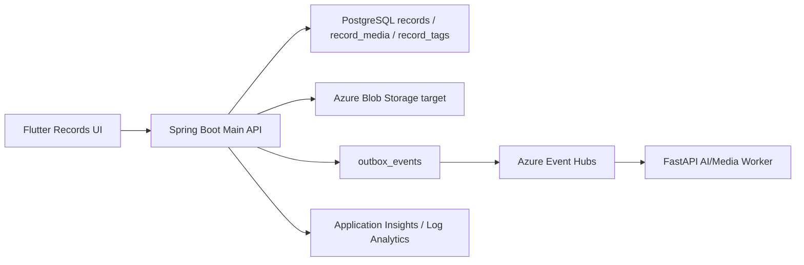

# ONMU Records/Memories/Media/OOTD 아키텍처

## 목적

이 문서는 ONMU의 기록 탭, 하루 일과, OOTD, 미디어 업로드, 기록 상세/수정/삭제 영역의 Current-to-Target Architecture 기준이다. 현재 repo의 Spring Boot Main API, Flutter record repository/UI, Flyway 데이터 사전을 기준으로 현재 구현과 Azure/Terraform 목표 구조를 분리한다.

## 제품 원칙

- 기록의 원장은 `records`이고, 사진/이미지 파일은 DB가 아니라 object storage에 둔다.
- `record_media`는 기록과 storage object의 연결 정보를 보관한다.
- 하루 일과는 `type=DAILY`, OOTD는 `type=OOTD`로 저장한다.
- 하루 일과와 OOTD는 같은 날짜에 공존할 수 있다. 날짜별 화면은 record type별 표시 우선순위를 명확히 가져야 한다.
- 다이어리 UI 복원에 필요한 theme, mood, weather, timeline, 사진별 comment는 `records.payload` JSON에 보존한다.
- 저장된 다이어리 결과는 다시 열어도 같은 레이아웃과 장식으로 보여야 한다. `layoutType`과 decoration seed 또는 selected asset key를 저장 대상으로 본다.
- OOTD 캐릭터 변경분은 기본 캐릭터를 수정하지 않고 `records.payload.characterSnapshot`에 저장한다.
- Flutter 앱은 Spring Boot Main API만 호출한다. Blob/MinIO, FastAPI Worker, DB는 직접 호출하지 않는다.
- 이미지 업로드는 먼저 `POST /api/v1/media/upload`로 storage URL을 만들고, 이후 memory create/update에 URL을 연결한다.
- Target media contract는 `imageUrls[]`만이 아니라 `media[]` metadata를 first-class로 다룬다.

## Current Implementation

### Spring Boot Main API

현재 repo 기준 구현 파일은 다음과 같다.

| 역할 | 파일 |
| --- | --- |
| 기록/메모리 controller | `services/api-spring/src/main/java/com/onmu/api/web/MemoryController.java` |
| legacy/record controller | `services/api-spring/src/main/java/com/onmu/api/web/RecordController.java` |
| 기록 service | `services/api-spring/src/main/java/com/onmu/api/service/RecordService.java` |
| 미디어 controller | `services/api-spring/src/main/java/com/onmu/api/web/MediaController.java` |
| 미디어 service | `services/api-spring/src/main/java/com/onmu/api/service/MediaService.java` |
| entity/repository | `RecordEntity.java`, `RecordRepository.java`, `RecordMediaEntity.java`, `RecordMediaRepository.java`, `RecordTagEntity.java`, `RecordTagRepository.java` |
| DTO | `CreateMemoryRequest.java`, `CreateRecordRequest.java`, `MemoryResponse.java`, `RecordMediaInput.java`, `UploadMediaResponse.java` |
| 테스트 | `RecordServiceTests.java`, `MediaServiceTests.java`, `MediaControllerTests.java` |

현재 route는 다음 계약을 제공한다.

| 기능 | Method / Path | 비고 |
| --- | --- | --- |
| 내 기록 목록 | `GET /api/v1/memories` | 기록 탭 월간/전체 read model |
| 기록 생성 | `POST /api/v1/memories` | DAILY/OOTD 공통 생성 |
| 기록 상세 | `GET /api/v1/memories/{memoryId}` | memory detail/edit 진입 |
| 기록 전체 수정 | `PUT /api/v1/memories/{memoryId}` | full replace 성격 |
| 기록 부분 수정 | `PATCH /api/v1/memories/{memoryId}` | Flutter Web 수정 저장 우선 경로 |
| 기록 삭제 | `DELETE /api/v1/memories/{memoryId}` | soft delete target |
| 그룹 기록 목록 | `GET /api/v1/groups/{groupId}/memories` | group detail read model |
| 그룹 기록 생성 | `POST /api/v1/groups/{groupId}/memories` | group scoped create |
| 미디어 업로드 | `POST /api/v1/media/upload` | multipart upload |
| 미디어 public proxy | `GET /api/v1/media/public` | storage key/public URL 표시 |
| presigned URL 후보 | `POST /api/v1/uploads/presigned-url` | target 확장 hook |

현재 `/api/v1/memories` create/update는 `imageUrls[]`를 받아 `record_media` row를 만든다. 이때 `RecordMediaInput` 전체 metadata를 받는 group record 경로와 달리 personal memories 경로는 아직 `media[]` metadata contract가 정식화되지 않았다. 따라서 current는 `imageUrls[]` 호환을 유지하되, target에서는 upload 응답의 `storageKey`, `contentType`, `sizeBytes`, `sortOrder`, `comment`를 memory 저장 payload에 보존하는 방향으로 보강한다.

### Flutter client

현재 Flutter 구현 경계는 다음과 같다.

| 역할 | 파일 |
| --- | --- |
| 기록 달력/바텀시트 | `apps/mobile-flutter/lib/features/ootd/ootd_list_page.dart` |
| 하루 일과 작성/결과 | `apps/mobile-flutter/lib/features/ootd/presentation/pages/daily_record_screen.dart` |
| 하루 일과 수정 | `apps/mobile-flutter/lib/features/ootd/presentation/pages/daily_record_edit_screen.dart` |
| OOTD 작성 | `apps/mobile-flutter/lib/features/ootd/presentation/pages/ootd_record_screen.dart` |
| 기록 repository | `apps/mobile-flutter/lib/features/ootd/repository/record_repository.dart` |
| record model | `apps/mobile-flutter/lib/shared/models/ootd_model.dart` |
| 기록 상세 화면 | `apps/mobile-flutter/lib/features/memory/presentation/pages/memory_detail_page.dart` |
| API client | `apps/mobile-flutter/lib/core/api/onmu_api_client.dart`, `onmu_media_url.dart` |
| route | `apps/mobile-flutter/lib/core/routing/route_paths.dart`, `app_router.dart` |

Route 기준은 `/records`, `/records/new/daily`, `/records/new/ootd`, `/records/{recordId}`, `/records/edit/{recordId}`, `/records/{recordId}/template-diary`다.

### Data model and Flyway

| 테이블 | Flyway | 역할 |
| --- | --- | --- |
| `records` | `V1__core_schema_scaffold.sql`, `V4__core_schema_data_dictionary.sql`, seed `V5`, `V9` | DAILY/OOTD/photo/memo 통합 기록 원장 |
| `record_media` | `V4__core_schema_data_dictionary.sql`, seed `V5`, `V9`, `V12__connect_seed_record_media_minio.sql` | 기록 첨부 미디어 metadata와 storage key/public URL |
| `record_tags` | `V4__core_schema_data_dictionary.sql`, seed `V5` | hashtag/mood/category tag 연결 |
| `ootd_features` | `V4__core_schema_data_dictionary.sql` | OOTD/persona feature 확장 후보 |
| `outbox_events` | `V4__core_schema_data_dictionary.sql` | record/media 후처리 이벤트 후보 |

`records.deleted_at`은 soft delete 기준이다. 목록/상세 조회는 `deleted_at IS NULL`을 기준으로 해야 한다.

## API Contract

기록 생성 요청 예시:

```json
{
  "type": "DAILY",
  "title": "Daily record 2026-06-17",
  "memo": "오늘의 소중한 순간을 기록했어요.",
  "date": "2026-06-17",
  "tags": ["#하루기록", "#찐인데"],
  "visibility": "PRIVATE",
  "imageUrls": [
    "/api/v1/media/public?key=dev/media/records/rec_123/image-1.jpg"
  ],
  "payload": {
    "brands": {
      "recordType": "daily",
      "theme": "diary",
      "crew": "userOnly"
    },
    "mood": "평온",
    "weather": "맑음",
    "timeline": [
      {
        "category": "daily",
        "imageUrl": "/api/v1/media/public?key=dev/media/records/rec_123/image-1.jpg",
        "description": "카페에서 쉬었다."
      }
    ]
  }
}
```

미디어 업로드 응답 예시:

```json
{
  "storageKey": "dev/media/records/rec_123/image-1.jpg",
  "publicUrl": "/api/v1/media/public?key=dev/media/records/rec_123/image-1.jpg"
}
```

Target media metadata 예시:

```json
{
  "media": [
    {
      "id": "media_123",
      "objectKey": "records/media/2026/06/17/photo-1.jpg",
      "publicUrl": "/api/v1/media/public?key=records/media/2026/06/17/photo-1.jpg",
      "contentType": "image/jpeg",
      "sizeBytes": 823421,
      "width": 1200,
      "height": 900,
      "sortOrder": 1,
      "comment": "사진 코멘트"
    }
  ]
}
```

Target에서는 `objectKey` 또는 `storageKey`가 storage object의 식별자이고, DB에는 원본 이미지 bytes가 아니라 metadata만 저장된다. `publicUrl`은 응답 편의를 위한 API URL이며 source of truth는 `record_media.storage_key`다.

OOTD character snapshot 예시:

```json
{
  "type": "OOTD",
  "payload": {
    "brands": {
      "recordType": "ootd"
    },
    "characterSnapshot": {
      "hairStyleIndex": 1,
      "hairColorIndex": 2,
      "eyeColorIndex": 0,
      "topIndex": 3,
      "bottomIndex": 1
    }
  }
}
```

Diary payload target 예시:

```json
{
  "schemaVersion": 2,
  "layoutType": "DIARY",
  "decorationSeed": 182937,
  "selectedStickers": ["heart_1", "flower_3"],
  "selectedPapers": ["scratch_paper_2"],
  "mood": "HAPPY",
  "weather": "SUNNY",
  "dailyMemo": "오늘의 소중한 순간을 기록했어요.",
  "tags": ["하루기록", "집가고싶다"]
}
```

`layoutType`은 최소 `DIARY`, `CLEAN`을 지원하는 target 필드다. 랜덤 장식은 record id/date 기반 seed 또는 selected asset key를 저장해 결과 화면, 상세 바텀시트, export 이미지가 같은 구성을 재현해야 한다.

## Display and State Refresh Rules

| 상태 | 캘린더/월간 표시 | 바텀시트/상세 표시 |
| --- | --- | --- |
| 해당 날짜 기록 없음 | 기본 날짜 셀 | empty state |
| DAILY만 있음 | diary/book icon | 하루 일과 탭 또는 단일 DAILY 상세 |
| OOTD만 있음 | OOTD 캐릭터 썸네일 | OOTD 상세 |
| DAILY와 OOTD 모두 있음 | 캐릭터 썸네일 + 기록 상태 indicator | `하루 일과`, `OOTD 기록` 탭으로 분리 |

OOTD record가 없으면 캐릭터를 표시하지 않는다. DAILY만 있는 날에 기본 캐릭터나 최근 OOTD 캐릭터를 대신 보여주면 사용자는 OOTD가 저장된 것으로 오해할 수 있다.

수정/삭제 후 Flutter 상태 갱신 기준:

- `POST/PATCH/PUT /api/v1/memories` 성공 후 `ootdRecordsProvider`와 상세 provider를 invalidate/refetch한다.
- `DELETE /api/v1/memories/{memoryId}` 성공 후 월간 캘린더 local state에서 해당 record id를 즉시 제거하고 바텀시트/상세를 닫는다.
- 삭제 후 동일 record 재삭제의 `404 memory_not_found`는 치명 오류가 아니라 이미 삭제된 상태로 처리한다.
- 실패 시에는 local optimistic state를 rollback하고 error code 중심 메시지를 표시한다.

## Upload Policy

| 항목 | 현재 | Target |
| --- | --- | --- |
| 업로드 경계 | Flutter가 `POST /api/v1/media/upload`로 Spring에 multipart 전송 | Spring API가 media upload boundary를 소유하고 Blob/MinIO provider를 추상화 |
| storage 직접 호출 | Flutter는 MinIO/Azure Blob을 직접 호출하지 않음 | 동일. presigned direct upload를 도입해도 Spring이 URL 발급/검증/metadata 저장을 소유 |
| 최대 장수 | 명시 정책 부족 | DAILY/OOTD 사진은 기본 5장 후보. 확정 값은 API validation과 Flutter picker 제한을 함께 변경 |
| MIME/확장자 | Spring `MediaService`가 image content type과 `.jpg`, `.jpeg`, `.png`, `.webp`, `.gif`, `.heic`, `.heif` 확장자를 허용 | 허용 목록을 문서/API error contract/test로 고정 |
| 용량 제한 | 명시 정책 부족 | 단일 파일 최대 크기, 전체 payload 최대 크기, client compression/WebP/JPEG 우선 정책을 확정 |
| 에러 코드 | `media_file_required`, `unsupported_media_type`, `failed_to_upload_media` | `media_file_too_large`, `media_count_exceeded`, `unsupported_media_type`, `media_upload_failed` 등으로 확장 |

용량 제한은 gateway, Spring multipart limit, mobile picker/compression이 함께 맞아야 한다. Terraform/Azure 전환 전에는 Container Apps ingress/body limit과 Spring `multipart.max-file-size` 계열 설정을 smoke에 포함한다.

## Event / Outbox / Side Effect Model

Current:

- `POST/PATCH/DELETE /api/v1/memories`는 Spring transaction 안에서 `records`, `record_media`, `record_tags`를 갱신한다.
- `POST /api/v1/media/upload`는 파일을 storage에 먼저 올리고 URL을 반환한다.
- Flutter는 upload 결과의 `publicUrl`을 memory payload와 `imageUrls[]`에 연결한다.

Target 후보:

| 이벤트 | 발생 시점 | 소비자 |
| --- | --- | --- |
| `record.created` | DAILY/OOTD 생성 | notification/read model worker 후보 |
| `record.updated` | 기록 수정 | cache/read model refresh 후보 |
| `record.deleted` | soft delete | media cleanup worker 후보 |
| `media.thumbnail.requested` | image upload 또는 record create | FastAPI/Media worker 후보 |
| `ai.summary.requested` | 기록 설명/추천 생성 필요 시 | FastAPI AI/Data Worker |

미디어 파일 삭제는 DB transaction과 object storage operation의 원자성이 다르므로, target에서는 soft delete 후 cleanup job/outbox로 정리하는 방식을 우선한다.

## Target Architecture



- 확정: records/memories public API는 Spring Boot `/api/v1`가 소유한다.
- 확정: core record schema는 Spring Flyway가 소유한다.
- 확정: Flutter는 미디어 storage에 직접 write하지 않는다.
- 확정: DB에는 image bytes를 저장하지 않고 `record_media` metadata와 object key/public URL만 저장한다.
- 후보: local/dev MinIO compatibility를 유지하되 Azure staging/prod는 Azure Blob Storage를 기본 target으로 둔다.
- 후보: storage provider 전환은 env var 또는 Spring profile로 선택하고 Flutter contract는 바꾸지 않는다.
- 후보: thumbnail, AI diary summary, OOTD/persona extraction은 FastAPI Worker가 소비한다.
- 미결정: presigned direct upload를 사용할지, Spring multipart proxy를 유지할지 결정 필요.

## Current-to-Target Delta

| 구분 | Current | Target | Delta |
| --- | --- | --- | --- |
| 기록 저장 | Spring `/memories` + payload JSON | 동일 + payload schema version | `payload.schemaVersion` 추가 후보 |
| 사진 업로드 | Spring multipart, MinIO/local object storage, `/memories`는 `imageUrls[]` 중심 | Azure Blob + managed identity 또는 SAS, `media[]` metadata contract | storage abstraction/env와 media metadata contract 정리 필요 |
| 이미지 표시 | `publicUrl` 상대 경로 가능 | absolute media URL normalization | Flutter `ONMU_API_BASE_URL` 기준 정규화 유지 |
| 삭제 | `DELETE /memories/{id}` soft delete target | soft delete + media cleanup outbox | cleanup worker 필요 |
| 수정 | Flutter Web은 `PATCH` 우선 | CORS policy에 PATCH/DELETE 고정 | APIM/ingress CORS Terraform 필요 |
| DAILY/OOTD 표시 | `type`과 payload 기반 표시 | 같은 날짜 공존, OOTD 없으면 캐릭터 미표시, DAILY만 있으면 diary/book icon | Flutter calendar/bottom sheet 표시 기준 고정 |
| 다이어리 재현성 | theme/mood/weather/timeline 일부 저장 | `layoutType`, `decorationSeed` 또는 selected asset key 저장 | payload schema version과 mapper test 필요 |
| OOTD | character snapshot payload | AI/OOTD feature extraction 확장 | worker job/event 필요 |

## Terraform Resource Implications

Terraform이 소유해야 할 리소스 후보:

- Azure Blob Storage account, container, lifecycle policy
- Azure Database for PostgreSQL Flexible Server, diagnostic settings
- Azure Key Vault, Managed Identity, app settings Key Vault reference
- Azure API Management 또는 ingress CORS policy for `GET,POST,PUT,PATCH,DELETE,OPTIONS`
- Azure Event Hubs event hub for media/AI job events
- Azure Monitor Application Insights, Log Analytics, alerts for 4xx/5xx/upload failure
- Container Apps ingress/body size와 Spring multipart limit에 맞춘 runtime setting 후보

Terraform이 소유하지 않는 것:

- `records`, `record_media`, `record_tags`, `outbox_events` DDL: Spring Flyway 소유
- `worker_ai` schema: FastAPI Alembic 소유
- media upload transaction, record payload validation: Spring runtime 소유
- Flutter layout/theme/assets: Flutter app repository 소유
- CI/CD run execution: GitHub Actions 소유
- storage object key naming, object copy, orphan cleanup 실행: runtime runbook/worker 소유

## Secret / Key Vault / Managed Identity Boundary

secret 값은 문서에 기록하지 않는다. 이름과 경계만 관리한다.

| 이름 | 사용처 | Key Vault secret name |
| --- | --- | --- |
| `DATABASE_URL` | Spring records DB connection | `database-url` 계열 환경별 secret |
| `POSTGRES_PASSWORD` | Spring DB password | `postgres-password` 계열 환경별 secret |
| `ONMU_ACCESS_TOKEN_SECRET` | dev JWT 검증/발급 | `dev-access-token-secret`, `int-access-token-secret` |
| `ONMU_CORS_ORIGINS` 또는 환경별 CORS env | Flutter Web origin 허용 | 환경별 앱 설정 또는 Key Vault 참조 |
| `MINIO_ROOT_USER`, `MINIO_ROOT_PASSWORD` | local/dev MinIO compatibility | `minio-root-user`, `minio-root-password` |
| Azure Blob credential 후보 | target media storage | Managed Identity 우선, 불가 시 storage credential secret |

Flutter 앱에는 storage credential, DB credential, Key Vault secret을 넣지 않는다.

## Observability and Smoke Test

Current smoke 후보:

- `GET /healthz`, `GET /readyz`
- `OPTIONS /api/v1/memories` with Origin `http://127.0.0.1:5173`, method `POST/PATCH/DELETE`
- `POST /api/v1/media/upload` small image upload
- `POST /api/v1/memories` DAILY create
- `POST /api/v1/memories` OOTD create
- `GET /api/v1/memories?date=...` 또는 월간 목록에서 해당 날짜 record presence 확인
- `PATCH /api/v1/memories/{memoryId}` update
- `DELETE /api/v1/memories/{memoryId}` soft delete
- `GET /api/v1/memories`에서 deleted record 제외 확인
- 사진 포함 기록의 `imageUrls[]`, target `media[]` metadata, `storageKey/objectKey`, content type, sort order presence 확인
- OOTD가 없는 DAILY 날짜에서 character thumbnail이 표시되지 않는지 확인
- DAILY와 OOTD가 같은 날짜에 있을 때 바텀시트 탭/상세 진입을 분리 확인
- 저장된 `layoutType`/decoration seed가 상세 재진입 후 유지되는지 확인

Target metrics:

- memory create/update/delete success/failure count
- media upload size rejection count
- media upload latency p95
- storage dependency failure count
- `record_not_found`, `media_upload_failed`, `authentication_required`, `token_expired` error dashboard
- CORS preflight failure count by origin/method

## Migration Risks

- dev server에 API PR이 merge/deploy되지 않으면 Flutter local code가 `PATCH`/`DELETE`/new payload를 호출해도 404/405/502처럼 보일 수 있다.
- 이미지 URL이 relative public URL이면 Flutter Web에서 dev server origin으로 잘못 붙을 수 있다.
- 큰 이미지 업로드는 dev API 제한에 걸릴 수 있어 client resize/compress 정책이 필요하다.
- `records.payload` JSON schema를 화면 UI와 함께 변경하면 이전 seed/기록이 깨질 수 있다.
- media object는 DB transaction과 원자적으로 삭제되지 않으므로 orphan object cleanup이 필요하다.
- OOTD가 없는 DAILY 기록은 character/WITH block을 표시하지 않아야 한다.
- 같은 날짜에 DAILY와 OOTD가 공존할 때 월간 캘린더가 하나만 있다고 가정하면 삭제/상세 진입이 잘못될 수 있다.
- 랜덤 장식 seed나 selected asset key를 저장하지 않으면 상세 재진입, export 이미지, 바텀시트 결과가 서로 달라질 수 있다.
- Flutter가 Blob/MinIO URL을 직접 저장소 endpoint로 호출하기 시작하면 CORS/secret/storage provider 교체 리스크가 커진다.

## Decision Log

| 상태 | 결정 |
| --- | --- |
| 확정 | Flutter는 Spring Boot Main API만 직접 호출한다. |
| 확정 | 하루 일과는 `type=DAILY`, OOTD는 `type=OOTD`로 구분한다. |
| 확정 | 사진은 upload 후 `publicUrl`과 storage key metadata를 record payload와 `record_media`에 연결한다. |
| 확정 | OOTD별 캐릭터 변경은 `records.payload.characterSnapshot`에 저장한다. |
| 확정 | 기록 삭제는 `records.deleted_at` 기준 soft delete로 처리한다. |
| 확정 | OOTD record가 없는 날짜에는 캐릭터 썸네일을 표시하지 않는다. |
| 후보 | DAILY/OOTD 사진은 최대 5장으로 제한한다. |
| 후보 | 다이어리 결과 재현성을 위해 `layoutType`과 `decorationSeed` 또는 selected asset key를 저장한다. |
| 후보 | media thumbnail/AI summary는 outbox + FastAPI Worker로 확장한다. |
| 미결정 | 단일 파일/전체 payload 최대 용량과 client compression 정책. |
| 미결정 | direct-to-Blob presigned upload를 도입할지 Spring multipart proxy를 유지할지 결정 필요. |

## Roadmap

1. `records.payload.schemaVersion`을 도입해 기존 seed/기록과 새 다이어리 UI를 구분한다.
2. Flutter image picker 결과를 client resize/compress 후 upload하도록 정리한다.
3. `media[]` metadata contract를 `/api/v1/memories` create/update response에 정식화한다.
4. `PATCH/DELETE /memories/{id}` dev/staging smoke를 CI/CD에 추가한다.
5. media upload를 Azure Blob Storage abstraction으로 교체한다.
6. same-day DAILY/OOTD 표시와 삭제 후 state invalidate/refetch 테스트를 추가한다.
7. `record.created`, `media.thumbnail.requested`, `ai.summary.requested` outbox event를 worker와 연결한다.
8. 기록 export image/share card는 외부 공개 링크가 아니라 client export 또는 share card domain으로 분리한다.

## Non-goals

- 실제 AI 이미지 생성/스타일 추천 prompt 구현
- Flutter에서 Blob/MinIO 직접 업로드
- Databricks/reporting layer 구현
- 공개 링크 기반 share page 구현
- 온모임/약속 장소 확정 로직 구현
