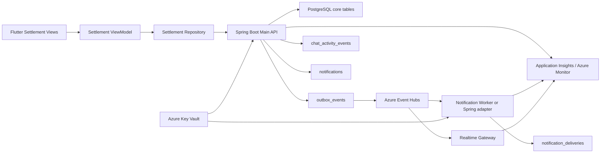

# ONMU Settlement 아키텍처

## 목적

이 문서는 ONMU 정산 영역을 현재 구현, 목표 아키텍처, Current-to-Target Delta로 나누어 정리한다. 정산은 모임 전체 기능이 아니라 반드시 `groups/{groupId}/plans/{planId}` 하위의 약속 단위 도메인이다. 사용자는 한 약속에서 발생한 결제 항목을 입력하고, 항목별 대상자를 고른 뒤, 미리보기로 송금 방향을 확인하고, 최종 정산 결과를 채팅 카드와 알림으로 공유해야 한다.

현재 구현은 Spring Boot Main API의 REST endpoint, PostgreSQL/Flyway core table, Flutter route/repository/read model이 존재하는 vertical slice다. 다만 Flutter 화면의 저장/생성 action, ChatActivity 카드 append, 사용자별 notification row 생성, 실제 push delivery는 아직 목표 구조와 차이가 있다.

구현 근거는 `services/api-spring/src/main/java/com/onmu/api/web/ApiController.java`, `services/api-spring/src/main/java/com/onmu/api/service/SettlementApiService.java`, `services/api-spring/src/main/java/com/onmu/api/domain/Settlement*`, `services/api-spring/src/main/resources/db/migration/V1/V3/V4/V5/V9`, `apps/mobile-flutter/lib/features/settlement/**`, `apps/mobile-flutter/lib/features/group/presentation/pages/plan_settlement_*`, `apps/mobile-flutter/lib/shared/models/settlement_models.dart`를 기준으로 확인했다.

## 제품 원칙

| 원칙 | 의미 |
| --- | --- |
| 정산은 약속 하위 도메인이다 | 정산 route, table 관계, 화면 이동은 모두 `group -> plan -> settlement` 경계를 따른다. |
| draft, preview, create, result를 분리한다 | 편집 상태, 계산 검증, 최종 생성, 결과 read model은 서로 다른 API/상태로 다룬다. |
| 구조화 table을 우선한다 | `settlement_items`, `settlement_item_targets`, `settlement_transfers`가 조회와 계산의 우선 원장이고, `payload` JSON은 compact fallback과 mock 호환 snapshot이다. |
| 사용자 ID가 이름보다 우선한다 | `payerUserId`, `targetUserIds`가 canonical 계약이고, `payerName`, `targetNames`는 dev seed와 과거 mock 호환 fallback이다. |
| 금액은 KRW 원 단위 정수다 | API의 `amountWon`과 현재 DB `amount_cents` 물리 컬럼은 모두 원 단위 integer로 해석한다. 컬럼명은 legacy mismatch다. |
| 정산 생성은 side effect를 남긴다 | 최종 생성은 `settlement.created`와 `notification.requested`를 outbox에 남기고, 목표 구조에서는 ChatActivity 카드와 사용자별 알림 row까지 같은 domain transaction에서 만든다. |
| 실제 결제/송금은 별도 범위다 | 현재 `settlement_transfers`는 송금 요약 projection이고, Toss Payments/PortOne 같은 실제 결제 연동은 목표 외부 후보로만 둔다. |

## Current Implementation

### Spring API

현재 public route는 `ApiController`가 받고 `SettlementApiService`로 위임한다.

| 기능 | API | 현재 동작 |
| --- | --- | --- |
| Draft 조회 | `GET /api/v1/groups/{groupId}/plans/{planId}/settlement-draft` | 저장된 draft가 있으면 table 기반 preview를 반환한다. 없으면 저장하지 않은 synthetic draft를 `persisted=false`, `targetPatchAvailable=false`로 반환한다. |
| Draft 저장 | `PATCH /api/v1/groups/{groupId}/plans/{planId}/settlement-draft` | `items`를 필수로 받고 draft payload와 `settlement_items`, `settlement_item_targets`를 교체 저장한다. |
| 항목 대상자 저장 | `PATCH /api/v1/groups/{groupId}/plans/{planId}/settlement-draft/items/{itemId}/targets` | 저장된 draft/item이 있을 때만 대상자를 교체하고 금액을 균등 분배한다. |
| Preview | `POST /api/v1/groups/{groupId}/plans/{planId}/settlements/preview` | 요청 items만으로 송금 방향을 계산한다. DB write와 outbox write는 하지 않는다. |
| Create | `POST /api/v1/groups/{groupId}/plans/{planId}/settlements` | `settlements`, `settlement_items`, `settlement_item_targets`, `settlement_transfers`를 저장하고 outbox event를 기록한다. |
| Result 최신 조회 | `GET /api/v1/groups/{groupId}/plans/{planId}/settlements` | 최신 settlement가 있으면 결과를 반환하고, 없으면 draft 또는 빈 draft 기반 preview를 반환한다. |
| Result ID 조회 | `GET /api/v1/groups/{groupId}/plans/{planId}/settlements/{settlementId}` | plan 하위 public settlement id로 결과를 조회한다. |

요청 items가 없으면 `400 missing_settlement_items`를 반환한다. 음수 금액은 `400 invalid_settlement_amount`다. 사용자 public id가 없거나 이름 fallback 조회가 실패하면 `400 settlement_member_not_found`다. 이름 fallback에서 같은 표시 이름이 여러 사용자와 매칭되면 `400 ambiguous_settlement_member_name`이다.

현재 `OnmuApiService`에도 과거 settlement helper가 남아 있지만, web route는 `SettlementApiService`를 사용한다. 문서 기준 Current Implementation은 `SettlementApiService`와 `ApiController` 경로를 canonical로 본다.

### Spring Data / Flyway

| Table | 현재 역할 | Source of truth 여부 |
| --- | --- | --- |
| `settlement_drafts` | 약속별 편집 draft row와 compact payload snapshot | draft envelope 원장 |
| `settlements` | 최종 생성된 settlement envelope와 compact payload snapshot | result envelope 원장 |
| `settlement_items` | draft 또는 settlement에 연결된 결제 항목 | 항목 read/calculation 우선 원장 |
| `settlement_item_targets` | 항목별 부담 대상자와 분배 금액 | 대상자 read/calculation 우선 원장 |
| `settlement_transfers` | 최종 정산 결과의 송금 요약 | result projection |
| `settlement_confirmations` | 송금 확인 scaffold table | 현재 runtime 미사용, 후속 확인/분쟁 확장 후보 |
| `outbox_events` | 정산 생성 후 side effect event | 비동기 side effect 원장 |

`V1__core_schema_scaffold.sql`은 `settlement_drafts`, `settlements`를 만든다. `V3__vertical_slice_contract_tables.sql`은 public id와 초기 payload seed를 더한다. `V4__core_schema_data_dictionary.sql`은 `settlement_items`, `settlement_item_targets`, `settlement_transfers`, `settlement_confirmations`를 만든다. `V5__core_seed_data_dictionary.sql`과 `V9__screen_aligned_dev_seed.sql`은 screen/dev smoke용 정산 seed를 보강한다.

조회는 structured table을 먼저 사용한다. `settlement_items`가 없으면 `payload.items`를 읽어 과거 Flutter mock payload와 V3 seed를 fallback으로 해석한다. payer 정보는 현재 별도 payer table이 없으므로 payload의 `payerShares`, `payerUserId`, `payerName`에서 읽는다.

### Flutter 흐름

Flutter route는 모두 plan 하위다.

```text
/groups/:groupId/plans/:planId/settlements/new
/groups/:groupId/plans/:planId/settlements/new/items/:itemId/targets
/groups/:groupId/plans/:planId/settlements/new/preview
/groups/:groupId/plans/:planId/settlements/:settlementId
```

현재 `SettlementRepository`는 draft 조회, preview, create, result 조회 API 메서드를 제공한다. `SettlementDraftItemInput.toJson()`은 `amount`와 `amountWon`을 함께 보내고, `payerUserId`, `targetUserIds`가 있으면 포함한다.

현재 화면 구현은 주로 read model 표시와 route 이동 중심이다. `SettlementViewModel`은 `fetchSettlement`만 호출한다. 대상자 선택 화면의 저장 버튼은 로컬 선택 상태를 API로 저장하지 않고 정산 생성 화면으로 돌아간다. preview 화면의 `정산 만들기` 버튼도 `createSettlement` API를 호출하지 않고 settlement detail route로 이동한다. 따라서 Flutter mutation action은 Target Architecture의 주요 Delta다.

### ChatActivity / Notification 현재 경계

`createSettlement`는 현재 같은 transaction 안에서 다음 outbox를 기록한다.

| Event | aggregate | payload 현재 필드 |
| --- | --- | --- |
| `settlement.created` | `settlement` | `groupId`, `planId`, `settlementId` |
| `notification.requested` | `settlement` | `groupId`, `planId`, `settlementId`, `channel=activity` |

runtime create 경로는 아직 `chat_activity_events` row나 사용자별 `notifications` row를 직접 만들지 않는다. 현재 `notification.requested` payload에는 `notificationId`가 없고 aggregate도 `notification`이 아니므로, 현재 `NotificationDeliveryService` 기준으로 provider delivery 대상 notification을 찾지 못해 `skipped_dev`로 끝날 수 있다. `channel=activity`는 ChatActivity 공유 또는 앱 안 활동 표시 의도를 나타내는 값으로 보고, FCM/APNs provider delivery 대상 이벤트와 분리해야 한다. V9 seed에는 `settlement_created` notification row와 `notificationId`가 들어간 seed outbox가 있지만, 이는 runtime create 경로와 구분해야 한다. 알림 inbox, device registry, provider delivery의 자세한 목표 경계는 [Notification / Push / Devices 아키텍처](./notification-push-devices-architecture.md)를 따른다.

## Target Architecture



목표 구조에서 Flutter는 계속 Spring Boot Main API만 호출한다. Spring은 group membership, plan ownership, participant 권한을 확인한 뒤 draft 저장, preview 계산, create transaction을 처리한다. 최종 생성 transaction은 `settlements`, `settlement_items`, `settlement_item_targets`, `settlement_transfers`, `chat_activity_events`, `notifications`, `outbox_events`를 일관되게 기록한다.

Realtime Gateway와 Notification Worker는 outbox/queue의 소비자다. 이들은 정산 원장을 직접 만들거나 수정하지 않는다. FastAPI AI/Data Worker도 정산 core table을 직접 변경하지 않는다.

## Current-to-Target Delta

| 구분 | 현재 | 목표 | 소유 |
| --- | --- | --- | --- |
| Flutter draft mutation | 화면 선택 상태가 API 저장으로 이어지지 않음 | ViewModel action이 `PATCH /settlement-draft`, item targets PATCH를 호출 | Flutter |
| Flutter create mutation | preview 버튼이 route 이동만 수행 | `POST /settlements/preview`, `POST /settlements` 결과와 오류를 ViewModel state로 관리 | Flutter |
| Auth viewer | `mySummaryLabel`, `isMe` 계산이 dev seed 첫 사용자 기준 | 인증된 viewer id 기준 계산 | Spring |
| Payer normalization | payer table 없음, payload payerShares 의존 | `settlement_item_payers` 또는 item-level payer role table 도입 여부 결정 | Spring/Flyway |
| ChatActivity card | runtime create 경로에서 card append 없음 | `settlement.created` 카드 snapshot을 `chat_activity_events`에 append | Spring |
| Notification row | runtime create 경로에서 사용자별 `notifications` row 없음 | 참여자별 inbox row 생성 후 `notification.requested` payload에 `notificationId` 포함 | Spring |
| Outbox delivery | `notification.requested` aggregate가 `settlement`라 provider 대상 탐색 불가 | provider delivery 대상 event는 aggregate `notification` 또는 payload `notificationId` 사용 | Spring/Worker |
| Event stream | Spring scheduled outbox가 일부 event 직접 처리 | Event Hubs 기반 publisher/consumer, checkpoint/replay/idempotency | Spring/Terraform |
| Amount naming | DB 컬럼이 `amount_cents`지만 원 단위 저장 | 컬럼 rename 또는 문서화된 legacy name 유지 결정 | Spring/Flyway |
| Observability | dev smoke와 단위 테스트 중심 | create latency, outbox 상태, notification/card 생성 drift 지표 | Observability |

## API Contract

### Public Flutter API

| API | Caller | Response/side effect |
| --- | --- | --- |
| `GET /api/v1/groups/{groupId}/plans/{planId}/settlement-draft` | create screen | draft envelope와 `preview` summary를 반환한다. 저장 draft가 없으면 synthetic draft다. |
| `PATCH /api/v1/groups/{groupId}/plans/{planId}/settlement-draft` | draft edit ViewModel | items를 저장하고 structured item/target table을 교체한다. |
| `PATCH /api/v1/groups/{groupId}/plans/{planId}/settlement-draft/items/{itemId}/targets` | target selection ViewModel | 저장된 draft item의 대상자를 교체한다. |
| `POST /api/v1/groups/{groupId}/plans/{planId}/settlements/preview` | preview ViewModel | write 없이 계산 결과를 반환한다. |
| `POST /api/v1/groups/{groupId}/plans/{planId}/settlements` | create ViewModel | 최종 settlement를 만들고 side effect outbox를 기록한다. |
| `GET /api/v1/groups/{groupId}/plans/{planId}/settlements` | detail/chat auxiliary | 최신 result 또는 draft preview를 반환한다. |
| `GET /api/v1/groups/{groupId}/plans/{planId}/settlements/{settlementId}` | result screen | 특정 settlement result를 반환한다. |

### Request item

```json
{
  "id": "401",
  "title": "커피",
  "amountWon": 12000,
  "amount": 12000,
  "payerUserId": "user-jimin",
  "payerName": "지민",
  "splitType": "equal",
  "targetUserIds": ["user-jimin", "user-minsu"],
  "targetNames": ["지민", "민수"]
}
```

규칙:

- `amountWon`이 canonical 금액 필드다. `amount`는 Flutter/mock 호환 필드다.
- 금액은 KRW 원 단위 integer다.
- `payerUserId`, `targetUserIds`를 우선 사용한다.
- public user id가 있으면 표시 이름은 fallback이나 화면 표시용 snapshot으로만 본다.
- user id가 없을 때만 `payerName`, `targetNames` fallback을 사용한다.
- 이름 fallback에서 동명이인이 있으면 `ambiguous_settlement_member_name`을 반환한다.
- `splitType=custom`은 현재 저장/표시 label을 구분하지만, target별 금액 입력 UI와 API는 후속 보강이 필요하다.

## Event / Outbox / Side Effect Model

| Event | Current | Target |
| --- | --- | --- |
| `settlement.created` | create transaction에서 outbox에 기록된다. 현재 consumer 없음으로 `no_consumer`가 될 수 있다. | ChatActivity, notification, analytics fan-out의 domain event로 사용한다. |
| `notification.requested` | create transaction에서 `aggregateType=settlement`, `channel=activity`로 기록된다. `notificationId`가 없다. | 실제 push/inbox delivery 대상은 `notificationId`를 포함하고 aggregate는 `notification`으로 통일한다. |
| ChatActivity card | runtime create와 현재 seed 모두 정산 카드 `chat_activity_events` append를 하지 않는다. | create transaction에서 `event_type=settlement.created` 또는 표준 card type으로 append한다. |
| Notification inbox | V9 seed에 settlement notification row가 있으나 runtime create는 만들지 않는다. | 참여자별 `notifications` row를 만들고 push는 후속 delivery projection으로 분리한다. |
| Push delivery | 현재 정산 create outbox만으로는 provider delivery 대상 알림을 찾지 못한다. | `notification.requested`에는 실제 `notifications.id`인 `notificationId`를 포함하고, 결과는 `notification_deliveries`에 기록한다. |

목표 transaction 순서:

1. group/plan/member 권한을 검증한다.
2. request items를 user id 기준으로 정규화한다.
3. `settlements`, `settlement_items`, `settlement_item_targets`, `settlement_transfers`를 저장한다.
4. `chat_activity_events`에 정산 카드 snapshot을 append한다.
5. 참여자별 `notifications` row를 만든다.
6. `settlement.created`, `notification.requested` outbox를 기록한다. 이때 provider delivery 대상 `notification.requested`는 `notificationId`를 포함하고, ChatActivity/activity-only 이벤트와 구분한다.
7. commit 이후 Realtime/Notification worker가 outbox를 소비한다.

## Data Model and Source of Truth

| 데이터 | Current source of truth | Target source of truth |
| --- | --- | --- |
| Draft envelope | `settlement_drafts` | 동일. plan당 active draft 정책 보강 |
| Draft items | `settlement_items.settlement_draft_id` 우선, 없으면 `settlement_drafts.payload.items` fallback | structured table만 canonical, payload는 compatibility snapshot |
| Final settlement envelope | `settlements` | 동일 |
| Final items | `settlement_items.settlement_id` 우선, 없으면 `settlements.payload.items` fallback | structured table만 canonical |
| Payer shares | payload `payerShares`/`payerUserId` | 별도 payer table 또는 item payer role 결정 필요 |
| Targets | `settlement_item_targets` | 동일 |
| Transfers | `settlement_transfers` | 동일. 실제 송금 완료 확인은 confirmation/status 확장 |
| Chat card | 현재 정산 card row 없음, runtime gap | `chat_activity_events` append-only stream |
| In-app notification | seed `notifications`, runtime gap | `notifications` 사용자별 inbox |
| Push delivery | 현재 정산 create payload로는 delivery 불가 | `notification_deliveries` provider result projection |

`payload` JSON에는 화면 fallback에 필요한 `items`, `payerShares`, `shareMessage` 등을 compact snapshot으로 남길 수 있다. 하지만 query, 권한, 정산 계산, migration 검증에 필요한 값은 structured table이 우선이다.

## Flutter Boundary

Flutter 책임:

- `/groups/:groupId/plans/:planId/settlements/*` route의 화면 렌더링.
- draft item 입력, 대상자 선택, preview/create button state.
- `SettlementRepository`를 통한 Spring API 호출.
- API 오류를 사용자-facing state로 변환.
- Chat screen에서 정산 카드 tap 시 settlement result route로 이동.

Flutter 금지:

- PostgreSQL, Event Hubs, Redis, Key Vault, Worker internal endpoint 직접 호출.
- 정산 계산의 최종 source of truth를 local state로 확정.
- JWT signing secret, DB password, provider credential, payment secret 저장.
- 실제 정산/송금 데이터를 로그나 analytics custom field에 원문으로 남기기.

현재 gap:

- `SettlementViewModel`은 조회만 담당한다.
- target selection 저장과 create CTA가 mutation API를 호출하지 않는다.
- `SettlementSummary.id`가 int 기반이라 public id가 숫자가 아닐 때의 route/model 전략을 결정해야 한다.

## Spring / Worker Boundary

Spring Boot Main API 책임:

- `groups/{groupId}/plans/{planId}` 하위 정산 route 제공.
- group/plan membership 권한 검증.
- request item normalization과 금액 검증.
- structured table 저장과 read model 생성.
- domain transaction과 outbox 기록.
- Flutter-facing `/api/v1` contract 유지.

현재 구현은 `groupId`, `planId` 존재와 plan이 해당 group에 속하는지만 확인하고, 인증 사용자별 plan participant/membership enforcement는 target gap으로 남아 있다. production 전에는 ChatActivity처럼 viewer identity를 주입해 `mySummaryLabel`, `isMe`, mutation 권한을 같은 기준으로 계산해야 한다.

Worker / Realtime / Notification 책임:

- outbox/queue message 소비.
- ChatActivity fan-out, push delivery, retry/dead-letter 처리.
- provider delivery 결과를 projection으로 남기기.

Worker 금지:

- 정산 core table의 DDL 소유.
- Flutter-facing settlement API 제공.
- Spring 권한 검증을 우회한 settlement mutation.

## Terraform Resource Implications

| 필요 기능 | 현재 구현 | 목표 구조 | Azure 리소스 후보 | Terraform 소유 여부 |
| --- | --- | --- | --- | --- |
| Public API runtime | Windows Spring dev runtime | ACA staging 또는 AKS production | Container Apps, AKS, ACR | 예 |
| Core DB | Local/dev PostgreSQL + Flyway | PostgreSQL Flexible Server private access | Azure Database for PostgreSQL Flexible Server, VNet/private endpoint | 서버/네트워크만 |
| Async side effect | Spring scheduled outbox | Event stream 기반 fan-out | Azure Event Hubs | 예 |
| Realtime card delivery | Spring chat SSE vertical slice | Realtime Gateway + Redis | Azure Cache for Redis, ingress | 예 |
| Notification delivery | dev-safe provider abstraction | Notification worker/provider adapter | Event Hubs, Container Apps/AKS service | 예 |
| Observability | tests/log 중심 | trace/metric/log | Application Insights, Log Analytics, Azure Monitor | 예 |
| Secret boundary | local env/Key Vault 문서화 | Managed Identity + Key Vault references | Azure Key Vault, Managed Identity | 예 |

Terraform이 소유하지 않는 것:

- `settlement_drafts`, `settlements`, `settlement_items`, `settlement_item_targets`, `settlement_transfers` DDL.
- Flyway migration history.
- seed data.
- 정산 API request/response schema.
- 정산 계산 로직.
- 실제 사용자 정산 데이터.

## Secret / Key Vault / Managed Identity Boundary

정산 core 자체에는 별도 provider secret이 없다. 정산 API는 Spring runtime의 공통 DB/JWT/queue/observability secret boundary를 따른다.

| 목적 | Env var 후보 | Key Vault secret name 후보 | Flutter 전달 여부 |
| --- | --- | --- | --- |
| Spring DB 접속 | `SPRING_DATASOURCE_URL`, `SPRING_DATASOURCE_PASSWORD` | 환경별 DB password secret | 금지 |
| ONMU access JWT 검증 | `ONMU_ACCESS_TOKEN_SECRET` | `dev-access-token-secret`, `int-access-token-secret`, `prod-access-token-secret` | 금지 |
| Event stream publish/consume | Event Hubs connection 또는 Managed Identity 기반 설정 | 환경별 Event Hubs secret/reference 후보 | 금지 |
| Worker URL fallback | `ONMU_WORKER_URL` | secret보다 config/env 후보 | 금지 |
| Observability | `APPLICATIONINSIGHTS_CONNECTION_STRING` | 환경별 App Insights connection secret 후보 | 금지 |

Managed Identity 기준:

- Azure runtime이 Key Vault와 Event Hubs에 접근한다.
- 일반 팀원 smoke는 secret 값을 출력하지 않고, 필요한 경우 로컬 프로세스 env 또는 git ignored dart-define 파일만 사용한다.
- Terraform plan은 가능하지만 apply, Azure 리소스 생성/삭제, Key Vault secret 값 쓰기는 사람 승인 전 수행하지 않는다.

## Observability and Smoke Test

### 최소 지표

| 지표 | 의미 |
| --- | --- |
| `settlement.draft.saved.count` | draft 저장량 |
| `settlement.preview.requested.count` | preview 계산량 |
| `settlement.created.count` | 최종 settlement 생성량 |
| `settlement.create.latency_ms` | create transaction latency |
| `settlement.outbox.created.count` | 생성 후 outbox 기록 수 |
| `settlement.notification.missing_id.count` | provider 대상 notification id 누락 |
| `settlement.chat_activity.created.count` | 정산 카드 append 수 |
| `settlement.transfer.count` | 생성된 transfer 수 |
| `settlement.validation_error.count` | amount/member/name ambiguity 오류 |

### Dev-safe smoke

보호 API는 기존 Spring dev API mode처럼 짧은 수명 ONMU access JWT를 사용한다. token 값은 출력하지 않는다.

1. `GET /api/v1/groups/1/plans/103/settlement-draft`로 draft envelope와 preview가 반환되는지 확인한다.
2. `POST /api/v1/groups/1/plans/103/settlements/preview`에 `amountWon`, `payerUserId`, `targetUserIds`를 넣어 DB write 없이 계산되는지 확인한다.
3. `POST /api/v1/groups/1/plans/103/settlements`가 `201 Created`와 settlement id를 반환하는지 확인한다.
4. `GET /api/v1/groups/1/plans/103/settlements/{settlementId}`가 structured item/target/transfer 기반 결과를 반환하는지 확인한다.
5. DB 또는 repository-level test에서 `settlement.created` outbox가 생성되는지 확인한다.
6. 현재 runtime에서는 `notification.requested`가 실제 push 성공을 의미하지 않음을 확인한다.
7. Flutter는 target 저장/create mutation이 붙기 전까지 화면 route smoke와 repository serialization test를 별도로 본다.

## Migration Risks

- `amount_cents` 컬럼명을 문자 그대로 해석하면 원 단위 금액을 100분의 1로 오해할 수 있다.
- `payload` fallback을 canonical로 계속 사용하면 query, 권한, migration 검증이 어려워진다.
- 이름 fallback을 production에서 허용하면 동명이인 오류와 잘못된 대상자 지정 위험이 커진다.
- Flutter 화면이 create API를 호출하지 않으면 사용자는 정산을 만든 것처럼 보지만 서버에는 최종 결과가 생기지 않는다.
- `notification.requested`에 `notificationId`가 없으면 delivery service가 provider 대상 알림을 찾지 못한다.
- `settlement.created`만 outbox에 남기고 ChatActivity card를 append하지 않으면 채팅 화면의 실행 흐름이 끊긴다.
- Terraform이 core table DDL을 만들면 Spring Flyway와 schema ownership 충돌이 난다.
- 실제 결제/송금 연동을 정산 MVP와 섞으면 보안, 법적 책임, PG credential 관리 범위가 급격히 커진다.

## Decision Log

| 결정 | 상태 | 근거 | 남은 질문 |
| --- | --- | --- | --- |
| 정산은 `groups/{groupId}/plans/{planId}` 하위 도메인 | 결정됨 | API map, route, Spring endpoint, Flutter route가 모두 plan 하위 | 없음 |
| Spring Boot Main API가 정산 public API 소유 | 결정됨 | Flutter는 Spring `/api/v1`만 직접 호출 | 없음 |
| DB schema는 Spring Flyway 소유 | 결정됨 | V1/V3/V4 migration과 Spring README | 없음 |
| structured table 우선, payload fallback 유지 | 구현됨 | `SettlementApiService` read path | payload 제거/축소 시점 |
| `payerUserId`, `targetUserIds` 우선 | 구현됨 | service/test 계약 | production에서 이름 fallback 허용 범위 |
| `amount_cents`는 현재 원 단위 logical amount | 확인됨 | API/test/seed가 원 단위 integer로 사용 | 컬럼명 유지 vs rename |
| Runtime create의 ChatActivity/Notification row 생성 | 미구현 | outbox만 기록됨 | 어느 PR에서 같은 transaction으로 묶을지 |
| Flutter mutation ViewModel | 미구현 | 현재 ViewModel은 read-only | action/state 설계 필요 |
| 실제 결제/송금 연동 | 보류 | 현재 transfer는 projection | PG 도입 여부 |

## Roadmap

| Phase | 목표 | 산출물 |
| --- | --- | --- |
| Phase 0 | Current-to-Target 문서화 | 이 문서, API/data/architecture 문서 보강 |
| Phase 1 | Flutter mutation 연결 | draft save, target patch, preview/create ViewModel action과 widget/repository tests |
| Phase 2 | Auth viewer 정합성 | `currentUser()` dev fallback 제거, 인증 사용자 기준 `isMe`/summary 계산 |
| Phase 3 | Runtime side effect hardening | ChatActivity card append, notification row 생성, `notificationId` payload 통일 |
| Phase 4 | Outbox/Event Hubs 전환 | Event Hubs publisher/consumer, idempotency, checkpoint/replay |
| Phase 5 | Data model cleanup | payer table 결정, `amount_cents` rename 또는 compatibility 문서화, payload 축소 |
| Phase 6 | Observability | metrics/log/trace, settlement smoke dashboard |
| Phase 7 | Confirmation flow | 송금 완료/이의 제기/확인 상태와 retention 정책 |

## Non-goals

- 이 문서는 실제 결제, 자동 송금, PG 계약, 금융 규제 대응을 구현 범위로 삼지 않는다.
- Flutter 앱이 Worker, Event Hubs, Redis, Key Vault, PostgreSQL을 직접 호출하지 않는다.
- Terraform이 Spring core settlement table을 만들거나 수정하지 않는다.
- 이 문서는 Terraform apply, Azure 리소스 생성/삭제, DNS 변경, Key Vault secret 값 쓰기를 수행하지 않는다.
- secret, token, DB password, 실제 사용자 정산 데이터 값을 문서에 남기지 않는다.
- 이름 기반 fallback을 production-grade identity contract로 격상하지 않는다.
