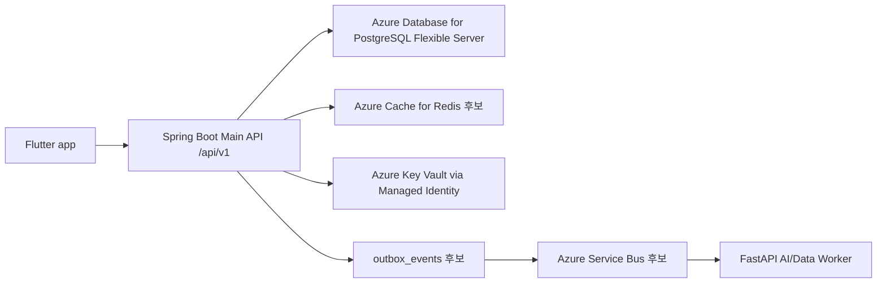

# ONMU User/Profile/Character/Friends 아키텍처

## 목적

이 문서는 ONMU의 사용자 프로필, 픽셀 캐릭터, 친구 관계, 마이페이지 취향 표시 영역의 Current-to-Target Architecture 기준이다. 현재 repo의 Spring Boot Main API, Flutter 화면/repository, Flyway 데이터 사전을 근거로 현재 구현과 Azure/Terraform 목표 구조를 분리한다.

이 문서는 인증 provider 자체의 OAuth 상세 구현, 온모임 생성 흐름, 채팅/알림 delivery 구현은 다루지 않는다. 관련 인증/프로필 정리는 별도 Auth/User/Profile 문서 또는 PR과 충돌하지 않도록 사용자 facing profile, character, friends 경계에 집중한다.

## 제품 원칙

- 사용자의 기본 프로필은 `users`가 원장이고, 마이페이지는 Spring Boot Main API를 통해서만 읽고 쓴다.
- 픽셀 캐릭터의 기본값은 `character_profiles` 1대1 row가 원장이다. OOTD 기록별 변경분은 `records.payload.characterSnapshot`에 스냅샷으로 남기며 기본 캐릭터를 덮어쓰지 않는다.
- 친구 관계는 A-B 쌍에 하나만 존재해야 하므로 `friendships(user_low_id, user_high_id)` canonical pair를 사용한다.
- 친구별 메모, 즐겨찾기, 숨김, 별칭은 관계 원장이 아니라 `friend_settings(friendship_id, user_id)`의 사용자별 개인 설정이다.
- Flutter 앱은 DB, Blob, Redis, Worker, Key Vault를 직접 호출하지 않는다. 공개 API는 Spring Boot `/api/v1`만 사용한다.
- 친구 프로필은 상대 사용자의 공개/친구 공개 프로필만 반환하고, 인증 provider, refresh token, 이메일 같은 내 계정 전용 필드는 노출하지 않는다.

## Current Implementation

### Spring Boot Main API

현재 repo 기준 구현 파일은 다음과 같다.

| 역할 | 파일 |
| --- | --- |
| 사용자/프로필 service | `services/api-spring/src/main/java/com/onmu/api/service/OnmuApiService.java` |
| 프로필 update DTO | `services/api-spring/src/main/java/com/onmu/api/web/dto/UpdateUserProfileRequest.java` |
| 캐릭터 controller | `services/api-spring/src/main/java/com/onmu/api/web/CharacterController.java` |
| 캐릭터 service | `services/api-spring/src/main/java/com/onmu/api/service/CharacterService.java` |
| 캐릭터 entity/repository | `services/api-spring/src/main/java/com/onmu/api/domain/CharacterProfileEntity.java`, `CharacterProfileRepository.java` |
| 친구 controller | `services/api-spring/src/main/java/com/onmu/api/web/FriendController.java` |
| 친구 service | `services/api-spring/src/main/java/com/onmu/api/service/FriendService.java` |
| 친구 DTO | `AddFriendRequest.java`, `UpdateFriendRequest.java`, `FriendResponse.java` |
| 테스트 | `CharacterServiceTests.java`, `OnmuApiServiceTests.java`, friend 관련 Flutter repository tests |

현재 controller route는 다음 계약을 제공한다.

| 기능 | Method / Path | 비고 |
| --- | --- | --- |
| 내 기본 프로필 조회 | `GET /api/v1/users/me` | 인증된 사용자 기준 |
| 내 기본 프로필 수정 | `PATCH /api/v1/users/me` | 이름, 소개, 지역, 취향 profile update |
| 내 캐릭터 조회 | `GET /api/v1/users/me/character` | row가 없으면 현재 dev 확인에서 404 가능 |
| 내 캐릭터 저장 | `PUT /api/v1/users/me/character` | 온보딩/마이페이지 수정에서 사용 |
| 캐릭터 생성 요청 | `POST /api/v1/users/me/character/generate` | AI/생성형 확장 hook |
| 캐릭터 온보딩 skip | `PATCH /api/v1/users/me/onboarding/character-skip` | onboarding status와 연동 |
| 친구 목록 | `GET /api/v1/users/me/friends` | 내 active 친구와 개인 설정 반환 |
| 친구 상세 프로필 | `GET /api/v1/users/me/friends/{friendUserId}/profile` | active 관계 검증 후 상대 프로필 반환 |
| 사용자 코드 검색 | `GET /api/v1/users/search?query={query}` | 친구 추가용 public id/user code 검색 |
| 친구 추가 | `POST /api/v1/users/me/friends` | MVP는 요청/수락 분리 없이 active 관계 생성 |
| 친구 설정 수정 | `PATCH /api/v1/users/me/friends/{friendUserId}` | memo, alias, favorite, hidden |
| 친구 삭제/숨김 | `DELETE /api/v1/users/me/friends/{friendUserId}` | 관계/설정 정책은 service가 결정 |

### Flutter client

현재 Flutter 구현 경계는 다음과 같다.

| 역할 | 파일 |
| --- | --- |
| 마이페이지 화면 | `apps/mobile-flutter/lib/features/my/presentation/pages/my_page.dart` |
| 내 프로필 repository | `apps/mobile-flutter/lib/features/my/repository/my_repository.dart` |
| 친구 repository | `apps/mobile-flutter/lib/features/my/repository/friend_repository.dart` |
| 마이 domain model | `apps/mobile-flutter/lib/features/my/domain/my_profile.dart` |
| 지역 domain model | `apps/mobile-flutter/lib/features/my/domain/korea_region.dart` |
| 캐릭터 화면 | `apps/mobile-flutter/lib/features/character/character_start_page.dart` |
| 캐릭터 repository | `apps/mobile-flutter/lib/features/character/repository/character_repository.dart` |
| 픽셀 캐릭터 렌더링 | `apps/mobile-flutter/lib/shared/widgets/pixel_character.dart`, `pixel_avatar.dart` |
| Route 경계 | `apps/mobile-flutter/lib/core/routing/route_paths.dart`, `app_router.dart` |

Route 기준은 `/my`, `/onboarding`, `/onboarding/preferences`, `/onboarding/character`다. `app_router.dart`는 캐릭터 저장 후 `characterProfileProvider`, `myProfileProvider`를 invalidate해 화면 state를 갱신한다.

### Data model and Flyway

| 테이블 | Flyway | 역할 |
| --- | --- | --- |
| `users` | `V1__core_schema_scaffold.sql`, `V4__core_schema_data_dictionary.sql` | 사용자 기본 원장, display/profile/preference 관련 JSON |
| `user_codes` | `V4__core_schema_data_dictionary.sql`, seed `V5`, `V9` | 친구 추가용 랜덤 public code |
| `character_profiles` | `V11__character_profiles.sql` | 기본 픽셀 캐릭터 1대1 원장 |
| `friendships` | `V4__core_schema_data_dictionary.sql`, `V6__align_friend_settings_data_dictionary.sql` | canonical pair 친구 관계 원장 |
| `friend_settings` | `V4`, `V6`, `V13__friend_api_contract.sql` | 사용자별 친구 메모/별칭/숨김/즐겨찾기 |
| `friend_requests` | `V4` | 요청 방향 보존이 필요할 때 사용하는 확장 테이블 |

### Current side effects

- 프로필/캐릭터 저장은 현재 synchronous Spring transaction으로 처리한다.
- 친구 추가는 MVP에서 active friendship과 양쪽 settings row를 만들어 read model을 즉시 반환한다.
- 친구 상세 프로필 조회는 active relation 검증이 선행된다.
- 캐릭터 저장은 기본 `character_profiles`를 갱신하고, OOTD 기록별 character snapshot은 Records domain이 소유한다.

## Target Architecture

### Runtime boundary



- 확정: Flutter는 Spring Boot Main API만 호출한다.
- 확정: profile, character, friends core schema는 Spring Flyway가 소유한다.
- 후보: 친구 검색 rate limit, user code lookup throttle은 Redis 또는 APIM policy로 분리한다.
- 후보: 친구 추가/프로필 변경 알림은 `notification.requested` outbox 이벤트로 확장한다.
- 미결정: friend request를 MVP 이후 양방향 요청/수락 UX로 확장할지, direct active add를 유지할지 결정 필요.

### API contract examples

프로필 수정 요청 예시:

```json
{
  "displayName": "나",
  "bio": "기록하고, 만나고, 추억해요",
  "region": "서울 성수동",
  "interestTags": ["전시", "카페", "산책"]
}
```

캐릭터 저장 요청 예시:

```json
{
  "gender": "female",
  "skinTone": "skin_1",
  "hairStyle": "long_wave",
  "hairColor": "brown",
  "eyeColor": "black",
  "top": "white_tshirt",
  "bottom": "denim_skirt",
  "shoes": "white_sneakers"
}
```

친구 추가 요청 예시:

```json
{
  "publicId": "ONMU-12345678",
  "memo": "프로젝트 팀원"
}
```

친구 응답 예시:

```json
{
  "publicId": "ONMU-12345678",
  "displayName": "지윤",
  "memo": "프로젝트 팀원",
  "isFavorite": true,
  "hidden": false
}
```

## Current-to-Target Delta

| 구분 | Current | Target | Delta |
| --- | --- | --- | --- |
| 프로필 저장 | Spring API + `users` JSON/columns | 동일, field contract 안정화 | null/empty normalization, 공개 범위 policy 명확화 |
| 캐릭터 저장 | `character_profiles` 구현 | 동일 + media/AI prompt snapshot 연동 | OOTD character snapshot과 기본 캐릭터 update 경계 문서화 |
| 친구 관계 | canonical pair 구현 | 요청/수락, 차단, 추천, 알림 확장 | `friend_requests` lifecycle와 notification event 추가 필요 |
| 친구 검색 | public id/user code 검색 | rate limit, abuse monitoring | Redis/APIM policy 및 security event 설계 필요 |
| 마이페이지 취향 | Flutter profile/preference UI와 API 연결 | 추천/장소/기록 domain에서 read-only 소비 | preference schema version 관리 필요 |

## Terraform Resource Implications

Terraform이 소유해야 할 리소스 후보:

- Azure Database for PostgreSQL Flexible Server, database, firewall/private endpoint, diagnostic settings
- Azure Key Vault, access policy 또는 RBAC, Managed Identity binding
- Azure API Management 또는 ingress CORS/rate limit policy
- Azure Cache for Redis, 친구 검색/user code lookup rate limit 후보
- Azure Monitor Application Insights, Log Analytics workspace, alerts
- Azure Service Bus topic/queue 후보: `notification.requested`, `profile.updated`, `friend.created`

Terraform이 소유하지 않는 것:

- `users`, `user_codes`, `character_profiles`, `friendships`, `friend_settings` DDL: Spring Flyway 소유
- seed data와 dev profile row: Flyway seed 또는 app runtime 소유
- profile/friend API transaction: Spring runtime 소유
- PR/CI workflow execution: GitHub Actions 소유

## Secret / Key Vault / Managed Identity Boundary

이 영역에서 secret 값은 문서에 기록하지 않는다. 필요한 것은 이름과 소유 경계뿐이다.

| 이름 | 사용처 | Key Vault secret name |
| --- | --- | --- |
| `DATABASE_URL` | Spring DB connection | `database-url` 계열 환경별 secret |
| `POSTGRES_PASSWORD` | Spring DB password | `postgres-password` 계열 환경별 secret |
| `ONMU_ACCESS_TOKEN_SECRET` | dev JWT 검증/발급 | `dev-access-token-secret`, `int-access-token-secret` |
| `ONMU_CORS_ORIGINS` 또는 환경별 CORS env | Flutter Web dev origin 허용 | 환경별 앱 설정 또는 Key Vault 참조 |
| `NAVER_OAUTH_CLIENT_ID`, `NAVER_OAUTH_CLIENT_SECRET` | OAuth profile bootstrap | `naver-oauth-client-id`, `naver-oauth-client-secret` |
| `KAKAO_REST_API_KEY`, `KAKAO_CLIENT_SECRET` | OAuth profile bootstrap | `kakao-rest-api-key`, `kakao-client-secret` |

Flutter 앱에는 client secret을 넣지 않는다. Flutter dev 검증은 `.dart_tool/onmu-dev-api.defines.json` 같은 ignored local define 파일을 사용한다.

## Observability and Smoke Test

현재 확인 가능한 smoke 범위:

- `GET /healthz`, `GET /readyz`로 Spring runtime 상태 확인
- `GET /api/v1/users/me`로 JWT/CORS/user seed 확인
- `GET /api/v1/users/me/character`로 character row 존재 여부 확인
- `GET /api/v1/users/me/friends`로 friend seed/relationship 확인
- `GET /api/v1/users/me/friends/{friendUserId}/profile`로 active relation authorization 확인

Target 관측성:

- profile update 4xx/5xx count
- friend search/add/delete latency와 abuse count
- character save failure count
- user code lookup rate limit hit count
- `friend_not_found`, `character_not_found`, `authentication_required` error code dashboard

## Migration Risks

- Auth/User/Profile 문서 PR과 본 문서가 같은 profile field를 다룰 수 있어 merge 순서에 따라 중복 정리가 필요하다.
- dev seed에 `user-me`만 있으면 친구 프로필을 실제 UI에서 확인하기 어렵다.
- `users.pixel_character`와 `character_profiles`가 동시에 남아 있어 read-through/제거 전략이 미결정이면 화면별 캐릭터 불일치가 생길 수 있다.
- 친구 삭제를 물리 삭제로 처리할지 hidden/settings update로 처리할지 UX와 API contract를 맞춰야 한다.
- CORS origin이 Flutter dev port와 다르면 profile/friend API가 인증 문제처럼 보이는 CORS 에러를 낼 수 있다.

## Decision Log

| 상태 | 결정 |
| --- | --- |
| 확정 | Flutter는 Spring Boot Main API만 직접 호출한다. |
| 확정 | 친구 관계는 canonical pair `friendships(user_low_id, user_high_id)`로 한 쌍에 한 row만 둔다. |
| 확정 | 친구 메모/즐겨찾기/숨김은 `friend_settings`의 owner 기준 개인 설정이다. |
| 확정 | 기본 캐릭터 원장은 `character_profiles`이고 OOTD별 변경은 `records.payload.characterSnapshot`에 저장한다. |
| 후보 | 친구 검색/user code lookup rate limit은 Redis 또는 APIM policy로 구현한다. |
| 미결정 | friend request UX를 MVP 이후 요청/수락 flow로 확장할지 여부. |

## Roadmap

1. Profile/character read-through 기준을 `character_profiles` 중심으로 고정한다.
2. 친구 seed/test 계정을 추가해 친구 상세 프로필 dev 검증을 가능하게 한다.
3. 친구 검색 rate limit과 security event logging을 추가한다.
4. 친구 요청/차단/숨김 정책을 API contract에 명시한다.
5. profile/friend 변경 이벤트를 notification/outbox와 연결한다.

## Non-goals

- OAuth provider별 로그인 상세 구현
- 온모임 생성 페이지에서 친구를 멤버로 반영하는 UI 구현
- 친구 추천 알고리즘
- 실제 push provider delivery
- Flutter에서 DB/Key Vault/Worker 직접 호출