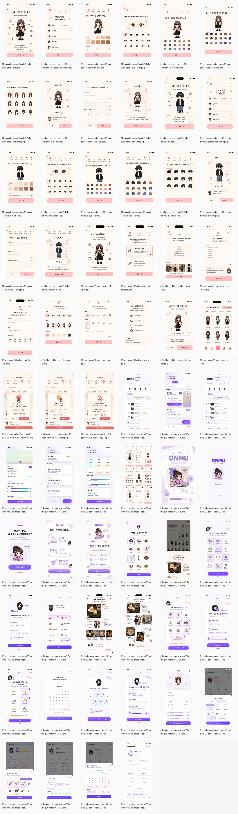
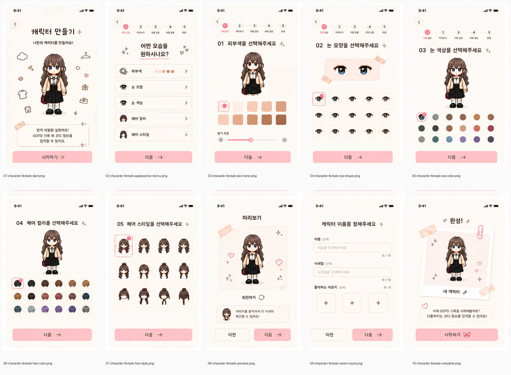
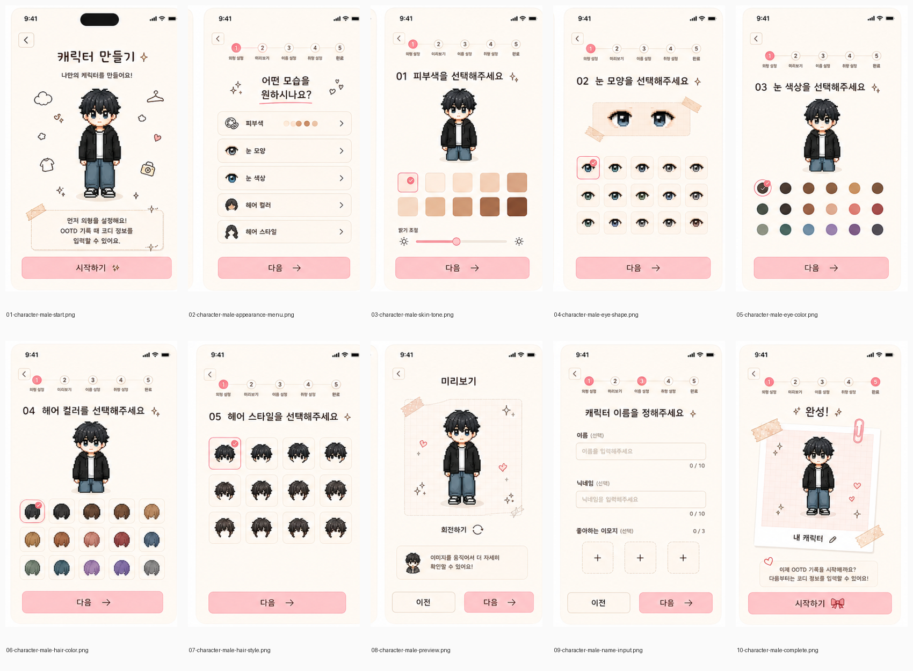
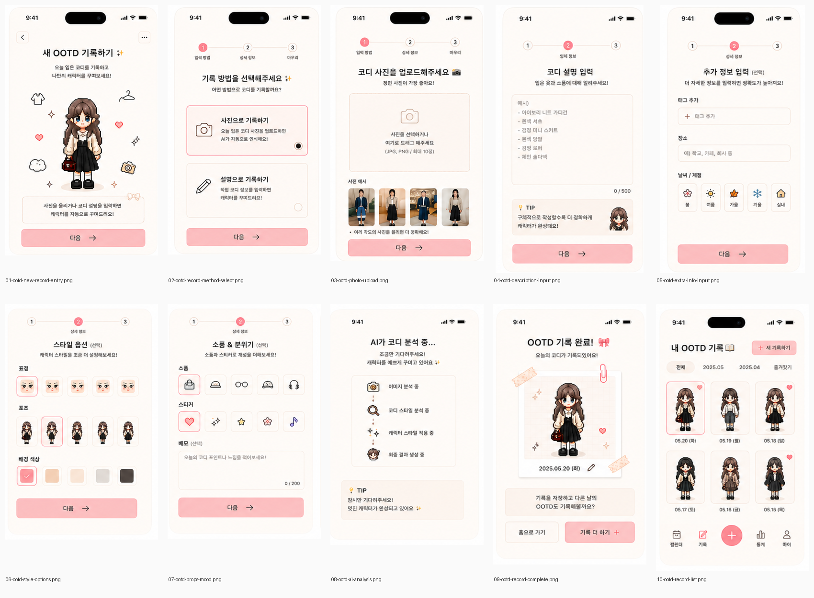
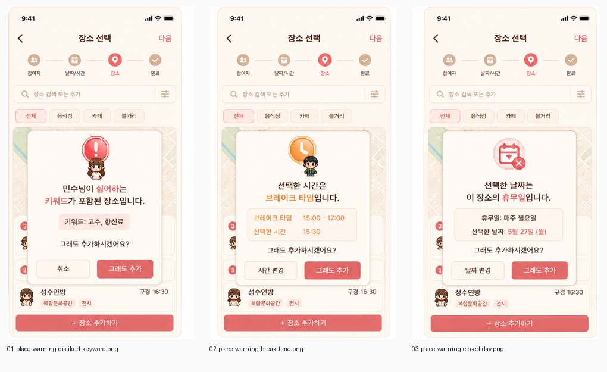
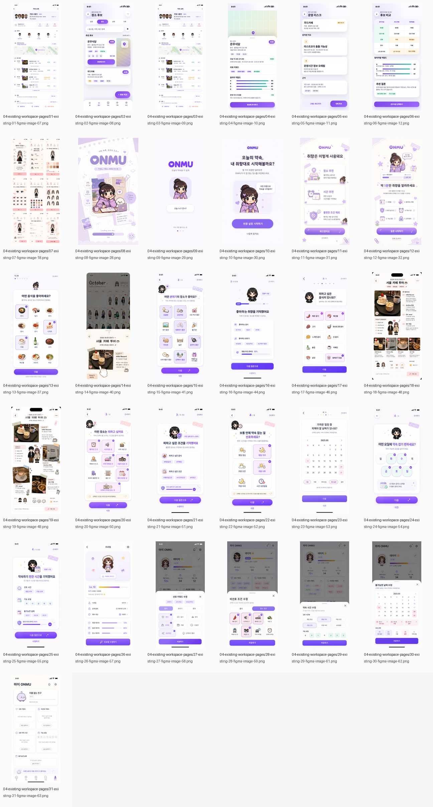
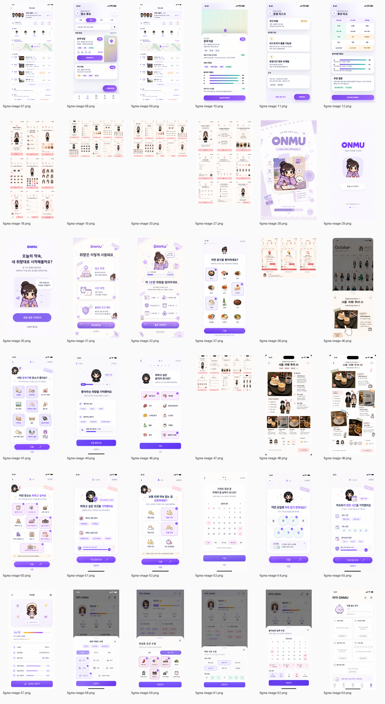

# ONMU UI 캡처 종합 정리

## 1. 문서 목적

이 문서는 ONMU Figma 작업 공간에서 추출한 UI 이미지를 구현 기준과 원본 추적 기준으로 나눠 한 번에 확인하기 위한 종합 인덱스다.

정리 기준은 다음과 같다.

| 분류 | 수량 | 현재 위치 | 역할 |
| --- | ---: | --- | --- |
| 기준 최종 분리 화면 | 33장 | `docs/design/assets/figma-captures/onmu-meeting-aligned/screens/01-*` ~ `03-*` | 실제 구현 기준 화면 |
| 기존 단일 페이지 선별본 | 31장 | `docs/design/assets/figma-captures/onmu-meeting-aligned/screens/04-existing-workspace-pages` | 기존 캡처 중 고유 화면, 최종 화면 폴더로 병합 |
| 구현 화면 묶음 합계 | 64장 | `docs/design/assets/figma-captures/onmu-meeting-aligned/screens` | Flutter 구현 참고용 전체 화면 |
| 원본 이미지 레이어 전체 | 36장 | `docs/design/assets/figma-captures/onmu-workspace-screens/contact-sheet.png` | 원본 추적과 누락 확인용 접촉시트 |

보드형 원본 4장은 최종 작업 단위가 아니다. 보드형 원본에서 잘라낸 `기준 최종 분리 화면 33장`을 먼저 보고, 기존에 캡처했던 단일 화면 31장은 같은 `screens` 폴더 안의 추가 참고 화면으로 함께 관리한다.

## 2. 회의 결정사항

| 항목 | 결정 |
| --- | --- |
| 기본 배경 | 전체 화면 기본 배경은 흰색을 기준으로 한다. |
| 포인트 컬러 | 강한 보라색보다 베이비핑크, 연노랑, 부드러운 코랄 계열을 우선한다. |
| 커스터마이징 | 자유 컬러 피커가 아니라 미리 정해둔 팔레트에서 선택하게 한다. |
| 텍스트 색 | 검은색, 짙은 회색, 흰색처럼 시인성이 검증된 조합을 사용한다. |
| 기록 화면 | 감성형 다이어리 스타일을 초기 기본 템플릿으로 둔다. |
| 확장 방향 | 더 깔끔한 기록 템플릿은 이후 템플릿/확장 기능으로 분리한다. |
| 개발 방향 | Flutter 중심으로 구현하고, 초기에는 프론트/백엔드를 과하게 분리하지 않는다. |

디자인 토큰과 컴포넌트 기준은 [onmu-design-system.md](./onmu-design-system.md)를 기준 문서로 사용한다.

## 3. 전체 산출물 구조

```text
docs/design/assets/figma-captures
├── onmu-meeting-aligned
│   ├── screens
│   │   ├── 01-character-create
│   │   ├── 02-ootd-record
│   │   ├── 03-place-external-api
│   │   └── 04-existing-workspace-pages
│   └── contact-sheets
└── onmu-workspace-screens
    └── contact-sheet.png
```

| 경로 | 설명 |
| --- | --- |
| `docs/design/assets/figma-captures/onmu-meeting-aligned/screens` | 구현 화면 묶음 64장 |
| `docs/design/assets/figma-captures/onmu-meeting-aligned/screens/04-existing-workspace-pages` | 기존 단일 페이지 선별본 31장을 병합한 위치 |
| `docs/design/assets/figma-captures/onmu-meeting-aligned/contact-sheets` | 전체/그룹별 접촉시트 |
| `docs/design/assets/figma-captures/onmu-workspace-screens/contact-sheet.png` | 원본 이미지 레이어 36장 접촉시트 |

ONMU 저장소에는 개발 참고에 필요한 화면 이미지와 접촉시트를 커밋한다. 크롭 좌표, TSV 인덱스, ZIP 압축본 같은 생성 메타데이터는 로컬 작업 산출물로만 유지한다.

## 4. 구현 화면 묶음 64장

이 섹션이 실제 구현 참고의 중심이다. 기준 최종 분리 화면 33장과 기존 단일 페이지 선별본 31장을 한 폴더 구조 안에서 함께 관리한다.



### 4.1 기준 최종 분리 화면 33장

기준 최종 분리 화면은 보드형 원본 4장에서 화면 단위로 잘라낸 결과다.

| 그룹 | 화면 수 | 위치 |
| --- | ---: | --- |
| 여자 캐릭터 생성 | 10장 | `screens/01-character-create/female` |
| 남자 캐릭터 생성 | 10장 | `screens/01-character-create/male` |
| OOTD 기록 | 10장 | `screens/02-ootd-record` |
| 장소 및 외부 API 경고 | 3장 | `screens/03-place-external-api/warnings` |

#### 여자 캐릭터 생성



| 순서 | 화면 | 최종 파일 | 해상도 | 처리 |
| ---: | --- | --- | --- | --- |
| 1 | 캐릭터 만들기 시작 | `screens/01-character-create/female/01-character-female-start.png` | 1672x2786 | 2배 업스케일 |
| 2 | 외형 설정 메뉴 | `screens/01-character-create/female/02-character-female-appearance-menu.png` | 1672x2786 | 2배 업스케일 |
| 3 | 피부색 선택 | `screens/01-character-create/female/03-character-female-skin-tone.png` | 1672x2786 | 2배 업스케일 |
| 4 | 눈 모양 선택 | `screens/01-character-create/female/04-character-female-eye-shape.png` | 1672x2786 | 2배 업스케일 |
| 5 | 눈 색상 선택 | `screens/01-character-create/female/05-character-female-eye-color.png` | 1672x2786 | 2배 업스케일 |
| 6 | 헤어 컬러 선택 | `screens/01-character-create/female/06-character-female-hair-color.png` | 1672x2786 | 2배 업스케일 |
| 7 | 헤어 스타일 선택 | `screens/01-character-create/female/07-character-female-hair-style.png` | 1672x2786 | 2배 업스케일 |
| 8 | 캐릭터 미리보기 | `screens/01-character-create/female/08-character-female-preview.png` | 1672x2786 | 2배 업스케일 |
| 9 | 캐릭터 이름 입력 | `screens/01-character-create/female/09-character-female-name-input.png` | 1672x2786 | 2배 업스케일 |
| 10 | 캐릭터 생성 완료 | `screens/01-character-create/female/10-character-female-complete.png` | 1672x2786 | 2배 업스케일 |

#### 남자 캐릭터 생성



| 순서 | 화면 | 최종 파일 | 해상도 | 처리 |
| ---: | --- | --- | --- | --- |
| 1 | 캐릭터 만들기 시작 | `screens/01-character-create/male/01-character-male-start.png` | 1672x2786 | 2배 업스케일 |
| 2 | 외형 설정 메뉴 | `screens/01-character-create/male/02-character-male-appearance-menu.png` | 1672x2786 | 2배 업스케일 |
| 3 | 피부색 선택 | `screens/01-character-create/male/03-character-male-skin-tone.png` | 1672x2786 | 2배 업스케일 |
| 4 | 눈 모양 선택 | `screens/01-character-create/male/04-character-male-eye-shape.png` | 1672x2786 | 2배 업스케일 |
| 5 | 눈 색상 선택 | `screens/01-character-create/male/05-character-male-eye-color.png` | 1672x2786 | 2배 업스케일 |
| 6 | 헤어 컬러 선택 | `screens/01-character-create/male/06-character-male-hair-color.png` | 1672x2786 | 2배 업스케일 |
| 7 | 헤어 스타일 선택 | `screens/01-character-create/male/07-character-male-hair-style.png` | 1672x2786 | 2배 업스케일 |
| 8 | 캐릭터 미리보기 | `screens/01-character-create/male/08-character-male-preview.png` | 1672x2786 | 2배 업스케일 |
| 9 | 캐릭터 이름 입력 | `screens/01-character-create/male/09-character-male-name-input.png` | 1672x2786 | 2배 업스케일 |
| 10 | 캐릭터 생성 완료 | `screens/01-character-create/male/10-character-male-complete.png` | 1672x2786 | 2배 업스케일 |

#### OOTD 기록



| 순서 | 화면 | 최종 파일 | 해상도 | 처리 |
| ---: | --- | --- | --- | --- |
| 1 | 새 OOTD 기록 시작 | `screens/02-ootd-record/01-ootd-new-record-entry.png` | 1605x2630 | 원본 유지 |
| 2 | 기록 방법 선택 | `screens/02-ootd-record/02-ootd-record-method-select.png` | 1613x2630 | 원본 유지 |
| 3 | 코디 사진 업로드 | `screens/02-ootd-record/03-ootd-photo-upload.png` | 1570x2630 | 원본 유지 |
| 4 | 코디 설명 입력 | `screens/02-ootd-record/04-ootd-description-input.png` | 1452x2630 | 원본 유지 |
| 5 | 추가 정보 입력 | `screens/02-ootd-record/05-ootd-extra-info-input.png` | 1416x2630 | 원본 유지 |
| 6 | 스타일 옵션 선택 | `screens/02-ootd-record/06-ootd-style-options.png` | 1605x2474 | 원본 유지 |
| 7 | 소품 및 분위기 선택 | `screens/02-ootd-record/07-ootd-props-mood.png` | 1613x2474 | 원본 유지 |
| 8 | AI 코디 분석 중 | `screens/02-ootd-record/08-ootd-ai-analysis.png` | 1570x2474 | 원본 유지 |
| 9 | OOTD 기록 완료 | `screens/02-ootd-record/09-ootd-record-complete.png` | 1452x2474 | 원본 유지 |
| 10 | 내 OOTD 기록 목록 | `screens/02-ootd-record/10-ootd-record-list.png` | 1416x2474 | 원본 유지 |

#### 장소 및 외부 API 경고



| 순서 | 화면 | 최종 파일 | 해상도 | 처리 |
| ---: | --- | --- | --- | --- |
| 1 | 싫어하는 키워드 경고 | `screens/03-place-external-api/warnings/01-place-warning-disliked-keyword.png` | 1985x3548 | 원본 유지 |
| 2 | 브레이크 타임 경고 | `screens/03-place-external-api/warnings/02-place-warning-break-time.png` | 1984x3548 | 원본 유지 |
| 3 | 휴무일 경고 | `screens/03-place-external-api/warnings/03-place-warning-closed-day.png` | 1985x3548 | 원본 유지 |

### 4.2 기존 단일 페이지 선별본 31장

기존 단일 페이지 선별본은 더 이상 별도 폴더로 관리하지 않는다. 최종 화면 묶음과 같은 `screens` 폴더 안의 `04-existing-workspace-pages`로 병합했다.



| 항목 | 값 |
| --- | --- |
| 현재 위치 | `docs/design/assets/figma-captures/onmu-meeting-aligned/screens/04-existing-workspace-pages` |
| 이미지 수 | 31장 |
| 중복 제거 대상 | 0장 |
| 전체 인덱스 | 이 문서의 파일 목록과 와이어프레임 표를 기준으로 관리 |

<details>
<summary>병합된 기존 단일 페이지 선별본 31장 파일 목록 보기</summary>

| 파일 | 해상도 |
| --- | --- |
| `04-existing-workspace-pages/01-existing-01-figma-image-07.png` | 804x1738 |
| `04-existing-workspace-pages/02-existing-02-figma-image-08.png` | 804x1748 |
| `04-existing-workspace-pages/03-existing-03-figma-image-09.png` | 804x1738 |
| `04-existing-workspace-pages/04-existing-04-figma-image-10.png` | 804x1748 |
| `04-existing-workspace-pages/05-existing-05-figma-image-11.png` | 804x1748 |
| `04-existing-workspace-pages/06-existing-06-figma-image-12.png` | 804x1748 |
| `04-existing-workspace-pages/07-existing-07-figma-image-18.png` | 1111x2402 |
| `04-existing-workspace-pages/08-existing-08-figma-image-28.png` | 1094x1944 |
| `04-existing-workspace-pages/09-existing-09-figma-image-29.png` | 854x1846 |
| `04-existing-workspace-pages/10-existing-10-figma-image-30.png` | 1274x2264 |
| `04-existing-workspace-pages/11-existing-11-figma-image-31.png` | 1048x2264 |
| `04-existing-workspace-pages/12-existing-12-figma-image-32.png` | 1042x2264 |
| `04-existing-workspace-pages/13-existing-13-figma-image-37.png` | 1048x2278 |
| `04-existing-workspace-pages/14-existing-14-figma-image-40.png` | 804x1976 |
| `04-existing-workspace-pages/15-existing-15-figma-image-41.png` | 1048x2278 |
| `04-existing-workspace-pages/16-existing-16-figma-image-44.png` | 1048x2278 |
| `04-existing-workspace-pages/17-existing-17-figma-image-46.png` | 1048x2278 |
| `04-existing-workspace-pages/18-existing-18-figma-image-48.png` | 806x1748 |
| `04-existing-workspace-pages/19-existing-19-figma-image-49.png` | 806x1748 |
| `04-existing-workspace-pages/20-existing-20-figma-image-50.png` | 1070x2324 |
| `04-existing-workspace-pages/21-existing-21-figma-image-51.png` | 1070x2324 |
| `04-existing-workspace-pages/22-existing-22-figma-image-52.png` | 1048x2278 |
| `04-existing-workspace-pages/23-existing-23-figma-image-53.png` | 1058x2298 |
| `04-existing-workspace-pages/24-existing-24-figma-image-54.png` | 1044x2268 |
| `04-existing-workspace-pages/25-existing-25-figma-image-55.png` | 1058x2298 |
| `04-existing-workspace-pages/26-existing-26-figma-image-57.png` | 1230x2670 |
| `04-existing-workspace-pages/27-existing-27-figma-image-58.png` | 1228x2670 |
| `04-existing-workspace-pages/28-existing-28-figma-image-59.png` | 1262x2670 |
| `04-existing-workspace-pages/29-existing-29-figma-image-61.png` | 1228x2670 |
| `04-existing-workspace-pages/30-existing-30-figma-image-62.png` | 1258x2734 |
| `04-existing-workspace-pages/31-existing-31-figma-image-63.png` | 1262x2742 |

</details>

## 5. 원본 추적과 누락 확인: 원본 이미지 레이어 36장

원본 추적과 누락 확인은 이 36장 폴더를 기준으로 한다. 여기에는 단일 세로 화면뿐 아니라 보드형 원본도 포함되어 있으므로, 구현 기준 화면으로 바로 쓰기보다 출처 확인용으로 사용한다.



| 항목 | 값 |
| --- | --- |
| 위치 | `docs/design/assets/figma-captures/onmu-workspace-screens/contact-sheet.png` |
| 이미지 수 | 36장 |
| 원본 보관 방식 | ONMU 저장소에는 전체 원본 PNG 대신 접촉시트를 보관하고, 세부 해상도와 파일명은 아래 표로 추적 |

<details>
<summary>원본 이미지 레이어 36장 파일 목록 보기</summary>

| 파일 | 해상도 | 비고 |
| --- | --- | --- |
| `figma-image-07.png` | 804x1738 | 원본 레이어 |
| `figma-image-08.png` | 804x1748 | 원본 레이어 |
| `figma-image-09.png` | 804x1738 | 원본 레이어 |
| `figma-image-10.png` | 804x1748 | 원본 레이어 |
| `figma-image-11.png` | 804x1748 | 원본 레이어 |
| `figma-image-12.png` | 804x1748 | 원본 레이어 |
| `figma-image-18.png` | 1111x2402 | 원본 레이어 |
| `figma-image-19.png` | 4180x2786 | 보드형 원본, 남자 캐릭터 생성 |
| `figma-image-20.png` | 4180x2786 | 보드형 원본, 여자 캐릭터 생성 |
| `figma-image-27.png` | 3380x5070 | 원본 레이어 |
| `figma-image-28.png` | 1094x1944 | 원본 레이어 |
| `figma-image-29.png` | 854x1846 | 원본 레이어 |
| `figma-image-30.png` | 1274x2264 | 원본 레이어 |
| `figma-image-31.png` | 1048x2264 | 원본 레이어 |
| `figma-image-32.png` | 1042x2264 | 원본 레이어 |
| `figma-image-37.png` | 1048x2278 | 원본 레이어 |
| `figma-image-38.png` | 5954x4286 | 보드형 원본, 장소/API 경고 |
| `figma-image-40.png` | 804x1976 | 원본 레이어 |
| `figma-image-41.png` | 1048x2278 | 원본 레이어 |
| `figma-image-44.png` | 1048x2278 | 원본 레이어 |
| `figma-image-46.png` | 1048x2278 | 원본 레이어 |
| `figma-image-47.png` | 7656x5104 | 보드형 원본, OOTD 기록 |
| `figma-image-48.png` | 806x1748 | 원본 레이어 |
| `figma-image-49.png` | 806x1748 | 원본 레이어 |
| `figma-image-50.png` | 1070x2324 | 원본 레이어 |
| `figma-image-51.png` | 1070x2324 | 원본 레이어 |
| `figma-image-52.png` | 1048x2278 | 원본 레이어 |
| `figma-image-53.png` | 1058x2298 | 원본 레이어 |
| `figma-image-54.png` | 1044x2268 | 원본 레이어 |
| `figma-image-55.png` | 1058x2298 | 원본 레이어 |
| `figma-image-57.png` | 1230x2670 | 원본 레이어 |
| `figma-image-58.png` | 1228x2670 | 원본 레이어 |
| `figma-image-59.png` | 1262x2670 | 원본 레이어 |
| `figma-image-61.png` | 1228x2670 | 원본 레이어 |
| `figma-image-62.png` | 1258x2734 | 원본 레이어 |
| `figma-image-63.png` | 1262x2742 | 원본 레이어 |

</details>

## 6. 보드형 원본 4장과 기준 최종 분리 화면 33장의 관계

| 보드형 원본 | 기준 최종 분리 결과 | 최종 폴더 |
| --- | ---: | --- |
| `figma-image-20.png` | 10장 | `screens/01-character-create/female` |
| `figma-image-19.png` | 10장 | `screens/01-character-create/male` |
| `figma-image-47.png` | 10장 | `screens/02-ootd-record` |
| `figma-image-38.png` | 3장 | `screens/03-place-external-api/warnings` |

## 7. 구현 우선순위

초기 프로토타입에서는 구현 화면 묶음 64장을 모두 한 번에 만들기보다, 아래 흐름을 먼저 연결한다.

1. 캐릭터 생성 시작
2. 외형 설정 메뉴
3. OOTD 기록 시작
4. 기록 방법 선택
5. 사진 업로드 또는 설명 입력
6. AI 코디 분석 중
7. OOTD 기록 완료
8. 내 OOTD 기록 목록
9. 장소 경고 모달 3종

캐릭터 세부 선택 화면은 팔레트 토큰과 캐릭터 데이터 구조가 정리된 뒤 단계적으로 구현한다.

## 8. Flutter 구현 메모

| 영역 | 기준 |
| --- | --- |
| 화면 배경 | `surface.base` 중심 |
| 카드 배경 | `surface.base` 또는 `surface.warm` |
| 주요 버튼 | `accent.pink` |
| 경고 강조 | `accent.coral` |
| 텍스트 | `text.primary`, `text.secondary`, `text.inverse` |
| 선택 상태 | 외곽선 + 체크 표시 |
| 커스터마이징 | 제한 팔레트 선택 방식 |

Figma 이미지를 그대로 앱에 박는 방식은 피한다. 이미지는 기준 시안으로만 사용하고, Flutter 위젯은 공통 토큰과 컴포넌트로 다시 만든다.

## 9. 스크린별 와이어프레임

와이어프레임은 최종 `screens` 폴더의 64장을 기준으로 한다. 표의 구조는 Flutter 구현 시 위젯 계층을 잡기 위한 요약이며, 이미지를 그대로 박는 방식이 아니라 공통 컴포넌트로 재구성하는 것을 전제로 한다.

### 9.1 여자 캐릭터 생성 10장

| 번호 | 화면 | 파일 | 마크다운 와이어프레임 | 주요 데이터/상호작용 |
| ---: | --- | --- | --- | --- |
| 1 | 캐릭터 만들기 시작 | `01-character-create/female/01-character-female-start.png` | `상태바` -> `뒤로가기` -> `화면 제목/설명` -> `캐릭터 히어로 영역` -> `장식 아이콘 배치` -> `안내 메모 카드` -> `하단 시작하기 CTA` | 캐릭터 생성 플로우 시작. `시작하기`를 누르면 외형 설정 메뉴로 이동한다. |
| 2 | 외형 설정 메뉴 | `01-character-create/female/02-character-female-appearance-menu.png` | `상태바` -> `뒤로가기` -> `5단계 진행 인디케이터` -> `질문 제목` -> `외형 항목 리스트` -> `하단 다음 CTA` | 피부색, 눈 모양, 눈 색상, 헤어 컬러, 헤어 스타일 항목을 선택 화면으로 연결한다. |
| 3 | 피부색 선택 | `01-character-create/female/03-character-female-skin-tone.png` | `상태바` -> `뒤로가기` -> `진행 인디케이터` -> `단계 제목` -> `캐릭터 프리뷰` -> `피부색 팔레트 그리드` -> `밝기 슬라이더` -> `하단 다음 CTA` | 선택된 피부색을 캐릭터 프리뷰에 즉시 반영한다. 팔레트는 제한 색상만 제공한다. |
| 4 | 눈 모양 선택 | `01-character-create/female/04-character-female-eye-shape.png` | `상태바` -> `뒤로가기` -> `진행 인디케이터` -> `단계 제목` -> `눈 확대 프리뷰 카드` -> `눈 모양 그리드` -> `하단 다음 CTA` | 눈 모양 선택 시 체크 배지와 외곽선을 표시하고 프리뷰를 갱신한다. |
| 5 | 눈 색상 선택 | `01-character-create/female/05-character-female-eye-color.png` | `상태바` -> `뒤로가기` -> `진행 인디케이터` -> `단계 제목` -> `캐릭터 프리뷰` -> `눈 색상 원형 팔레트` -> `하단 다음 CTA` | 원형 색상 팔레트 중 하나만 선택한다. 대비가 낮은 색상 조합은 제한한다. |
| 6 | 헤어 컬러 선택 | `01-character-create/female/06-character-female-hair-color.png` | `상태바` -> `뒤로가기` -> `진행 인디케이터` -> `단계 제목` -> `캐릭터 프리뷰` -> `헤어 컬러 썸네일 그리드` -> `하단 다음 CTA` | 헤어 컬러 선택값을 캐릭터 프리뷰와 썸네일 선택 상태에 반영한다. |
| 7 | 헤어 스타일 선택 | `01-character-create/female/07-character-female-hair-style.png` | `상태바` -> `뒤로가기` -> `진행 인디케이터` -> `단계 제목` -> `헤어 스타일 카드 그리드` -> `하단 다음 CTA` | 헤어 스타일 카드 하나를 선택한다. 긴 목록이 되면 세로 스크롤 영역으로 처리한다. |
| 8 | 캐릭터 미리보기 | `01-character-create/female/08-character-female-preview.png` | `상태바` -> `뒤로가기` -> `화면 제목` -> `메모지 스타일 프리뷰 카드` -> `회전하기 버튼` -> `안내 카드` -> `이전/다음 CTA 2열` | 선택한 외형을 최종 확인한다. `회전하기`는 전면/측면 프리뷰 전환으로 구현할 수 있다. |
| 9 | 캐릭터 이름 입력 | `01-character-create/female/09-character-female-name-input.png` | `상태바` -> `뒤로가기` -> `화면 제목` -> `이름 입력 필드` -> `닉네임 입력 필드` -> `좋아하는 이모지 3개 선택 슬롯` -> `이전/다음 CTA 2열` | 이름/닉네임은 선택 입력으로 두되 글자 수 카운터를 표시한다. 이모지는 최대 3개까지 선택한다. |
| 10 | 캐릭터 생성 완료 | `01-character-create/female/10-character-female-complete.png` | `상태바` -> `진행 인디케이터 완료` -> `완료 제목` -> `완성 캐릭터 카드` -> `캐릭터 이름/수정 아이콘` -> `다음 행동 안내 카드` -> `하단 시작하기 CTA` | 캐릭터 생성 결과를 저장하고 OOTD 기록 또는 홈 흐름으로 진입한다. |

### 9.2 남자 캐릭터 생성 10장

| 번호 | 화면 | 파일 | 마크다운 와이어프레임 | 주요 데이터/상호작용 |
| ---: | --- | --- | --- | --- |
| 1 | 캐릭터 만들기 시작 | `01-character-create/male/01-character-male-start.png` | `상태바` -> `뒤로가기` -> `화면 제목/설명` -> `캐릭터 히어로 영역` -> `장식 아이콘 배치` -> `안내 메모 카드` -> `하단 시작하기 CTA` | 캐릭터 생성 플로우 시작. 성별/스타일 프리셋만 다르고 화면 구조는 공통화한다. |
| 2 | 외형 설정 메뉴 | `01-character-create/male/02-character-male-appearance-menu.png` | `상태바` -> `뒤로가기` -> `5단계 진행 인디케이터` -> `질문 제목` -> `외형 항목 리스트` -> `하단 다음 CTA` | 여자 캐릭터와 같은 메뉴 컴포넌트를 사용하고 썸네일 에셋만 분리한다. |
| 3 | 피부색 선택 | `01-character-create/male/03-character-male-skin-tone.png` | `상태바` -> `뒤로가기` -> `진행 인디케이터` -> `단계 제목` -> `캐릭터 프리뷰` -> `피부색 팔레트 그리드` -> `밝기 슬라이더` -> `하단 다음 CTA` | 피부색 토큰은 공통 팔레트를 사용한다. 선택 상태는 체크 배지로 통일한다. |
| 4 | 눈 모양 선택 | `01-character-create/male/04-character-male-eye-shape.png` | `상태바` -> `뒤로가기` -> `진행 인디케이터` -> `단계 제목` -> `눈 확대 프리뷰 카드` -> `눈 모양 그리드` -> `하단 다음 CTA` | 눈 모양 옵션은 캐릭터 타입별 에셋을 쓰되 그리드 UI는 재사용한다. |
| 5 | 눈 색상 선택 | `01-character-create/male/05-character-male-eye-color.png` | `상태바` -> `뒤로가기` -> `진행 인디케이터` -> `단계 제목` -> `캐릭터 프리뷰` -> `눈 색상 원형 팔레트` -> `하단 다음 CTA` | 색 선택은 한 번에 하나만 가능하며 선택값은 캐릭터 모델에 저장한다. |
| 6 | 헤어 컬러 선택 | `01-character-create/male/06-character-male-hair-color.png` | `상태바` -> `뒤로가기` -> `진행 인디케이터` -> `단계 제목` -> `캐릭터 프리뷰` -> `헤어 컬러 썸네일 그리드` -> `하단 다음 CTA` | 컬러 썸네일은 이미지 에셋과 색상 토큰을 매핑해 관리한다. |
| 7 | 헤어 스타일 선택 | `01-character-create/male/07-character-male-hair-style.png` | `상태바` -> `뒤로가기` -> `진행 인디케이터` -> `단계 제목` -> `헤어 스타일 카드 그리드` -> `하단 다음 CTA` | 헤어 스타일 선택 시 프리뷰에 즉시 반영한다. |
| 8 | 캐릭터 미리보기 | `01-character-create/male/08-character-male-preview.png` | `상태바` -> `뒤로가기` -> `화면 제목` -> `메모지 스타일 프리뷰 카드` -> `회전하기 버튼` -> `안내 카드` -> `이전/다음 CTA 2열` | 최종 저장 전 캐릭터를 확인한다. |
| 9 | 캐릭터 이름 입력 | `01-character-create/male/09-character-male-name-input.png` | `상태바` -> `뒤로가기` -> `화면 제목` -> `이름 입력 필드` -> `닉네임 입력 필드` -> `좋아하는 이모지 3개 선택 슬롯` -> `이전/다음 CTA 2열` | 입력값 검증과 글자 수 카운터를 공통 컴포넌트로 처리한다. |
| 10 | 캐릭터 생성 완료 | `01-character-create/male/10-character-male-complete.png` | `상태바` -> `진행 인디케이터 완료` -> `완료 제목` -> `완성 캐릭터 카드` -> `캐릭터 이름/수정 아이콘` -> `다음 행동 안내 카드` -> `하단 시작하기 CTA` | 캐릭터 생성 완료 후 다음 핵심 여정으로 연결한다. |

### 9.3 OOTD 기록 10장

| 번호 | 화면 | 파일 | 마크다운 와이어프레임 | 주요 데이터/상호작용 |
| ---: | --- | --- | --- | --- |
| 1 | 새 OOTD 기록 시작 | `02-ootd-record/01-ootd-new-record-entry.png` | `상태바` -> `뒤로가기/더보기` -> `화면 제목/설명` -> `캐릭터 히어로` -> `장식 아이콘` -> `안내 카드` -> `하단 다음 CTA` | OOTD 기록 플로우 진입. 다음 버튼은 기록 방법 선택으로 이동한다. |
| 2 | 기록 방법 선택 | `02-ootd-record/02-ootd-record-method-select.png` | `상태바` -> `3단계 진행 인디케이터` -> `질문 제목` -> `사진 기록 카드` -> `설명 기록 카드` -> `하단 다음 CTA` | 사진 업로드 또는 텍스트 설명 중 하나를 선택한다. 선택 카드는 외곽선과 라디오 상태를 표시한다. |
| 3 | 코디 사진 업로드 | `02-ootd-record/03-ootd-photo-upload.png` | `상태바` -> `진행 인디케이터` -> `화면 제목/보조문` -> `드롭존 카드` -> `사진 예시 썸네일 행` -> `하단 다음 CTA` | 갤러리/카메라 권한, 다중 이미지 업로드, 파일 형식/개수 제한을 처리한다. |
| 4 | 코디 설명 입력 | `02-ootd-record/04-ootd-description-input.png` | `상태바` -> `진행 인디케이터` -> `화면 제목/보조문` -> `큰 텍스트 입력 박스` -> `글자 수 카운터` -> `팁 카드` -> `하단 다음 CTA` | 코디 설명을 최대 글자 수 안에서 입력한다. 예시 문구는 placeholder로 제공한다. |
| 5 | 추가 정보 입력 | `02-ootd-record/05-ootd-extra-info-input.png` | `상태바` -> `진행 인디케이터` -> `화면 제목` -> `태그 추가 필드` -> `장소 입력 필드` -> `날씨/계절 선택 칩` -> `하단 다음 CTA` | 태그, 장소, 계절/날씨 메타데이터를 선택 입력으로 저장한다. |
| 6 | 스타일 옵션 선택 | `02-ootd-record/06-ootd-style-options.png` | `상태바` -> `진행 인디케이터` -> `화면 제목` -> `표정 선택 행` -> `포즈 선택 행` -> `배경 색상 팔레트` -> `하단 다음 CTA` | 캐릭터 표정, 포즈, 배경색을 제한 팔레트 안에서 선택한다. |
| 7 | 소품 및 분위기 선택 | `02-ootd-record/07-ootd-props-mood.png` | `상태바` -> `진행 인디케이터` -> `화면 제목` -> `소품 아이콘 그리드` -> `스티커 아이콘 그리드` -> `메모 입력 박스` -> `하단 다음 CTA` | 소품과 스티커는 다중 선택 가능 여부를 명확히 정한다. 메모는 선택 입력이다. |
| 8 | AI 코디 분석 중 | `02-ootd-record/08-ootd-ai-analysis.png` | `상태바` -> `화면 제목/대기 문구` -> `분석 단계 카드` -> `단계별 아이콘/상태` -> `팁 카드` | 이미지 분석, 스타일 분석, 캐릭터 적용, 결과 생성 단계를 순차 상태로 보여준다. |
| 9 | OOTD 기록 완료 | `02-ootd-record/09-ootd-record-complete.png` | `상태바` -> `완료 제목` -> `완성 기록 카드` -> `날짜/수정 아이콘` -> `다음 기록 제안 카드` -> `홈/기록 더 하기 CTA 2열` | 결과 저장 후 홈 이동 또는 추가 기록으로 분기한다. |
| 10 | 내 OOTD 기록 목록 | `02-ootd-record/10-ootd-record-list.png` | `상태바` -> `화면 제목/새 기록 버튼` -> `월/전체/즐겨찾기 필터` -> `기록 카드 그리드` -> `하단 탭바` | OOTD 기록을 월별/즐겨찾기별로 필터링한다. 카드 선택 시 상세 기록으로 이동한다. |

### 9.4 장소 및 외부 API 경고 3장

| 번호 | 화면 | 파일 | 마크다운 와이어프레임 | 주요 데이터/상호작용 |
| ---: | --- | --- | --- | --- |
| 1 | 싫어하는 키워드 경고 | `03-place-external-api/warnings/01-place-warning-disliked-keyword.png` | `상태바` -> `상단 앱바/다음` -> `약속 생성 단계 인디케이터` -> `검색창/필터 버튼` -> `카테고리 칩` -> `장소 리스트 배경` -> `중앙 경고 모달` -> `하단 장소 추가 CTA` | 장소가 사용자의 비선호 키워드와 충돌할 때 모달을 띄운다. 취소 또는 그래도 추가를 선택한다. |
| 2 | 브레이크 타임 경고 | `03-place-external-api/warnings/02-place-warning-break-time.png` | `상태바` -> `상단 앱바/다음` -> `단계 인디케이터` -> `검색/필터` -> `장소 리스트 배경` -> `브레이크 타임 모달` -> `시간 변경/그래도 추가 CTA` | 선택 시간이 브레이크 타임과 겹치면 시간 변경 CTA를 제공한다. |
| 3 | 휴무일 경고 | `03-place-external-api/warnings/03-place-warning-closed-day.png` | `상태바` -> `상단 앱바/다음` -> `단계 인디케이터` -> `검색/필터` -> `장소 리스트 배경` -> `휴무일 모달` -> `날짜 변경/그래도 추가 CTA` | 선택 날짜가 휴무일과 겹치면 날짜 변경 CTA를 우선 노출한다. |

### 9.5 병합된 기존 단일 페이지 선별본 31장

| 번호 | 화면 추정 | 파일 | 마크다운 와이어프레임 | 주요 데이터/상호작용 |
| ---: | --- | --- | --- | --- |
| 1 | 장소 후보 전체 목록 | `04-existing-workspace-pages/01-existing-01-figma-image-07.png` | `상태바` -> `참여자/약속 요약 헤더` -> `필터/정렬 영역` -> `지도 미리보기` -> `장소 후보 리스트` -> `하단 액션 영역` | 장소 후보를 목록과 지도 기준으로 비교한다. 후보 선택/추가/다음 이동을 제공한다. |
| 2 | 장소 후보 카드 리스트 | `04-existing-workspace-pages/02-existing-02-figma-image-08.png` | `상태바` -> `장소 후보 제목` -> `검색/필터 바` -> `장소 카드 리스트` -> `하단 탭바` -> `플로팅 후보 추가 CTA` | 장소 후보를 카드 단위로 탐색한다. 각 카드는 태그, 거리, 상태를 가진다. |
| 3 | 장소 후보 목록 확장 | `04-existing-workspace-pages/03-existing-03-figma-image-09.png` | `상태바` -> `약속 요약 헤더` -> `지도/리스트 복합 영역` -> `후보 카드 반복` -> `하단 결정 CTA` | 후보 목록이 길어지는 경우 스크롤과 선택 상태를 유지한다. |
| 4 | 장소 상세 바텀시트 | `04-existing-workspace-pages/04-existing-04-figma-image-10.png` | `지도 배경` -> `장소 상세 바텀시트` -> `장소명/상태 배지` -> `영업시간/주소/태그` -> `참여자 적합도 막대` -> `하단 추가 CTA` | 장소 상세를 확인하고 후보로 추가한다. 지도 위치와 장소 상세 데이터를 연결한다. |
| 5 | 운영 리스크 안내 | `04-existing-workspace-pages/05-existing-05-figma-image-11.png` | `상태바` -> `상단 앱바` -> `운영 리스크 제목` -> `리스크 카드 리스트` -> `근거/갱신 정보` -> `하단 선택 CTA` | 휴무, 브레이크 타임, 정보 오래됨 같은 리스크를 카드로 설명한다. |
| 6 | 후보 비교 | `04-existing-workspace-pages/06-existing-06-figma-image-12.png` | `상태바` -> `후보 비교 제목` -> `카테고리 비교 표` -> `참여자 적합도 막대` -> `추천 설명 카드` -> `하단 선택 CTA` | 후보 장소 간 점수, 카테고리, 운영 상태를 비교한다. |
| 7 | 캐릭터 생성 보드 참고 | `04-existing-workspace-pages/07-existing-07-figma-image-18.png` | `보드형 참고 이미지` -> `캐릭터 생성 여러 화면 묶음` -> `개별 화면은 01-character-create 그룹 기준 사용` | 원본 추적용 참고 보드다. 구현은 분리된 캐릭터 생성 20장을 기준으로 한다. |
| 8 | ONMU 일러스트 스플래시 | `04-existing-workspace-pages/08-existing-08-figma-image-28.png` | `상단 여백` -> `ONMU 로고` -> `중앙 일러스트 카드` -> `로딩/진행 표시` -> `하단 여백` | 앱 최초 진입 또는 로딩 화면으로 사용한다. |
| 9 | ONMU 시작/로그인 | `04-existing-workspace-pages/09-existing-09-figma-image-29.png` | `상단 로고` -> `중앙 캐릭터` -> `짧은 안내 문구` -> `시작/로그인 CTA` -> `하단 보조 문구` | 로그인 전 시작 화면. 인증 흐름 또는 온보딩으로 이동한다. |
| 10 | 취향 입력 시작 | `04-existing-workspace-pages/10-existing-10-figma-image-30.png` | `ONMU 로고` -> `질문형 헤드라인` -> `캐릭터 말풍선 카드` -> `취향 생성 시작 CTA` -> `나중에 할래 링크` | 개인화 취향 입력을 시작한다. |
| 11 | 취향 기능 소개 | `04-existing-workspace-pages/11-existing-11-figma-image-31.png` | `상단 로고` -> `기능 소개 제목` -> `장소 추천 카드` -> `시간 추천 카드` -> `조건 제안 카드` -> `하단 확인 CTA` | 취향 입력의 이점을 카드로 설명한다. |
| 12 | 취향 입력 단계 시작 | `04-existing-workspace-pages/12-existing-12-figma-image-32.png` | `상단 진행 안내` -> `약 1분 안내 제목` -> `카테고리 선택 그리드` -> `하단 질문 시작 CTA` | 취향 질문 흐름의 시작점. 여러 카테고리로 분기한다. |
| 13 | 음식 선호 선택 | `04-existing-workspace-pages/13-existing-13-figma-image-37.png` | `상태바` -> `진행 표시` -> `질문 제목` -> `음식 아이콘 그리드` -> `선택 상태` -> `하단 다음 CTA` | 음식 선호를 다중 선택한다. |
| 14 | 추억 기록 상세 | `04-existing-workspace-pages/14-existing-14-figma-image-40.png` | `상태바` -> `날짜/장소 헤더` -> `사진 콜라주` -> `캐릭터 스티커` -> `메모 카드` -> `하단 액션` | 약속 후 기록 상세를 보여준다. |
| 15 | 분위기/활동 선호 선택 | `04-existing-workspace-pages/15-existing-15-figma-image-41.png` | `상태바` -> `질문 제목` -> `활동/분위기 아이콘 그리드` -> `선택 상태` -> `하단 다음 CTA` | 장소 추천에 쓸 활동/분위기 태그를 수집한다. |
| 16 | 취향 분석 요약 | `04-existing-workspace-pages/16-existing-16-figma-image-44.png` | `상태바` -> `진행 표시` -> `캐릭터/레벨 영역` -> `취향 요약 카드` -> `진행도 바` -> `하단 다음 CTA` | 취향 입력 결과를 요약하고 다음 질문으로 유도한다. |
| 17 | 비선호 음식 선택 | `04-existing-workspace-pages/17-existing-17-figma-image-46.png` | `상태바` -> `질문 제목` -> `비선호 음식 그리드` -> `선택 칩` -> `하단 다음 CTA` | 장소 제외/경고 조건으로 쓸 비선호 데이터를 수집한다. |
| 18 | 모임 기록 상세 A | `04-existing-workspace-pages/18-existing-18-figma-image-48.png` | `상태바` -> `기록 제목/날짜` -> `큰 사진 콜라주` -> `참여 캐릭터` -> `기록 메모` -> `하단 탭바/액션` | 모임 기록을 사진과 메모 중심으로 보여준다. |
| 19 | 모임 기록 상세 B | `04-existing-workspace-pages/19-existing-19-figma-image-49.png` | `상태바` -> `기록 제목/날짜` -> `사진 콜라주` -> `캐릭터 스티커` -> `텍스트 기록` -> `하단 액션` | 같은 기록 상세의 다른 구성안. 감성형 기록 템플릿 참고로 둔다. |
| 20 | 비선호 장소 조건 선택 | `04-existing-workspace-pages/20-existing-20-figma-image-50.png` | `상태바` -> `진행 표시` -> `질문 제목` -> `조건 카드 그리드` -> `하단 다음 CTA` | 시끄러움, 멀리 있음, 대기 많음 등 장소 제외 조건을 선택한다. |
| 21 | 조건 기반 추천 결과 | `04-existing-workspace-pages/21-existing-21-figma-image-51.png` | `상태바` -> `진행 표시` -> `추천 결과 제목` -> `조건 만족 카드` -> `적합도 막대` -> `하단 완료 CTA` | 입력한 조건으로 개인화 추천 품질을 설명한다. |
| 22 | 선호 시간대 선택 | `04-existing-workspace-pages/22-existing-22-figma-image-52.png` | `상태바` -> `진행 표시` -> `질문 제목` -> `시간대 카드 그리드` -> `하단 다음 CTA` | 오전/오후/저녁 등 선호 시간대를 선택한다. |
| 23 | 불가능 날짜 선택 | `04-existing-workspace-pages/23-existing-23-figma-image-53.png` | `상태바` -> `진행 표시` -> `달력 카드` -> `날짜 선택 상태` -> `하단 다음 CTA` | 약속이 어려운 날짜를 캘린더에서 선택한다. |
| 24 | 선호 요일 선택 | `04-existing-workspace-pages/24-existing-24-figma-image-54.png` | `상태바` -> `진행 표시` -> `질문 제목` -> `요일 칩 그리드` -> `안내 카드` -> `하단 다음 CTA` | 약속 선호 요일을 다중 선택한다. |
| 25 | 불편한 시간 선택 | `04-existing-workspace-pages/25-existing-25-figma-image-55.png` | `상태바` -> `진행 표시` -> `질문 제목` -> `시간 조건 카드` -> `하단 완료 CTA` | 약속하기 불편한 시간대를 입력한다. |
| 26 | 마이 ONMU 프로필 | `04-existing-workspace-pages/26-existing-26-figma-image-57.png` | `상태바` -> `마이 제목/설정` -> `캐릭터 프로필 카드` -> `레벨/진행도` -> `취향 데이터 카드` -> `하단 탭바` | 프로필, 레벨, 취향 데이터 완성도를 보여준다. |
| 27 | 선호 키워드 수정 바텀시트 | `04-existing-workspace-pages/27-existing-27-figma-image-58.png` | `딤 처리 배경` -> `마이 화면` -> `하단 바텀시트` -> `선호 키워드 그리드` -> `저장 CTA` | 선호 키워드를 수정한다. 바텀시트는 드래그/닫기를 지원한다. |
| 28 | 비선호 조건 수정 바텀시트 | `04-existing-workspace-pages/28-existing-28-figma-image-59.png` | `딤 처리 배경` -> `마이 화면` -> `하단 바텀시트` -> `비선호 조건 그리드` -> `저장 CTA` | 싫어하는 음식/조건 등을 수정한다. |
| 29 | 약속 시간 수정 바텀시트 | `04-existing-workspace-pages/29-existing-29-figma-image-61.png` | `딤 처리 배경` -> `마이 화면` -> `하단 바텀시트` -> `약속 시간 선택 칩` -> `저장 CTA` | 선호 약속 시간을 수정한다. |
| 30 | 불가능 날짜 수정 바텀시트 | `04-existing-workspace-pages/30-existing-30-figma-image-62.png` | `딤 처리 배경` -> `마이 화면` -> `하단 바텀시트` -> `캘린더` -> `날짜 상태 범례` -> `저장 CTA` | 불가능한 날짜를 수정한다. |
| 31 | 마이 ONMU 빈 상태 | `04-existing-workspace-pages/31-existing-31-figma-image-63.png` | `상태바` -> `마이 제목/알림/설정` -> `캐릭터 요약 카드` -> `취향 데이터 빈 카드 그리드` -> `추천 개선 안내 배너` -> `하단 탭바` | 아직 입력되지 않은 취향 데이터를 카드별 CTA로 채우게 한다. |

## 10. 검증 체크리스트

- [x] 원본 추적과 누락 확인 기준을 36장 원본 이미지 레이어 전체로 분리했다.
- [x] 기존 단일 페이지 선별본 31장을 최종 화면 묶음과 같은 `screens` 폴더로 병합했다.
- [x] 기존 단일 페이지 선별본 독립 폴더와 독립 ZIP은 제거했다.
- [x] 기준 최종 분리 화면 33장은 유지했다.
- [x] 최종 `screens` 폴더 합계가 64장인지 확인했다.
- [x] 33장과 31장의 중복 비교 결과, 삭제 대상 중복은 0장임을 기록했다.
- [x] 구현 화면 전체 접촉시트를 갱신했다.
- [x] 원본 이미지 레이어 36장 접촉시트를 유지했다.
- [x] Markdown 이미지 링크를 검증했다.
- [x] 구현 화면 묶음 64장 전체에 스크린별 와이어프레임을 추가했다.

## 11. 관련 문서

| 파일 | 설명 |
| --- | --- |
| [onmu-flutter-flow-storyboard.md](./onmu-flutter-flow-storyboard.md) | Flutter/FlutterFlow 구현용 스토리보드 및 라우팅 흐름 |
| [onmu-design-system.md](./onmu-design-system.md) | 디자인 시스템 기준 |
| [release-architecture.md](../architecture/release-architecture.md) | 릴리즈 아키텍처 및 인프라 전략 |
| `docs/design/assets/figma-captures/onmu-meeting-aligned/screens` | 구현 화면 64장 이미지 |
| `docs/design/assets/figma-captures/onmu-meeting-aligned/contact-sheets` | 구현 화면 그룹별 접촉시트 |
| `docs/design/assets/figma-captures/onmu-workspace-screens/contact-sheet.png` | 원본 이미지 레이어 36장 접촉시트 |
